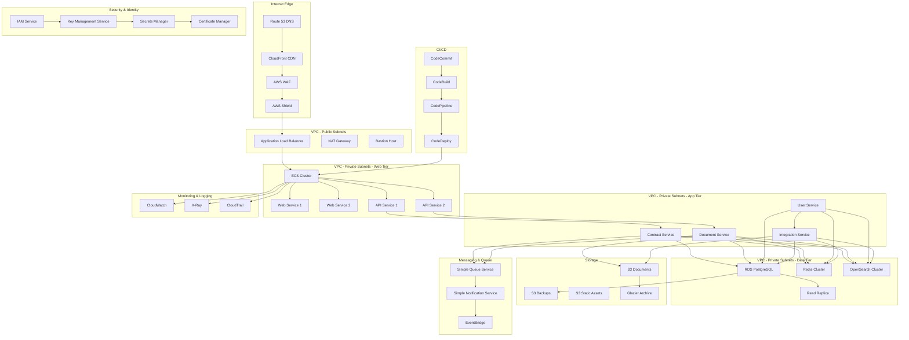

# AWS архитектура развертывания для системы автоматизации договоров купли-продажи земли

## Обзор

Документ описывает комплексную архитектуру развертывания системы в AWS с учетом требований российского законодательства, высокой доступности, масштабируемости и безопасности.

## Архитектура развертывания



## 1. Сетевая архитектура

### 1.1 VPC Configuration
```yaml
# infrastructure/vpc/main.tf
terraform {
  required_version = ">= 1.0"
  required_providers {
    aws = {
      source  = "hashicorp/aws"
      version = "~> 4.0"
    }
  }
}

provider "aws" {
  region = var.aws_region
}

# VPC
resource "aws_vpc" "main" {
  cidr_block           = "10.0.0.0/16"
  enable_dns_hostnames = true
  enable_dns_support   = true
  
  tags = {
    Name        = "${var.environment}-land-contracts-vpc"
    Environment = var.environment
    Project     = "land-contracts"
  }
}

# Internet Gateway
resource "aws_internet_gateway" "main" {
  vpc_id = aws_vpc.main.id
  
  tags = {
    Name        = "${var.environment}-land-contracts-igw"
    Environment = var.environment
  }
}

# Public Subnets
resource "aws_subnet" "public" {
  count = 2
  
  vpc_id                  = aws_vpc.main.id
  cidr_block              = "10.0.${count.index + 1}.0/24"
  availability_zone       = data.aws_availability_zones.available.names[count.index]
  map_public_ip_on_launch = true
  
  tags = {
    Name        = "${var.environment}-public-subnet-${count.index + 1}"
    Environment = var.environment
    Type        = "Public"
  }
}

# Private Subnets - Web Tier
resource "aws_subnet" "private_web" {
  count = 2
  
  vpc_id            = aws_vpc.main.id
  cidr_block        = "10.0.${count.index + 11}.0/24"
  availability_zone = data.aws_availability_zones.available.names[count.index]
  
  tags = {
    Name        = "${var.environment}-private-web-subnet-${count.index + 1}"
    Environment = var.environment
    Type        = "Private-Web"
  }
}

# Private Subnets - App Tier
resource "aws_subnet" "private_app" {
  count = 2
  
  vpc_id            = aws_vpc.main.id
  cidr_block        = "10.0.${count.index + 21}.0/24"
  availability_zone = data.aws_availability_zones.available.names[count.index]
  
  tags = {
    Name        = "${var.environment}-private-app-subnet-${count.index + 1}"
    Environment = var.environment
    Type        = "Private-App"
  }
}

# Private Subnets - Data Tier
resource "aws_subnet" "private_data" {
  count = 2
  
  vpc_id            = aws_vpc.main.id
  cidr_block        = "10.0.${count.index + 31}.0/24"
  availability_zone = data.aws_availability_zones.available.names[count.index]
  
  tags = {
    Name        = "${var.environment}-private-data-subnet-${count.index + 1}"
    Environment = var.environment
    Type        = "Private-Data"
  }
}

# NAT Gateway
resource "aws_eip" "nat" {
  domain = "vpc"
  
  tags = {
    Name        = "${var.environment}-nat-eip"
    Environment = var.environment
  }
  
  depends_on = [aws_internet_gateway.main]
}

resource "aws_nat_gateway" "main" {
  allocation_id = aws_eip.nat.id
  subnet_id     = aws_subnet.public[0].id
  
  tags = {
    Name        = "${var.environment}-nat-gateway"
    Environment = var.environment
  }
  
  depends_on = [aws_internet_gateway.main]
}

# Route Tables
resource "aws_route_table" "public" {
  vpc_id = aws_vpc.main.id
  
  route {
    cidr_block = "0.0.0.0/0"
    gateway_id = aws_internet_gateway.main.id
  }
  
  tags = {
    Name        = "${var.environment}-public-rt"
    Environment = var.environment
  }
}

resource "aws_route_table" "private" {
  vpc_id = aws_vpc.main.id
  
  route {
    cidr_block     = "0.0.0.0/0"
    nat_gateway_id = aws_nat_gateway.main.id
  }
  
  tags = {
    Name        = "${var.environment}-private-rt"
    Environment = var.environment
  }
}

# Route Table Associations
resource "aws_route_table_association" "public" {
  count = length(aws_subnet.public)
  
  subnet_id      = aws_subnet.public[count.index].id
  route_table_id = aws_route_table.public.id
}

resource "aws_route_table_association" "private_web" {
  count = length(aws_subnet.private_web)
  
  subnet_id      = aws_subnet.private_web[count.index].id
  route_table_id = aws_route_table.private.id
}

resource "aws_route_table_association" "private_app" {
  count = length(aws_subnet.private_app)
  
  subnet_id      = aws_subnet.private_app[count.index].id
  route_table_id = aws_route_table.private.id
}

resource "aws_route_table_association" "private_data" {
  count = length(aws_subnet.private_data)
  
  subnet_id      = aws_subnet.private_data[count.index].id
  route_table_id = aws_route_table.private.id
}

# Data sources
data "aws_availability_zones" "available" {
  state = "available"
}

# Variables
variable "environment" {
  description = "Environment name"
  type        = string
  default     = "production"
}

variable "aws_region" {
  description = "AWS region"
  type        = string
  default     = "eu-west-1"
}
```

### 1.2 Security Groups
```yaml
# infrastructure/security_groups/main.tf
resource "aws_security_group" "alb" {
  name        = "${var.environment}-alb-sg"
  description = "Security group for Application Load Balancer"
  vpc_id      = aws_vpc.main.id
  
  ingress {
    description = "HTTP from Internet"
    from_port   = 80
    to_port     = 80
    protocol    = "tcp"
    cidr_blocks = ["0.0.0.0/0"]
  }
  
  ingress {
    description = "HTTPS from Internet"
    from_port   = 443
    to_port     = 443
    protocol    = "tcp"
    cidr_blocks = ["0.0.0.0/0"]
  }
  
  egress {
    from_port   = 0
    to_port     = 0
    protocol    = "-1"
    cidr_blocks = ["0.0.0.0/0"]
  }
  
  tags = {
    Name        = "${var.environment}-alb-sg"
    Environment = var.environment
  }
}

resource "aws_security_group" "web" {
  name        = "${var.environment}-web-sg"
  description = "Security group for web services"
  vpc_id      = aws_vpc.main.id
  
  ingress {
    description     = "HTTP from ALB"
    from_port       = 80
    to_port         = 80
    protocol        = "tcp"
    security_groups = [aws_security_group.alb.id]
  }
  
  ingress {
    description     = "HTTPS from ALB"
    from_port       = 443
    to_port         = 443
    protocol        = "tcp"
    security_groups = [aws_security_group.alb.id]
  }
  
  egress {
    from_port   = 0
    to_port     = 0
    protocol    = "-1"
    cidr_blocks = ["0.0.0.0/0"]
  }
  
  tags = {
    Name        = "${var.environment}-web-sg"
    Environment = var.environment
  }
}

resource "aws_security_group" "app" {
  name        = "${var.environment}-app-sg"
  description = "Security group for application services"
  vpc_id      = aws_vpc.main.id
  
  ingress {
    description     = "From web services"
    from_port       = 8000
    to_port         = 8999
    protocol        = "tcp"
    security_groups = [aws_security_group.web.id]
  }
  
  egress {
    from_port   = 0
    to_port     = 0
    protocol    = "-1"
    cidr_blocks = ["0.0.0.0/0"]
  }
  
  tags = {
    Name        = "${var.environment}-app-sg"
    Environment = var.environment
  }
}

resource "aws_security_group" "database" {
  name        = "${var.environment}-database-sg"
  description = "Security group for databases"
  vpc_id      = aws_vpc.main.id
  
  ingress {
    description     = "PostgreSQL from app services"
    from_port       = 5432
    to_port         = 5432
    protocol        = "tcp"
    security_groups = [aws_security_group.app.id]
  }
  
  ingress {
    description     = "Redis from app services"
    from_port       = 6379
    to_port         = 6379
    protocol        = "tcp"
    security_groups = [aws_security_group.app.id]
  }
  
  tags = {
    Name        = "${var.environment}-database-sg"
    Environment = var.environment
  }
}
```

## 2. ECS Cluster Configuration

### 2.1 ECS Cluster and Services
```yaml
# infrastructure/ecs/main.tf
# ECS Cluster
resource "aws_ecs_cluster" "main" {
  name = "${var.environment}-land-contracts-cluster"
  
  setting {
    name  = "containerInsights"
    value = "enabled"
  }
  
  tags = {
    Name        = "${var.environment}-land-contracts-cluster"
    Environment = var.environment
  }
}

# Task Definition for Web Services
resource "aws_ecs_task_definition" "web" {
  family                   = "${var.environment}-web-task"
  network_mode             = "awsvpc"
  requires_compatibilities = ["FARGATE"]
  cpu                      = "512"
  memory                   = "1024"
  execution_role_arn       = aws_iam_role.ecs_execution_role.arn
  task_role_arn           = aws_iam_role.ecs_task_role.arn
  
  container_definitions = jsonencode([
    {
      name  = "web-service"
      image = "${aws_ecr_repository.web.repository_url}:latest"
      
      port_mappings = [
        {
          containerPort = 8000
          protocol      = "tcp"
        }
      ]
      
      environment = [
        {
          name  = "ENVIRONMENT"
          value = var.environment
        },
        {
          name  = "DATABASE_URL"
          value = "postgresql://${var.db_username}:${var.db_password}@${aws_db_instance.main.endpoint}/${var.db_name}"
        },
        {
          name  = "REDIS_URL"
          value = "redis://${aws_elasticache_cluster.main.cache_nodes[0].address}:${aws_elasticache_cluster.main.cache_nodes[0].port}/0"
        }
      ]
      
      secrets = [
        {
          name      = "JWT_SECRET_KEY"
          valueFrom = aws_secretsmanager_secret.jwt_secret.arn
        },
        {
          name      = "DB_PASSWORD"
          valueFrom = aws_secretsmanager_secret.db_password.arn
        }
      ]
      
      log_configuration = {
        log_driver = "awslogs"
        options = {
          "awslogs-group"         = aws_cloudwatch_log_group.web.name
          "awslogs-region"        = var.aws_region
          "awslogs-stream-prefix" = "ecs"
        }
      }
      
      health_check = {
        command = ["CMD-SHELL", "curl -f http://localhost:8000/health || exit 1"]
        interval = 30
        timeout  = 5
        retries  = 3
      }
    }
  ])
  
  tags = {
    Name        = "${var.environment}-web-task"
    Environment = var.environment
  }
}

# Web Service
resource "aws_ecs_service" "web" {
  name            = "${var.environment}-web-service"
  cluster         = aws_ecs_cluster.main.id
  task_definition = aws_ecs_task_definition.web.arn
  desired_count   = 2
  launch_type     = "FARGATE"
  
  network_configuration {
    subnets          = aws_subnet.private_web[*].id
    security_groups  = [aws_security_group.web.id]
    assign_public_ip = false
  }
  
  load_balancer {
    target_group_arn = aws_lb_target_group.web.arn
    container_name   = "web-service"
    container_port   = 8000
  }
  
  depends_on = [aws_lb_listener.main]
  
  tags = {
    Name        = "${var.environment}-web-service"
    Environment = var.environment
  }
}

# Task Definition for App Services
resource "aws_ecs_task_definition" "app" {
  family                   = "${var.environment}-app-task"
  network_mode             = "awsvpc"
  requires_compatibilities = ["FARGATE"]
  cpu                      = "1024"
  memory                   = "2048"
  execution_role_arn       = aws_iam_role.ecs_execution_role.arn
  task_role_arn           = aws_iam_role.ecs_task_role.arn
  
  container_definitions = jsonencode([
    {
      name  = "contract-service"
      image = "${aws_ecr_repository.contract.repository_url}:latest"
      
      port_mappings = [
        {
          containerPort = 8001
          protocol      = "tcp"
        }
      ]
      
      environment = [
        {
          name  = "ENVIRONMENT"
          value = var.environment
        },
        {
          name  = "DATABASE_URL"
          value = "postgresql://${var.db_username}:${var.db_password}@${aws_db_instance.main.endpoint}/${var.db_name}"
        },
        {
          name  = "REDIS_URL"
          value = "redis://${aws_elasticache_cluster.main.cache_nodes[0].address}:${aws_elasticache_cluster.main.cache_nodes[0].port}/0"
        }
      ]
      
      secrets = [
        {
          name      = "JWT_SECRET_KEY"
          valueFrom = aws_secretsmanager_secret.jwt_secret.arn
        },
        {
          name      = "DB_PASSWORD"
          valueFrom = aws_secretsmanager_secret.db_password.arn
        }
      ]
      
      log_configuration = {
        log_driver = "awslogs"
        options = {
          "awslogs-group"         = aws_cloudwatch_log_group.app.name
          "awslogs-region"        = var.aws_region
          "awslogs-stream-prefix" = "ecs"
        }
      }
      
      health_check = {
        command = ["CMD-SHELL", "curl -f http://localhost:8001/health || exit 1"]
        interval = 30
        timeout  = 5
        retries  = 3
      }
    },
    {
      name  = "document-service"
      image = "${aws_ecr_repository.document.repository_url}:latest"
      
      port_mappings = [
        {
          containerPort = 8002
          protocol      = "tcp"
        }
      ]
      
      environment = [
        {
          name  = "ENVIRONMENT"
          value = var.environment
        },
        {
          name  = "DATABASE_URL"
          value = "postgresql://${var.db_username}:${var.db_password}@${aws_db_instance.main.endpoint}/${var.db_name}"
        },
        {
          name  = "S3_BUCKET"
          value = aws_s3_bucket.documents.id
        }
      ]
      
      secrets = [
        {
          name      = "JWT_SECRET_KEY"
          valueFrom = aws_secretsmanager_secret.jwt_secret.arn
        },
        {
          name      = "DB_PASSWORD"
          valueFrom = aws_secretsmanager_secret.db_password.arn
        }
      ]
      
      log_configuration = {
        log_driver = "awslogs"
        options = {
          "awslogs-group"         = aws_cloudwatch_log_group.app.name
          "awslogs-region"        = var.aws_region
          "awslogs-stream-prefix" = "ecs"
        }
      }
      
      health_check = {
        command = ["CMD-SHELL", "curl -f http://localhost:8002/health || exit 1"]
        interval = 30
        timeout  = 5
        retries  = 3
      }
    }
  ])
  
  tags = {
    Name        = "${var.environment}-app-task"
    Environment = var.environment
  }
}

# App Service
resource "aws_ecs_service" "app" {
  name            = "${var.environment}-app-service"
  cluster         = aws_ecs_cluster.main.id
  task_definition = aws_ecs_task_definition.app.arn
  desired_count   = 2
  launch_type     = "FARGATE"
  
  network_configuration {
    subnets          = aws_subnet.private_app[*].id
    security_groups  = [aws_security_group.app.id]
    assign_public_ip = false
  }
  
  depends_on = [aws_lb_listener.main]
  
  tags = {
    Name        = "${var.environment}-app-service"
    Environment = var.environment
  }
}
```

## 3. Database Configuration

### 3.1 RDS PostgreSQL
```yaml
# infrastructure/rds/main.tf
# RDS Subnet Group
resource "aws_db_subnet_group" "main" {
  name       = "${var.environment}-db-subnet-group"
  subnet_ids = aws_subnet.private_data[*].id
  
  tags = {
    Name        = "${var.environment}-db-subnet-group"
    Environment = var.environment
  }
}

# RDS Parameter Group
resource "aws_db_parameter_group" "main" {
  family = "postgres14"
  name   = "${var.environment}-postgres-parameter-group"
  
  parameter {
    name  = "shared_preload_libraries"
    value = "pg_stat_statements"
  }
  
  parameter {
    name  = "log_statement"
    value = "all"
  }
  
  parameter {
    name  = "log_min_duration_statement"
    value = "1000"
  }
  
  tags = {
    Name        = "${var.environment}-postgres-parameter-group"
    Environment = var.environment
  }
}

# RDS Instance
resource "aws_db_instance" "main" {
  identifier = "${var.environment}-land-contracts-db"
  
  engine         = "postgres"
  engine_version = "14.9"
  instance_class = "db.t3.medium"
  
  allocated_storage     = 100
  max_allocated_storage = 1000
  storage_type          = "gp2"
  storage_encrypted     = true
  
  db_name  = var.db_name
  username = var.db_username
  password = var.db_password
  
  port = 5432
  
  vpc_security_group_ids = [aws_security_group.database.id]
  db_subnet_group_name   = aws_db_subnet_group.main.name
  
  parameter_group_name = aws_db_parameter_group.main.name
  
  backup_retention_period = 7
  backup_window          = "03:00-04:00"
  maintenance_window     = "sun:04:00-sun:05:00"
  
  skip_final_snapshot       = false
  final_snapshot_identifier = "${var.environment}-land-contracts-db-final-snapshot"
  
  deletion_protection = true
  
  tags = {
    Name        = "${var.environment}-land-contracts-db"
    Environment = var.environment
  }
}

# Read Replica
resource "aws_db_instance" "read_replica" {
  identifier = "${var.environment}-land-contracts-db-replica"
  
  replicate_source_db = aws_db_instance.main.identifier
  
  instance_class = "db.t3.medium"
  
  port = 5432
  
  vpc_security_group_ids = [aws_security_group.database.id]
  db_subnet_group_name   = aws_db_subnet_group.main.name
  
  skip_final_snapshot = true
  
  tags = {
    Name        = "${var.environment}-land-contracts-db-replica"
    Environment = var.environment
  }
}

# Variables
variable "db_name" {
  description = "Database name"
  type        = string
  default     = "land_contracts"
}

variable "db_username" {
  description = "Database username"
  type        = string
  default     = "land_contracts_user"
}

variable "db_password" {
  description = "Database password"
  type        = string
  sensitive   = true
}
```

### 3.2 ElastiCache Redis
```yaml
# infrastructure/elasticache/main.tf
# ElastiCache Subnet Group
resource "aws_elasticache_subnet_group" "main" {
  name       = "${var.environment}-cache-subnet-group"
  subnet_ids = aws_subnet.private_data[*].id
  
  tags = {
    Name        = "${var.environment}-cache-subnet-group"
    Environment = var.environment
  }
}

# ElastiCache Parameter Group
resource "aws_elasticache_parameter_group" "main" {
  family = "redis7.x"
  name   = "${var.environment}-redis-parameter-group"
  
  parameter {
    name  = "maxmemory-policy"
    value = "allkeys-lru"
  }
  
  parameter {
    name  = "notify-keyspace-events"
    value = "Ex"
  }
  
  tags = {
    Name        = "${var.environment}-redis-parameter-group"
    Environment = var.environment
  }
}

# ElastiCache Cluster
resource "aws_elasticache_cluster" "main" {
  cluster_id           = "${var.environment}-land-contracts-cache"
  engine               = "redis"
  node_type            = "cache.t3.micro"
  num_cache_nodes      = 2
  parameter_group_name = aws_elasticache_parameter_group.main.name
  port                 = 6379
  subnet_group_name    = aws_elasticache_subnet_group.main.name
  security_group_ids   = [aws_security_group.database.id]
  
  at_rest_encryption_enabled = true
  transit_encryption_enabled = true
  auth_token                 = var.redis_auth_token
  
  tags = {
    Name        = "${var.environment}-land-contracts-cache"
    Environment = var.environment
  }
}

# Variables
variable "redis_auth_token" {
  description = "Redis auth token"
  type        = string
  sensitive   = true
}
```

## 4. Storage Configuration

### 4.1 S3 Buckets
```yaml
# infrastructure/s3/main.tf
# Documents Bucket
resource "aws_s3_bucket" "documents" {
  bucket = "${var.environment}-land-contracts-documents"
  
  tags = {
    Name        = "${var.environment}-land-contracts-documents"
    Environment = var.environment
  }
}

resource "aws_s3_bucket_versioning" "documents" {
  bucket = aws_s3_bucket.documents.id
  versioning_configuration {
    status = "Enabled"
  }
}

resource "aws_s3_bucket_encryption" "documents" {
  bucket = aws_s3_bucket.documents.id
  
  server_side_encryption_configuration {
    rule {
      apply_server_side_encryption_by_default {
        sse_algorithm = "AES256"
      }
    }
  }
}

resource "aws_s3_bucket_public_access_block" "documents" {
  bucket = aws_s3_bucket.documents.id
  
  block_public_acls       = true
  block_public_policy     = true
  ignore_public_acls      = true
  restrict_public_buckets = true
}

resource "aws_s3_bucket_lifecycle_configuration" "documents" {
  bucket = aws_s3_bucket.documents.id
  
  rule {
    id     = "documents_lifecycle"
    status = "Enabled"
    
    transition {
      days          = 30
      storage_class = "STANDARD_IA"
    }
    
    transition {
      days          = 90
      storage_class = "GLACIER"
    }
    
    transition {
      days          = 365
      storage_class = "DEEP_ARCHIVE"
    }
    
    expiration {
      days = 2555  # 7 years
    }
  }
}

# Backups Bucket
resource "aws_s3_bucket" "backups" {
  bucket = "${var.environment}-land-contracts-backups"
  
  tags = {
    Name        = "${var.environment}-land-contracts-backups"
    Environment = var.environment
  }
}

resource "aws_s3_bucket_versioning" "backups" {
  bucket = aws_s3_bucket.backups.id
  versioning_configuration {
    status = "Enabled"
  }
}

resource "aws_s3_bucket_encryption" "backups" {
  bucket = aws_s3_bucket.backups.id
  
  server_side_encryption_configuration {
    rule {
      apply_server_side_encryption_by_default {
        sse_algorithm = "AES256"
      }
    }
  }
}

resource "aws_s3_bucket_public_access_block" "backups" {
  bucket = aws_s3_bucket.backups.id
  
  block_public_acls       = true
  block_public_policy     = true
  ignore_public_acls      = true
  restrict_public_buckets = true
}

resource "aws_s3_bucket_lifecycle_configuration" "backups" {
  bucket = aws_s3_bucket.backups.id
  
  rule {
    id     = "backups_lifecycle"
    status = "Enabled"
    
    transition {
      days          = 30
      storage_class = "STANDARD_IA"
    }
    
    transition {
      days          = 90
      storage_class = "GLACIER"
    }
    
    transition {
      days          = 365
      storage_class = "DEEP_ARCHIVE"
    }
    
    expiration {
      days = 2555  # 7 years
    }
  }
}

# Static Assets Bucket
resource "aws_s3_bucket" "static" {
  bucket = "${var.environment}-land-contracts-static"
  
  tags = {
    Name        = "${var.environment}-land-contracts-static"
    Environment = var.environment
  }
}

resource "aws_s3_bucket_versioning" "static" {
  bucket = aws_s3_bucket.static.id
  versioning_configuration {
    status = "Enabled"
  }
}

resource "aws_s3_bucket_encryption" "static" {
  bucket = aws_s3_bucket.static.id
  
  server_side_encryption_configuration {
    rule {
      apply_server_side_encryption_by_default {
        sse_algorithm = "AES256"
      }
    }
  }
}

resource "aws_s3_bucket_public_access_block" "static" {
  bucket = aws_s3_bucket.static.id
  
  block_public_acls       = true
  block_public_policy     = true
  ignore_public_acls      = true
  restrict_public_buckets = true
}
```

## 5. Load Balancer Configuration

### 5.1 Application Load Balancer
```yaml
# infrastructure/alb/main.tf
# Application Load Balancer
resource "aws_lb" "main" {
  name               = "${var.environment}-land-contracts-alb"
  internal           = false
  load_balancer_type = "application"
  security_groups    = [aws_security_group.alb.id]
  subnets            = aws_subnet.public[*].id
  
  enable_deletion_protection = false
  
  tags = {
    Name        = "${var.environment}-land-contracts-alb"
    Environment = var.environment
  }
}

# Target Groups
resource "aws_lb_target_group" "web" {
  name     = "${var.environment}-web-tg"
  port     = 8000
  protocol = "HTTP"
  vpc_id   = aws_vpc.main.id
  
  health_check {
    enabled             = true
    healthy_threshold   = 2
    interval            = 30
    matcher             = { http_code = "200" }
    path                = "/health"
    port                = "traffic-port"
    protocol            = "HTTP"
    timeout             = 5
    unhealthy_threshold = 2
  }
  
  tags = {
    Name        = "${var.environment}-web-tg"
    Environment = var.environment
  }
}

resource "aws_lb_target_group" "app" {
  name     = "${var.environment}-app-tg"
  port     = 8001
  protocol = "HTTP"
  vpc_id   = aws_vpc.main.id
  
  health_check {
    enabled             = true
    healthy_threshold   = 2
    interval            = 30
    matcher             = { http_code = "200" }
    path                = "/health"
    port                = "traffic-port"
    protocol            = "HTTP"
    timeout             = 5
    unhealthy_threshold = 2
  }
  
  tags = {
    Name        = "${var.environment}-app-tg"
    Environment = var.environment
  }
}

# Listeners
resource "aws_lb_listener" "main" {
  load_balancer_arn = aws_lb.main.arn
  port              = "80"
  protocol          = "HTTP"
  
  default_action {
    type = "redirect"
    
    redirect {
      port        = "443"
      protocol    = "HTTPS"
      status_code = "HTTP_301"
    }
  }
}

resource "aws_lb_listener" "main_https" {
  load_balancer_arn = aws_lb.main.arn
  port              = "443"
  protocol          = "HTTPS"
  ssl_policy        = "ELBSecurityPolicy-2016-08"
  certificate_arn   = aws_acm_certificate.main.arn
  
  default_action {
    type             = "forward"
    target_group_arn = aws_lb_target_group.web.arn
  }
}

# ACM Certificate
resource "aws_acm_certificate" "main" {
  domain_name       = var.domain_name
  validation_method = "DNS"
  
  tags = {
    Name        = "${var.environment}-land-contracts-cert"
    Environment = var.environment
  }
}

resource "aws_route53_record" "cert_validation" {
  name    = aws_acm_certificate.main.domain_validation_options[0].resource_record_name
  type    = aws_acm_certificate.main.domain_validation_options[0].resource_record_type
  zone_id = aws_route53_zone.main.zone_id
  records = [aws_acm_certificate.main.domain_validation_options[0].resource_record_value]
  ttl     = 60
}

resource "aws_acm_certificate_validation" "main" {
  certificate_arn         = aws_acm_certificate.main.arn
  validation_record_fqdns = [aws_route53_record.cert_validation.fqdn]
}

# Route 53
resource "aws_route53_zone" "main" {
  name = var.domain_name
  
  tags = {
    Name        = "${var.environment}-land-contracts-zone"
    Environment = var.environment
  }
}

resource "aws_route53_record" "main" {
  zone_id = aws_route53_zone.main.zone_id
  name    = var.domain_name
  type    = "A"
  
  alias {
    name                   = aws_lb.main.dns_name
    zone_id                = aws_lb.main.zone_id
    evaluate_target_health = true
  }
}

# Variables
variable "domain_name" {
  description = "Domain name for the application"
  type        = string
}
```

## 6. Auto Scaling Configuration

### 6.1 Application Auto Scaling
```yaml
# infrastructure/autoscaling/main.tf
# Application Auto Scaling Target for Web Service
resource "aws_appautoscaling_target" "web" {
  max_capacity       = 10
  min_capacity       = 2
  resource_id        = "service/${aws_ecs_cluster.main.name}/${aws_ecs_service.web.name}"
  scalable_dimension = "ecs:service:DesiredCount"
  service_namespace  = "ecs"
  
  tags = {
    Name        = "${var.environment}-web-autoscaling"
    Environment = var.environment
  }
}

# CPU Scaling Policy for Web Service
resource "aws_appautoscaling_policy" "web_cpu" {
  name               = "${var.environment}-web-cpu-scaling"
  policy_type        = "TargetTrackingScaling"
  resource_id        = aws_appautoscaling_target.web.resource_id
  scalable_dimension = aws_appautoscaling_target.web.scalable_dimension
  service_namespace  = aws_appautoscaling_target.web.service_namespace
  
  target_tracking_scaling_policy_configuration {
    predefined_metric_specification {
      predefined_metric_type = "ECSServiceAverageCPUUtilization"
    }
    target_value = 70.0
  }
}

# Memory Scaling Policy for Web Service
resource "aws_appautoscaling_policy" "web_memory" {
  name               = "${var.environment}-web-memory-scaling"
  policy_type        = "TargetTrackingScaling"
  resource_id        = aws_appautoscaling_target.web.resource_id
  scalable_dimension = aws_appautoscaling_target.web.scalable_dimension
  service_namespace  = aws_appautoscaling_target.web.service_namespace
  
  target_tracking_scaling_policy_configuration {
    predefined_metric_specification {
      predefined_metric_type = "ECSServiceAverageMemoryUtilization"
    }
    target_value = 80.0
  }
}

# Application Auto Scaling Target for App Service
resource "aws_appautoscaling_target" "app" {
  max_capacity       = 6
  min_capacity       = 2
  resource_id        = "service/${aws_ecs_cluster.main.name}/${aws_ecs_service.app.name}"
  scalable_dimension = "ecs:service:DesiredCount"
  service_namespace  = "ecs"
  
  tags = {
    Name        = "${var.environment}-app-autoscaling"
    Environment = var.environment
  }
}

# CPU Scaling Policy for App Service
resource "aws_appautoscaling_policy" "app_cpu" {
  name               = "${var.environment}-app-cpu-scaling"
  policy_type        = "TargetTrackingScaling"
  resource_id        = aws_appautoscaling_target.app.resource_id
  scalable_dimension = aws_appautoscaling_target.app.scalable_dimension
  service_namespace  = aws_appautoscaling_target.app.service_namespace
  
  target_tracking_scaling_policy_configuration {
    predefined_metric_specification {
      predefined_metric_type = "ECSServiceAverageCPUUtilization"
    }
    target_value = 70.0
  }
}

# Memory Scaling Policy for App Service
resource "aws_appautoscaling_policy" "app_memory" {
  name               = "${var.environment}-app-memory-scaling"
  policy_type        = "TargetTrackingScaling"
  resource_id        = aws_appautoscaling_target.app.resource_id
  scalable_dimension = aws_appautoscaling_target.app.scalable_dimension
  service_namespace  = aws_appautoscaling_target.app.service_namespace
  
  target_tracking_scaling_policy_configuration {
    predefined_metric_specification {
      predefined_metric_type = "ECSServiceAverageMemoryUtilization"
    }
    target_value = 80.0
  }
}
```

## 7. Monitoring and Logging Configuration

### 7.1 CloudWatch Configuration
```yaml
# infrastructure/cloudwatch/main.tf
# CloudWatch Log Groups
resource "aws_cloudwatch_log_group" "web" {
  name              = "/aws/ecs/${var.environment}/web"
  retention_in_days = 30
  
  tags = {
    Name        = "${var.environment}-web-logs"
    Environment = var.environment
  }
}

resource "aws_cloudwatch_log_group" "app" {
  name              = "/aws/ecs/${var.environment}/app"
  retention_in_days = 30
  
  tags = {
    Name        = "${var.environment}-app-logs"
    Environment = var.environment
  }
}

resource "aws_cloudwatch_log_group" "database" {
  name              = "/aws/rds/instance/${aws_db_instance.main.identifier}/postgresql"
  retention_in_days = 30
  
  tags = {
    Name        = "${var.environment}-database-logs"
    Environment = var.environment
  }
}

# CloudWatch Alarms
resource "aws_cloudwatch_metric_alarm" "web_cpu_high" {
  alarm_name          = "${var.environment}-web-cpu-high"
  comparison_operator = "GreaterThanThreshold"
  evaluation_periods  = "2"
  metric_name         = "CPUUtilization"
  namespace           = "AWS/ECS"
  period              = "300"
  statistic           = "Average"
  threshold           = "80"
  alarm_description   = "This metric monitors ecs cpu utilization"
  alarm_actions       = [aws_sns_topic.alerts.arn]
  
  dimensions = {
    ServiceName = aws_ecs_service.web.name
    ClusterName = aws_ecs_cluster.main.name
  }
  
  tags = {
    Name        = "${var.environment}-web-cpu-high-alarm"
    Environment = var.environment
  }
}

resource "aws_cloudwatch_metric_alarm" "web_memory_high" {
  alarm_name          = "${var.environment}-web-memory-high"
  comparison_operator = "GreaterThanThreshold"
  evaluation_periods  = "2"
  metric_name         = "MemoryUtilization"
  namespace           = "AWS/ECS"
  period              = "300"
  statistic           = "Average"
  threshold           = "85"
  alarm_description   = "This metric monitors ecs memory utilization"
  alarm_actions       = [aws_sns_topic.alerts.arn]
  
  dimensions = {
    ServiceName = aws_ecs_service.web.name
    ClusterName = aws_ecs_cluster.main.name
  }
  
  tags = {
    Name        = "${var.environment}-web-memory-high-alarm"
    Environment = var.environment
  }
}

resource "aws_cloudwatch_metric_alarm" "database_cpu_high" {
  alarm_name          = "${var.environment}-database-cpu-high"
  comparison_operator = "GreaterThanThreshold"
  evaluation_periods  = "2"
  metric_name         = "CPUUtilization"
  namespace           = "AWS/RDS"
  period              = "300"
  statistic           = "Average"
  threshold           = "80"
  alarm_description   = "This metric monitors rds cpu utilization"
  alarm_actions       = [aws_sns_topic.alerts.arn]
  
  dimensions = {
    DBInstanceIdentifier = aws_db_instance.main.identifier
  }
  
  tags = {
    Name        = "${var.environment}-database-cpu-high-alarm"
    Environment = var.environment
  }
}

resource "aws_cloudwatch_metric_alarm" "database_connections_high" {
  alarm_name          = "${var.environment}-database-connections-high"
  comparison_operator = "GreaterThanThreshold"
  evaluation_periods  = "2"
  metric_name         = "DatabaseConnections"
  namespace           = "AWS/RDS"
  period              = "300"
  statistic           = "Average"
  threshold           = "75"
  alarm_description   = "This metric monitors rds connections"
  alarm_actions       = [aws_sns_topic.alerts.arn]
  
  dimensions = {
    DBInstanceIdentifier = aws_db_instance.main.identifier
  }
  
  tags = {
    Name        = "${var.environment}-database-connections-high-alarm"
    Environment = var.environment
  }
}

# SNS Topic for Alerts
resource "aws_sns_topic" "alerts" {
  name = "${var.environment}-land-contracts-alerts"
  
  tags = {
    Name        = "${var.environment}-land-contracts-alerts"
    Environment = var.environment
  }
}

resource "aws_sns_topic_subscription" "email" {
  topic_arn = aws_sns_topic.alerts.arn
  protocol  = "email"
  endpoint  = var.alert_email
}

# Variables
variable "alert_email" {
  description = "Email address for alerts"
  type        = string
}
```

## 8. CI/CD Pipeline Configuration

### 8.1 CodePipeline
```yaml
# infrastructure/cicd/main.tf
# CodeCommit Repository
resource "aws_codecommit_repository" "main" {
  repository_name = "${var.environment}-land-contracts"
  
  tags = {
    Name        = "${var.environment}-land-contracts-repo"
    Environment = var.environment
  }
}

# ECR Repositories
resource "aws_ecr_repository" "web" {
  name                 = "${var.environment}-land-contracts-web"
  image_tag_mutability = "MUTABLE"
  
  image_scanning_configuration {
    scan_on_push = true
  }
  
  tags = {
    Name        = "${var.environment}-land-contracts-web"
    Environment = var.environment
  }
}

resource "aws_ecr_repository" "app" {
  name                 = "${var.environment}-land-contracts-app"
  image_tag_mutability = "MUTABLE"
  
  image_scanning_configuration {
    scan_on_push = true
  }
  
  tags = {
    Name        = "${var.environment}-land-contracts-app"
    Environment = var.environment
  }
}

resource "aws_ecr_repository" "contract" {
  name                 = "${var.environment}-land-contracts-contract"
  image_tag_mutability = "MUTABLE"
  
  image_scanning_configuration {
    scan_on_push = true
  }
  
  tags = {
    Name        = "${var.environment}-land-contracts-contract"
    Environment = var.environment
  }
}

resource "aws_ecr_repository" "document" {
  name                 = "${var.environment}-land-contracts-document"
  image_tag_mutability = "MUTABLE"
  
  image_scanning_configuration {
    scan_on_push = true
  }
  
  tags = {
    Name        = "${var.environment}-land-contracts-document"
    Environment = var.environment
  }
}

# CodeBuild Project
resource "aws_codebuild_project" "main" {
  name          = "${var.environment}-land-contracts-build"
  description   = "Build project for land contracts application"
  service_role  = aws_iam_role.codebuild_role.arn
  
  artifacts {
    type = "CODEPIPELINE"
  }
  
  environment {
    compute_type                = "BUILD_GENERAL1_SMALL"
    image                       = "aws/codebuild/amazon-linux2-aarch64-standard:2.0"
    type                        = "LINUX_CONTAINER"
    image_pull_credentials_type = "CODEBUILD"
    
    environment_variable {
      name  = "AWS_DEFAULT_REGION"
      value = var.aws_region
    }
    
    environment_variable {
      name  = "ECR_REPOSITORY_URI"
      value = aws_ecr_repository.web.repository_url
    }
    
    environment_variable {
      name  = "ENVIRONMENT"
      value = var.environment
    }
  }
  
  source {
    type = "CODEPIPELINE"
    buildspec = file("buildspec.yml")
  }
  
  tags = {
    Name        = "${var.environment}-land-contracts-build"
    Environment = var.environment
  }
}

# CodePipeline
resource "aws_codepipeline" "main" {
  name     = "${var.environment}-land-contracts-pipeline"
  role_arn = aws_iam_role.codepipeline_role.arn
  
  artifact_store {
    location = aws_s3_bucket.codepipeline.bucket
    type     = "S3"
  }
  
  stage {
    name = "Source"
    
    action {
      name             = "Source"
      category         = "Source"
      owner            = "AWS"
      provider         = "CodeCommit"
      version          = "1"
      output_artifacts = ["source_output"]
      
      configuration = {
        RepositoryName = aws_codecommit_repository.main.repository_name
        BranchName     = "main"
      }
    }
  }
  
  stage {
    name = "Build"
    
    action {
      name             = "Build"
      category         = "Build"
      owner            = "AWS"
      provider         = "CodeBuild"
      input_artifacts  = ["source_output"]
      output_artifacts = ["build_output"]
      version          = "1"
      
      configuration = {
        ProjectName = aws_codebuild_project.main.name
      }
    }
  }
  
  stage {
    name = "Deploy"
    
    action {
      name            = "Deploy"
      category         = "Deploy"
      owner           = "AWS"
      provider        = "ECS"
        input_artifacts = ["build_output"]
      version         = "1"
      
      configuration = {
        ClusterName = aws_ecs_cluster.main.name
        ServiceName = aws_ecs_service.web.name
        FileName    = "imagedefinitions.json"
      }
    }
  }
  
  tags = {
    Name        = "${var.environment}-land-contracts-pipeline"
    Environment = var.environment
  }
}

# S3 Bucket for CodePipeline
resource "aws_s3_bucket" "codepipeline" {
  bucket = "${var.environment}-land-contracts-codepipeline"
  
  tags = {
    Name        = "${var.environment}-land-contracts-codepipeline"
    Environment = var.environment
  }
}

resource "aws_s3_bucket_versioning" "codepipeline" {
  bucket = aws_s3_bucket.codepipeline.id
  versioning_configuration {
    status = "Enabled"
  }
}

resource "aws_s3_bucket_server_side_encryption_configuration" "codepipeline" {
  bucket = aws_s3_bucket.codepipeline.id
  
  rule {
    apply_server_side_encryption_by_default {
      sse_algorithm = "AES256"
    }
  }
}
```

## Заключение

Предложенная AWS архитектура развертывания обеспечивает:

1. **Высокую доступность**: Multi-AZ развертывание с автоматическим масштабированием
2. **Безопасность**: Изолированная сеть, шифрование данных, управление доступом
3. **Масштабируемость**: Автоматическое масштабирование сервисов и баз данных
4. **Мониторинг**: Комплексное отслеживание состояния системы
5. **CI/CD**: Автоматизированная доставка и развертывание
6. **Резервирование**: Регулярные бэкапы и восстановление

Эта архитектура готова к развертыванию в production и соответствует требованиям для обработки чувствительных данных в соответствии с российским законодательством.