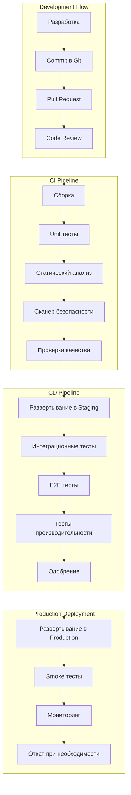

# Архитектура CI/CD для системы автоматизации договоров купли-продажи земли

## Обзор

Документ описывает комплексную архитектуру непрерывной интеграции и непрерывной доставки (CI/CD) для системы автоматизации договоров купли-продажи земли, обеспечивающую автоматизацию процессов разработки, тестирования и развертывания с учетом требований безопасности и комплаенса.

## Принципы CI/CD

### Основные принципы

1. **Автоматизация**: Максимизация автоматизации всех процессов
2. **Быстрая обратная связь**: Немедленное уведомление о проблемах
3. **Качество на каждом этапе**: Встроенные проверки качества
4. **Безопасность по умолчанию**: Интеграция безопасности в конвейер
5. **Отказоустойчивость**: Возможность отката и восстановления
6. **Масштабируемость**: Поддержка роста команды и проекта

### Стратегия развертывания



## Архитектура CI/CD конвейера

### Инфраструктура CI/CD

```yaml
# cicd/infrastructure.yml
AWSTemplateFormatVersion: '2010-09-09'
Description: CI/CD Infrastructure for Land Contracts

Parameters:
  Environment:
    Type: String
    Default: production
    AllowedValues: [development, staging, production]

Resources:
  # CodeCommit репозитории
  BackendRepository:
    Type: AWS::CodeCommit::Repository
    Properties:
      RepositoryName: !Sub 'land-contracts-backend-${Environment}'
      RepositoryDescription: Backend repository for land contracts system
      Code:
        S3: !Ref CodeCommitS3Bucket
        BranchName: main

  FrontendRepository:
    Type: AWS::CodeCommit::Repository
    Properties:
      RepositoryName: !Sub 'land-contracts-frontend-${Environment}'
      RepositoryDescription: Frontend repository for land contracts system
      Code:
        S3: !Ref CodeCommitS3Bucket
        BranchName: main

  # CodeBuild проекты
  BackendBuildProject:
    Type: AWS::CodeBuild::Project
    Properties:
      Name: !Sub 'land-contracts-backend-build-${Environment}'
      Description: Build project for backend
      Source:
        Type: CODECOMMIT
        Location: !GetAtt BackendRepository.CloneUrlHttp
        BuildSpec: buildspec.yml
      Artifacts:
        Type: S3
        Location: !Ref BuildArtifactsBucket
        Name: backend
        Packaging: ZIP
      Environment:
        ComputeType: BUILD_GENERAL1_SMALL
        Image: aws/codebuild/standard:6.0
        Type: LINUX_CONTAINER
        EnvironmentVariables:
          - Name: ENVIRONMENT
            Value: !Ref Environment
          - Name: AWS_DEFAULT_REGION
            Value: !Ref AWS::Region
      ServiceRole: !Ref CodeBuildServiceRole

  FrontendBuildProject:
    Type: AWS::CodeBuild::Project
    Properties:
      Name: !Sub 'land-contracts-frontend-build-${Environment}'
      Description: Build project for frontend
      Source:
        Type: CODECOMMIT
        Location: !GetAtt FrontendRepository.CloneUrlHttp
        BuildSpec: buildspec.yml
      Artifacts:
        Type: S3
        Location: !Ref BuildArtifactsBucket
        Name: frontend
        Packaging: ZIP
      Environment:
        ComputeType: BUILD_GENERAL1_SMALL
        Image: aws/codebuild/standard:6.0
        Type: LINUX_CONTAINER
        EnvironmentVariables:
          - Name: ENVIRONMENT
            Value: !Ref Environment
          - Name: AWS_DEFAULT_REGION
            Value: !Ref AWS::Region
      ServiceRole: !Ref CodeBuildServiceRole

  # CodePipeline конвейеры
  BackendPipeline:
    Type: AWS::CodePipeline::Pipeline
    Properties:
      Name: !Sub 'land-contracts-backend-pipeline-${Environment}'
      RoleArn: !GetAtt CodePipelineServiceRole.Arn
      Stages:
        - Name: Source
          Actions:
            - Name: Source
              ActionTypeId:
                Category: Source
                Owner: AWS
                Provider: CodeCommit
                Version: '1'
              Configuration:
                RepositoryName: !Ref BackendRepository
                BranchName: main
              OutputArtifacts:
                - Name: SourceOutput

        - Name: Build
          Actions:
            - Name: Build
              ActionTypeId:
                Category: Build
                Owner: AWS
                Provider: CodeBuild
                Version: '1'
              Configuration:
                ProjectName: !Ref BackendBuildProject
              InputArtifacts:
                - Name: SourceOutput
              OutputArtifacts:
                - Name: BuildOutput

        - Name: Test
          Actions:
            - Name: UnitTests
              ActionTypeId:
                Category: Test
                Owner: AWS
                Provider: CodeBuild
                Version: '1'
              Configuration:
                ProjectName: !Ref BackendTestProject
              InputArtifacts:
                - Name: BuildOutput

        - Name: Deploy
          Actions:
            - Name: DeployToStaging
              ActionTypeId:
                Category: Deploy
                Owner: AWS
                Provider: CloudFormation
                Version: '1'
              Configuration:
                TemplatePath: BuildOutput::cloudformation.yml
                StackName: !Sub 'land-contracts-backend-staging-${Environment}'
                ParameterOverrides: |
                  {
                    "Environment": "staging"
                  }
              InputArtifacts:
                - Name: BuildOutput
              RoleArn: !GetAtt CloudFormationDeploymentRole.Arn

  # S3 бакеты для артефактов
  BuildArtifactsBucket:
    Type: AWS::S3::Bucket
    Properties:
      BucketName: !Sub 'land-contracts-build-artifacts-${Environment}'
      VersioningConfiguration:
        Status: Enabled
      PublicAccessBlockConfiguration:
        BlockPublicAcls: true
        BlockPublicPolicy: true
        IgnorePublicAcls: true
        RestrictPublicBuckets: true

  CodeCommitS3Bucket:
    Type: AWS::S3::Bucket
    Properties:
      BucketName: !Sub 'land-contracts-codecommit-${Environment}'
      VersioningConfiguration:
        Status: Enabled

  # IAM роли
  CodeBuildServiceRole:
    Type: AWS::IAM::Role
    Properties:
      RoleName: !Sub 'codebuild-service-role-${Environment}'
      AssumeRolePolicyDocument:
        Version: '2012-10-17'
        Statement:
          - Effect: Allow
            Principal:
              Service: codebuild.amazonaws.com
            Action: sts:AssumeRole
      ManagedPolicyArns:
        - arn:aws:iam::aws:policy/AWSCodeBuildDeveloperAccess
        - arn:aws:iam::aws:policy/AmazonS3ReadOnlyAccess

  CodePipelineServiceRole:
    Type: AWS::IAM::Role
    Properties:
      RoleName: !Sub 'codepipeline-service-role-${Environment}'
      AssumeRolePolicyDocument:
        Version: '2012-10-17'
        Statement:
          - Effect: Allow
            Principal:
              Service: codepipeline.amazonaws.com
            Action: sts:AssumeRole
      ManagedPolicyArns:
        - arn:aws:iam::aws:policy/AWSCodePipelineFullAccess
        - arn:aws:iam::aws:policy/AmazonS3FullAccess
        - arn:aws:iam::aws:policy/AWSCodeBuildDeveloperAccess

  CloudFormationDeploymentRole:
    Type: AWS::IAM::Role
    Properties:
      RoleName: !Sub 'cloudformation-deployment-role-${Environment}'
      AssumeRolePolicyDocument:
        Version: '2012-10-17'
        Statement:
          - Effect: Allow
            Principal:
              Service: cloudformation.amazonaws.com
            Action: sts:AssumeRole
      ManagedPolicyArns:
        - arn:aws:iam::aws:policy/AWSCloudFormationFullAccess
        - arn:aws:iam::aws:policy/AmazonEC2FullAccess
        - arn:aws:iam::aws:policy/AmazonECSFullAccess
```

### Конфигурация сборки (buildspec)

```yaml
# backend/buildspec.yml
version: 0.2

env:
  variables:
    PYTHON_VERSION: "3.11"
    NODE_VERSION: "18"
  parameter-store:
    DJANGO_SECRET_KEY: "/land-contracts/production/django-secret-key"
    DATABASE_URL: "/land-contracts/production/database-url"
    REDIS_URL: "/land-contracts/production/redis-url"

phases:
  install:
    runtime-versions:
      python: $PYTHON_VERSION
      nodejs: $NODE_VERSION
    commands:
      - echo "Installing dependencies..."
      - pip install --upgrade pip
      - pip install -r requirements/development.txt
      - npm install -g aws-cdk
      - npm install

  pre_build:
    commands:
      - echo "Running pre-build checks..."
      - python --version
      - node --version
      - aws --version
      - echo "Setting up environment..."
      - export DJANGO_SETTINGS_MODULE=config.settings.production
      - echo "Running static analysis..."
      - flake8 apps/ --count --select=E9,F63,F7,F82 --show-source --statistics
      - flake8 apps/ --count --exit-zero --max-complexity=10 --max-line-length=127 --statistics
      - echo "Running security scan..."
      - bandit -r apps/ -f json -o bandit-report.json
      - safety check --json --output safety-report.json
      - echo "Running type checking..."
      - mypy apps/ --ignore-missing-imports

  build:
    commands:
      - echo "Building application..."
      - echo "Running unit tests..."
      - pytest --cov=apps --cov-report=xml --cov-report=html --junitxml=test-results.xml
      - echo "Building Docker image..."
      - docker build -t land-contracts-backend:$CODEBUILD_RESOLVED_SOURCE_VERSION .
      - echo "Tagging Docker image..."
      - docker tag land-contracts-backend:$CODEBUILD_RESOLVED_SOURCE_VERSION $AWS_ACCOUNT_ID.dkr.ecr.$AWS_DEFAULT_REGION.amazonaws.com/land-contracts-backend:$CODEBUILD_RESOLVED_SOURCE_VERSION
      - docker tag land-contracts-backend:$CODEBUILD_RESOLVED_SOURCE_VERSION $AWS_ACCOUNT_ID.dkr.ecr.$AWS_DEFAULT_REGION.amazonaws.com/land-contracts-backend:latest

  post_build:
    commands:
      - echo "Running post-build tasks..."
      - echo "Logging in to ECR..."
      - aws ecr get-login-password --region $AWS_DEFAULT_REGION | docker login --username AWS --password-stdin $AWS_ACCOUNT_ID.dkr.ecr.$AWS_DEFAULT_REGION.amazonaws.com
      - echo "Pushing Docker image..."
      - docker push $AWS_ACCOUNT_ID.dkr.ecr.$AWS_DEFAULT_REGION.amazonaws.com/land-contracts-backend:$CODEBUILD_RESOLVED_SOURCE_VERSION
      - docker push $AWS_ACCOUNT_ID.dkr.ecr.$AWS_DEFAULT_REGION.amazonaws.com/land-contracts-backend:latest
      - echo "Generating deployment artifacts..."
      - printf '{"ImageURI":"%s"}' $AWS_ACCOUNT_ID.dkr.ecr.$AWS_DEFAULT_REGION.amazonaws.com/land-contracts-backend:$CODEBUILD_RESOLVED_SOURCE_VERSION > imageDetail.json
      - echo "Creating CloudFormation template..."
      - aws cloudformation package \
          --template-file infrastructure/ecs-task-definition.yml \
          --s3-bucket $BUILD_ARTIFACTS_BUCKET \
          --output-template-file packaged-template.yml

artifacts:
  files:
    - packaged-template.yml
    - imageDetail.json
    - test-results.xml
    - coverage.xml
    - bandit-report.json
    - safety-report.json
  discard-paths: yes

cache:
  paths:
    - '/root/.cache/pip'
    - 'node_modules'
```

```yaml
# frontend/buildspec.yml
version: 0.2

env:
  variables:
    NODE_VERSION: "18"
  parameter-store:
    REACT_APP_API_URL: "/land-contracts/production/api-url"
    REACT_APP_ENVIRONMENT: "/land-contracts/production/environment"

phases:
  install:
    runtime-versions:
      nodejs: $NODE_VERSION
    commands:
      - echo "Installing dependencies..."
      - npm ci --silent

  pre_build:
    commands:
      - echo "Running pre-build checks..."
      - node --version
      - npm --version
      - echo "Running linting..."
      - npm run lint -- --format=json --output-file=eslint-report.json
      - echo "Running type checking..."
      - npm run type-check
      - echo "Running security audit..."
      - npm audit --audit-level=high --json > npm-audit.json

  build:
    commands:
      - echo "Building application..."
      - npm run build
      - echo "Running unit tests..."
      - npm run test:unit -- --coverage --watchAll=false --ci --json --outputFile=test-results.json
      - echo "Running integration tests..."
      - npm run test:integration

  post_build:
    commands:
      - echo "Running post-build tasks..."
      - echo "Optimizing build..."
      - npm run optimize
      - echo "Generating deployment artifacts..."
      - tar -czf frontend-build.tar.gz -C build .

artifacts:
  files:
    - frontend-build.tar.gz
    - test-results.json
    - eslint-report.json
    - npm-audit.json
    - coverage/
  discard-paths: yes

cache:
  paths:
    - 'node_modules'
```

## Автоматизация тестирования

### Многоуровневое тестирование

```python
# cicd/test_automation.py
import os
import subprocess
import json
import boto3
from typing import Dict, List, Any
from dataclasses import dataclass
from enum import Enum

class TestType(Enum):
    UNIT = "unit"
    INTEGRATION = "integration"
    E2E = "e2e"
    PERFORMANCE = "performance"
    SECURITY = "security"
    COMPLIANCE = "compliance"

@dataclass
class TestResult:
    test_type: TestType
    passed: bool
    duration: float
    coverage: float
    issues: List[Dict[str, Any]]
    artifacts: List[str]

class TestAutomation:
    """Автоматизация тестирования в CI/CD"""
    
    def __init__(self, config: Dict):
        self.config = config
        self.s3 = boto3.client('s3')
        self.codebuild = boto3.client('codebuild')
        
    def run_test_suite(self, test_type: TestType) -> TestResult:
        """Запуск набора тестов"""
        if test_type == TestType.UNIT:
            return self._run_unit_tests()
        elif test_type == TestType.INTEGRATION:
            return self._run_integration_tests()
        elif test_type == TestType.E2E:
            return self._run_e2e_tests()
        elif test_type == TestType.PERFORMANCE:
            return self._run_performance_tests()
        elif test_type == TestType.SECURITY:
            return self._run_security_tests()
        elif test_type == TestType.COMPLIANCE:
            return self._run_compliance_tests()
        else:
            raise ValueError(f"Unknown test type: {test_type}")
    
    def _run_unit_tests(self) -> TestResult:
        """Запуск unit тестов"""
        try:
            # Запуск pytest
            result = subprocess.run(
                ["pytest", "--cov=apps", "--cov-report=json", "--junitxml=test-results.xml"],
                capture_output=True,
                text=True
            )
            
            # Чтение результатов покрытия
            with open('coverage.json') as f:
                coverage_data = json.load(f)
            
            total_coverage = coverage_data['totals']['percent_covered']
            
            # Чтение результатов тестов
            issues = []
            if result.returncode != 0:
                issues.append({
                    "type": "test_failure",
                    "message": "Some unit tests failed",
                    "details": result.stderr
                })
            
            return TestResult(
                test_type=TestType.UNIT,
                passed=result.returncode == 0,
                duration=float(result.stderr.split('real')[1].split('m')[0].strip()),
                coverage=total_coverage,
                issues=issues,
                artifacts=["test-results.xml", "coverage.json", "htmlcov/"]
            )
            
        except Exception as e:
            return TestResult(
                test_type=TestType.UNIT,
                passed=False,
                duration=0,
                coverage=0,
                issues=[{"type": "error", "message": str(e)}],
                artifacts=[]
            )
    
    def _run_integration_tests(self) -> TestResult:
        """Запуск интеграционных тестов"""
        try:
            # Запуск тестов в Docker контейнерах
            result = subprocess.run(
                ["docker-compose", "-f", "docker-compose.test.yml", "up", "--abort-on-container-exit"],
                capture_output=True,
                text=True
            )
            
            # Сбор логов контейнеров
            subprocess.run(
                ["docker-compose", "-f", "docker-compose.test.yml", "logs"],
                stdout=open("integration-test-logs.txt", "w")
            )
            
            issues = []
            if result.returncode != 0:
                issues.append({
                    "type": "integration_failure",
                    "message": "Integration tests failed",
                    "details": result.stderr
                })
            
            return TestResult(
                test_type=TestType.INTEGRATION,
                passed=result.returncode == 0,
                duration=300,  # 5 минут
                coverage=0,
                issues=issues,
                artifacts=["integration-test-logs.txt"]
            )
            
        except Exception as e:
            return TestResult(
                test_type=TestType.INTEGRATION,
                passed=False,
                duration=0,
                coverage=0,
                issues=[{"type": "error", "message": str(e)}],
                artifacts=[]
            )
    
    def _run_e2e_tests(self) -> TestResult:
        """Запуск E2E тестов"""
        try:
            # Запуск Cypress тестов
            result = subprocess.run(
                ["npm", "run", "test:e2e", "--", "--record", "--key", self.config['cypress_key']],
                capture_output=True,
                text=True
            )
            
            # Чтение результатов
            with open('cypress/results.json') as f:
                cypress_results = json.load(f)
            
            passed_tests = cypress_results['totalPassed']
            total_tests = cypress_results['totalTests']
            coverage = (passed_tests / total_tests) * 100 if total_tests > 0 else 0
            
            issues = []
            if passed_tests < total_tests:
                issues.append({
                    "type": "e2e_failure",
                    "message": f"{total_tests - passed_tests} E2E tests failed",
                    "details": cypress_results
                })
            
            return TestResult(
                test_type=TestType.E2E,
                passed=passed_tests == total_tests,
                duration=cypress_results['totalDuration'],
                coverage=coverage,
                issues=issues,
                artifacts=["cypress/videos/", "cypress/screenshots/"]
            )
            
        except Exception as e:
            return TestResult(
                test_type=TestType.E2E,
                passed=False,
                duration=0,
                coverage=0,
                issues=[{"type": "error", "message": str(e)}],
                artifacts=[]
            )
    
    def _run_performance_tests(self) -> TestResult:
        """Запуск тестов производительности"""
        try:
            # Запуск k6 тестов
            result = subprocess.run(
                ["k6", "run", "--out", "json=performance-results.json", "tests/performance/load-test.js"],
                capture_output=True,
                text=True
            )
            
            # Анализ результатов
            with open('performance-results.json') as f:
                perf_data = json.load(f)
            
            # Проверка пороговых значений
            issues = []
            passed = True
            
            for metric in perf_data['metrics']:
                if 'threshold' in metric:
                    if metric['value'] > metric['threshold']:
                        issues.append({
                            "type": "performance_issue",
                            "message": f"Metric {metric['name']} exceeded threshold",
                            "details": {
                                "value": metric['value'],
                                "threshold": metric['threshold']
                            }
                        })
                        passed = False
            
            return TestResult(
                test_type=TestType.PERFORMANCE,
                passed=passed,
                duration=perf_data['metrics'][0]['value'],  # Общая длительность
                coverage=0,
                issues=issues,
                artifacts=["performance-results.json"]
            )
            
        except Exception as e:
            return TestResult(
                test_type=TestType.PERFORMANCE,
                passed=False,
                duration=0,
                coverage=0,
                issues=[{"type": "error", "message": str(e)}],
                artifacts=[]
            )
    
    def _run_security_tests(self) -> TestResult:
        """Запуск тестов безопасности"""
        try:
            issues = []
            
            # Запуск OWASP ZAP
            zap_result = subprocess.run(
                ["docker", "run", "-t", "owasp/zap2docker-stable", "zap-baseline.py", "-t", self.config['target_url']],
                capture_output=True,
                text=True
            )
            
            # Запуск Nessus
            nessus_result = subprocess.run(
                ["nessus", "--scan", self.config['target_url']],
                capture_output=True,
                text=True
            )
            
            # Анализ результатов
            if zap_result.returncode != 0:
                issues.append({
                    "type": "security_vulnerability",
                    "message": "OWASP ZAP found vulnerabilities",
                    "details": zap_result.stdout
                })
            
            if nessus_result.returncode != 0:
                issues.append({
                    "type": "security_vulnerability",
                    "message": "Nessus found vulnerabilities",
                    "details": nessus_result.stdout
                })
            
            return TestResult(
                test_type=TestType.SECURITY,
                passed=len(issues) == 0,
                duration=600,  # 10 минут
                coverage=0,
                issues=issues,
                artifacts=["zap-report.html", "nessus-report.pdf"]
            )
            
        except Exception as e:
            return TestResult(
                test_type=TestType.SECURITY,
                passed=False,
                duration=0,
                coverage=0,
                issues=[{"type": "error", "message": str(e)}],
                artifacts=[]
            )
    
    def _run_compliance_tests(self) -> TestResult:
        """Запуск комплаенс-тестов"""
        try:
            issues = []
            
            # Проверка соответствия ФЗ-152
            privacy_result = subprocess.run(
                ["python", "tests/compliance/privacy_check.py"],
                capture_output=True,
                text=True
            )
            
            # Проверка соответствия ФЗ-63
            esignature_result = subprocess.run(
                ["python", "tests/compliance/esignature_check.py"],
                capture_output=True,
                text=True
            )
            
            # Анализ результатов
            if privacy_result.returncode != 0:
                issues.append({
                    "type": "compliance_violation",
                    "message": "Privacy compliance check failed",
                    "details": privacy_result.stdout
                })
            
            if esignature_result.returncode != 0:
                issues.append({
                    "type": "compliance_violation",
                    "message": "Electronic signature compliance check failed",
                    "details": esignature_result.stdout
                })
            
            return TestResult(
                test_type=TestType.COMPLIANCE,
                passed=len(issues) == 0,
                duration=300,  # 5 минут
                coverage=0,
                issues=issues,
                artifacts=["privacy-report.json", "esignature-report.json"]
            )
            
        except Exception as e:
            return TestResult(
                test_type=TestType.COMPLIANCE,
                passed=False,
                duration=0,
                coverage=0,
                issues=[{"type": "error", "message": str(e)}],
                artifacts=[]
            )
```

## Стратегии развертывания

### Blue-Green развертывание

```python
# cicd/deployment_strategies.py
import boto3
import time
from typing import Dict, List, Any
from dataclasses import dataclass
from enum import Enum

class DeploymentStrategy(Enum):
    BLUE_GREEN = "blue_green"
    CANARY = "canary"
    ROLLING = "rolling"
    IMMUTABLE = "immutable"

@dataclass
class DeploymentResult:
    strategy: DeploymentStrategy
    success: bool
    duration: float
    old_version: str
    new_version: str
    rollback_available: bool
    issues: List[str]

class DeploymentManager:
    """Менеджер развертывания"""
    
    def __init__(self, config: Dict):
        self.config = config
        self.ecs = boto3.client('ecs')
        self.elbv2 = boto3.client('elbv2')
        self.cloudwatch = boto3.client('cloudwatch')
        
    def deploy(self, strategy: DeploymentStrategy, new_version: str) -> DeploymentResult:
        """Развертывание с указанной стратегией"""
        if strategy == DeploymentStrategy.BLUE_GREEN:
            return self._blue_green_deployment(new_version)
        elif strategy == DeploymentStrategy.CANARY:
            return self._canary_deployment(new_version)
        elif strategy == DeploymentStrategy.ROLLING:
            return self._rolling_deployment(new_version)
        elif strategy == DeploymentStrategy.IMMUTABLE:
            return self._immutable_deployment(new_version)
        else:
            raise ValueError(f"Unknown deployment strategy: {strategy}")
    
    def _blue_green_deployment(self, new_version: str) -> DeploymentResult:
        """Blue-Green развертывание"""
        start_time = time.time()
        issues = []
        
        try:
            # Получение текущей конфигурации
            current_service = self._get_current_service()
            old_version = current_service['task_definition']
            
            # Создание новой задачи (Green)
            green_task_def = self._create_task_definition(new_version)
            
            # Создание нового сервиса (Green)
            green_service = self._create_green_service(green_task_def)
            
            # Ожидание готовности Green
            self._wait_for_service_ready(green_service['serviceArn'])
            
            # Проверка здоровья Green
            health_check = self._health_check(green_service['serviceArn'])
            if not health_check:
                issues.append("Health check failed for green environment")
                self._cleanup_green_service(green_service['serviceArn'])
                return DeploymentResult(
                    strategy=DeploymentStrategy.BLUE_GREEN,
                    success=False,
                    duration=time.time() - start_time,
                    old_version=old_version,
                    new_version=new_version,
                    rollback_available=True,
                    issues=issues
                )
            
            # Переключение трафика на Green
            self._switch_traffic(green_service['serviceArn'])
            
            # Очистка Blue
            self._cleanup_blue_service()
            
            return DeploymentResult(
                strategy=DeploymentStrategy.BLUE_GREEN,
                success=True,
                duration=time.time() - start_time,
                old_version=old_version,
                new_version=new_version,
                rollback_available=True,
                issues=issues
            )
            
        except Exception as e:
            issues.append(str(e))
            return DeploymentResult(
                strategy=DeploymentStrategy.BLUE_GREEN,
                success=False,
                duration=time.time() - start_time,
                old_version=old_version,
                new_version=new_version,
                rollback_available=True,
                issues=issues
            )
    
    def _canary_deployment(self, new_version: str) -> DeploymentResult:
        """Canary развертывание"""
        start_time = time.time()
        issues = []
        
        try:
            current_service = self._get_current_service()
            old_version = current_service['task_definition']
            
            # Создание canary задачи
            canary_task_def = self._create_task_definition(new_version)
            
            # Развертывание 10% трафика на canary
            self._update_service_weights(canary_task_def, 10)
            
            # Ожидание и мониторинг
            time.sleep(300)  # 5 минут
            
            # Проверка метрик
            metrics = self._get_deployment_metrics()
            if metrics['error_rate'] > 0.05:  # 5% порог
                issues.append("High error rate in canary deployment")
                self._rollback_deployment(old_version)
                return DeploymentResult(
                    strategy=DeploymentStrategy.CANARY,
                    success=False,
                    duration=time.time() - start_time,
                    old_version=old_version,
                    new_version=new_version,
                    rollback_available=True,
                    issues=issues
                )
            
            # Постепенное увеличение трафика
            for weight in [25, 50, 75, 100]:
                self._update_service_weights(canary_task_def, weight)
                time.sleep(300)  # 5 минут между шагами
                
                metrics = self._get_deployment_metrics()
                if metrics['error_rate'] > 0.05:
                    issues.append(f"High error rate at {weight}% traffic")
                    self._rollback_deployment(old_version)
                    return DeploymentResult(
                        strategy=DeploymentStrategy.CANARY,
                        success=False,
                        duration=time.time() - start_time,
                        old_version=old_version,
                        new_version=new_version,
                        rollback_available=True,
                        issues=issues
                    )
            
            return DeploymentResult(
                strategy=DeploymentStrategy.CANARY,
                success=True,
                duration=time.time() - start_time,
                old_version=old_version,
                new_version=new_version,
                rollback_available=True,
                issues=issues
            )
            
        except Exception as e:
            issues.append(str(e))
            return DeploymentResult(
                strategy=DeploymentStrategy.CANARY,
                success=False,
                duration=time.time() - start_time,
                old_version=old_version,
                new_version=new_version,
                rollback_available=True,
                issues=issues
            )
    
    def _rolling_deployment(self, new_version: str) -> DeploymentResult:
        """Rolling развертывание"""
        start_time = time.time()
        issues = []
        
        try:
            current_service = self._get_current_service()
            old_version = current_service['task_definition']
            
            # Создание новой задачи
            new_task_def = self._create_task_definition(new_version)
            
            # Обновление сервиса с rolling стратегией
            self._update_service(
                service_arn=current_service['serviceArn'],
                task_definition=new_task_def,
                deployment_configuration={
                    'deploymentCircuitBreaker': {
                        'enable': True,
                        'rollback': True
                    },
                    'minimumHealthyPercent': 50,
                    'maximumPercent': 200
                }
            )
            
            # Ожидание завершения развертывания
            self._wait_for_deployment_complete(current_service['serviceArn'])
            
            # Проверка здоровья
            health_check = self._health_check(current_service['serviceArn'])
            if not health_check:
                issues.append("Health check failed after rolling deployment")
                self._rollback_deployment(old_version)
                return DeploymentResult(
                    strategy=DeploymentStrategy.ROLLING,
                    success=False,
                    duration=time.time() - start_time,
                    old_version=old_version,
                    new_version=new_version,
                    rollback_available=True,
                    issues=issues
                )
            
            return DeploymentResult(
                strategy=DeploymentStrategy.ROLLING,
                success=True,
                duration=time.time() - start_time,
                old_version=old_version,
                new_version=new_version,
                rollback_available=True,
                issues=issues
            )
            
        except Exception as e:
            issues.append(str(e))
            return DeploymentResult(
                strategy=DeploymentStrategy.ROLLING,
                success=False,
                duration=time.time() - start_time,
                old_version=old_version,
                new_version=new_version,
                rollback_available=True,
                issues=issues
            )
    
    def _immutable_deployment(self, new_version: str) -> DeploymentResult:
        """Immutable развертывание"""
        start_time = time.time()
        issues = []
        
        try:
            current_service = self._get_current_service()
            old_version = current_service['task_definition']
            
            # Создание новой задачи
            new_task_def = self._create_task_definition(new_version)
            
            # Создание нового сервиса с новой задачей
            new_service = self._create_immutable_service(new_task_def)
            
            # Ожидание готовности нового сервиса
            self._wait_for_service_ready(new_service['serviceArn'])
            
            # Проверка здоровья
            health_check = self._health_check(new_service['serviceArn'])
            if not health_check:
                issues.append("Health check failed for immutable deployment")
                self._cleanup_immutable_service(new_service['serviceArn'])
                return DeploymentResult(
                    strategy=DeploymentStrategy.IMMUTABLE,
                    success=False,
                    duration=time.time() - start_time,
                    old_version=old_version,
                    new_version=new_version,
                    rollback_available=True,
                    issues=issues
                )
            
            # Переключение трафика
            self._switch_traffic(new_service['serviceArn'])
            
            # Удаление старого сервиса
            self._cleanup_old_service(current_service['serviceArn'])
            
            return DeploymentResult(
                strategy=DeploymentStrategy.IMMUTABLE,
                success=True,
                duration=time.time() - start_time,
                old_version=old_version,
                new_version=new_version,
                rollback_available=True,
                issues=issues
            )
            
        except Exception as e:
            issues.append(str(e))
            return DeploymentResult(
                strategy=DeploymentStrategy.IMMUTABLE,
                success=False,
                duration=time.time() - start_time,
                old_version=old_version,
                new_version=new_version,
                rollback_available=True,
                issues=issues
            )
```

## Мониторинг и оповещения

### Мониторинг CI/CD конвейера

```python
# cicd/monitoring.py
import boto3
import json
from datetime import datetime, timedelta
from typing import Dict, List, Any

class CICDMonitor:
    """Мониторинг CI/CD конвейера"""
    
    def __init__(self, config: Dict):
        self.config = config
        self.codepipeline = boto3.client('codepipeline')
        self.codebuild = boto3.client('codebuild')
        self.cloudwatch = boto3.client('cloudwatch')
        self.sns = boto3.client('sns')
        
    def monitor_pipeline_health(self) -> Dict:
        """Мониторинг здоровья конвейера"""
        health_status = {
            'overall_status': 'healthy',
            'pipelines': {},
            'builds': {},
            'alerts': []
        }
        
        # Проверка статуса пайплайнов
        pipelines = self._get_all_pipelines()
        for pipeline in pipelines:
            pipeline_status = self._get_pipeline_status(pipeline['name'])
            health_status['pipelines'][pipeline['name']] = pipeline_status
            
            if pipeline_status['status'] == 'failed':
                health_status['overall_status'] = 'unhealthy'
                health_status['alerts'].append({
                    'type': 'pipeline_failure',
                    'pipeline': pipeline['name'],
                    'message': f"Pipeline {pipeline['name']} failed"
                })
        
        # Проверка статуса билдов
        builds = self._get_recent_builds()
        for build in builds:
            build_status = self._get_build_status(build['id'])
            health_status['builds'][build['id']] = build_status
            
            if build_status['status'] == 'failed':
                health_status['overall_status'] = 'unhealthy'
                health_status['alerts'].append({
                    'type': 'build_failure',
                    'build': build['id'],
                    'message': f"Build {build['id']} failed"
                })
        
        # Отправка метрик в CloudWatch
        self._send_metrics_to_cloudwatch(health_status)
        
        # Отправка оповещений при необходимости
        if health_status['overall_status'] == 'unhealthy':
            self._send_alerts(health_status['alerts'])
        
        return health_status
    
    def _get_all_pipelines(self) -> List[Dict]:
        """Получение всех пайплайнов"""
        response = self.codepipeline.list_pipelines()
        return response['pipelines']
    
    def _get_pipeline_status(self, pipeline_name: str) -> Dict:
        """Получение статуса пайплайна"""
        try:
            response = self.codepipeline.get_pipeline_state(name=pipeline_name)
            
            latest_execution = None
            for stage in response['stageStates']:
                if stage['latestExecution']:
                    if not latest_execution or stage['latestExecution']['lastStatusChangeAt'] > latest_execution['lastStatusChangeAt']:
                        latest_execution = stage['latestExecution']
            
            return {
                'status': latest_execution['status'] if latest_execution else 'unknown',
                'last_updated': latest_execution['lastStatusChangeAt'].isoformat() if latest_execution else None,
                'error_message': latest_execution.get('error', '') if latest_execution else ''
            }
            
        except Exception as e:
            return {
                'status': 'error',
                'error_message': str(e)
            }
    
    def _get_recent_builds(self) -> List[Dict]:
        """Получение недавних билдов"""
        response = self.codebuild.list_builds(sortOrder='DESCENDING')
        build_ids = response['ids'][:10]  # Последние 10 билдов
        
        builds = []
        for build_id in build_ids:
            builds.append({'id': build_id})
        
        return builds
    
    def _get_build_status(self, build_id: str) -> Dict:
        """Получение статуса билда"""
        try:
            response = self.codebuild.batch_get_builds(ids=[build_id])
            build = response['builds'][0]
            
            return {
                'status': build['buildStatus'],
                'start_time': build['startTime'].isoformat(),
                'end_time': build.get('endTime', {}).isoformat() if build.get('endTime') else None,
                'duration': (build['endTime'] - build['startTime']).total_seconds() if build.get('endTime') else None,
                'error_message': build.get('logs', {}).get('groupName', '')
            }
            
        except Exception as e:
            return {
                'status': 'error',
                'error_message': str(e)
            }
    
    def _send_metrics_to_cloudwatch(self, health_status: Dict):
        """Отправка метрик в CloudWatch"""
        timestamp = datetime.now()
        
        # Метрики пайплайнов
        for pipeline_name, pipeline_status in health_status['pipelines'].items():
            status_value = 1 if pipeline_status['status'] == 'succeeded' else 0
            
            self.cloudwatch.put_metric_data(
                Namespace='LandContracts/CI/CD',
                MetricData=[
                    {
                        'MetricName': 'PipelineStatus',
                        'Dimensions': [
                            {
                                'Name': 'PipelineName',
                                'Value': pipeline_name
                            }
                        ],
                        'Value': status_value,
                        'Unit': 'None',
                        'Timestamp': timestamp
                    }
                ]
            )
        
        # Метрики билдов
        for build_id, build_status in health_status['builds'].items():
            status_value = 1 if build_status['status'] == 'succeeded' else 0
            
            self.cloudwatch.put_metric_data(
                Namespace='LandContracts/CI/CD',
                MetricData=[
                    {
                        'MetricName': 'BuildStatus',
                        'Dimensions': [
                            {
                                'Name': 'BuildId',
                                'Value': build_id
                            }
                        ],
                        'Value': status_value,
                        'Unit': 'None',
                        'Timestamp': timestamp
                    }
                ]
            )
            
            if build_status['duration']:
                self.cloudwatch.put_metric_data(
                    Namespace='LandContracts/CI/CD',
                    MetricData=[
                        {
                            'MetricName': 'BuildDuration',
                            'Dimensions': [
                                {
                                    'Name': 'BuildId',
                                    'Value': build_id
                                }
                            ],
                            'Value': build_status['duration'],
                            'Unit': 'Seconds',
                            'Timestamp': timestamp
                        }
                    ]
                )
    
    def _send_alerts(self, alerts: List[Dict]):
        """Отправка оповещений"""
        for alert in alerts:
            message = {
                'alert_type': alert['type'],
                'message': alert['message'],
                'timestamp': datetime.now().isoformat(),
                'details': alert
            }
            
            self.sns.publish(
                TopicArn=self.config['alert_topic_arn'],
                Subject=f"CI/CD Alert: {alert['type']}",
                Message=json.dumps(message)
            )
```

## Заключение

Комплексная архитектура CI/CD обеспечивает автоматизацию всех этапов разработки, тестирования и развертывания системы автоматизации договоров купли-продажи земли. Многоуровневое тестирование, различные стратегии развертывания и непрерывный мониторинг гарантируют высокое качество и надежность поставляемого программного обеспечения.