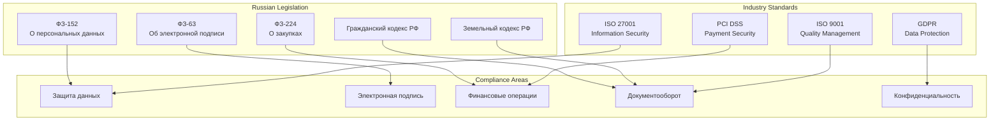
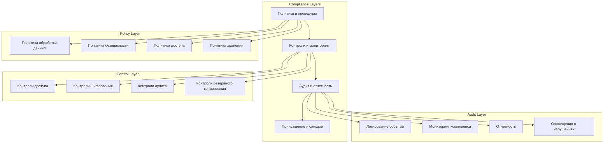

# Фреймворк комплаенса и аудита для системы автоматизации договоров купли-продажи земли

## Обзор

Документ описывает комплексный фреймворк комплаенса и аудита для системы автоматизации договоров купли-продажи земли, обеспечивающий соответствие российскому законодательству, отраслевым стандартам и лучшим практикам корпоративного управления.

## Регуляторные требования

### Основные законодательные акты



### Требования ФЗ-152 "О персональных данных"

| Требование | Реализация в системе | Ответственный |
|------------|---------------------|--------------|
| Согласие на обработку ПДн | Формы согласия при регистрации | Юридический отдел |
| Обработка по минимизации | Сбор только необходимых данных | Руководитель продукта |
| Хранение в зашифрованном виде | Шифрование AES-256 | CISO |
| Уничтожение по истечении срока | Автоматическое удаление через 10 лет | CISO |
| Предоставление копии ПДн | Функция экспорта данных пользователя | Руководитель продукта |

### Требования ФЗ-63 "Об электронной подписи"

| Требование | Реализация в системе | Ответственный |
|------------|---------------------|--------------|
| Использование усиленной ЭП | Интеграция с CryptoPro | Технический директор |
| Проверка действительности ЭП | Валидация сертификатов | CISO |
| Хранение ЭП в защищенном виде | Шифрованное хранилище | CISO |
| Юридическая значимость | Создание электронного документа | Юридический отдел |
| Время создания ЭП | Привязка к доверенному времени | Технический директор |

## Архитектура комплаенса

### Многоуровневая модель комплаенса



## Система аудита

### Архитектура аудита

```python
# audit/audit_system.py
import json
import hashlib
from datetime import datetime
from typing import Dict, List, Any, Optional
from dataclasses import dataclass, asdict
from enum import Enum
import boto3
from botocore.exceptions import ClientError

class AuditEventType(Enum):
    USER_LOGIN = "user_login"
    USER_LOGOUT = "user_logout"
    DATA_ACCESS = "data_access"
    DATA_MODIFICATION = "data_modification"
    DOCUMENT_CREATE = "document_create"
    DOCUMENT_SIGN = "document_sign"
    CONTRACT_CREATE = "contract_create"
    CONTRACT_MODIFY = "contract_modify"
    PERMISSION_CHANGE = "permission_change"
    SYSTEM_CONFIG_CHANGE = "system_config_change"
    SECURITY_EVENT = "security_event"
    COMPLIANCE_VIOLATION = "compliance_violation"

class AuditSeverity(Enum):
    LOW = "low"
    MEDIUM = "medium"
    HIGH = "high"
    CRITICAL = "critical"

@dataclass
class AuditEvent:
    event_id: str
    event_type: AuditEventType
    severity: AuditSeverity
    timestamp: datetime
    user_id: Optional[str]
    user_email: Optional[str]
    ip_address: Optional[str]
    user_agent: Optional[str]
    resource_id: Optional[str]
    resource_type: Optional[str]
    action: str
    details: Dict[str, Any]
    outcome: str  # success, failure, error
    session_id: Optional[str]
    correlation_id: Optional[str]
    
    def to_dict(self) -> Dict:
        """Преобразование в словарь для хранения"""
        data = asdict(self)
        data['timestamp'] = self.timestamp.isoformat()
        data['event_type'] = self.event_type.value
        data['severity'] = self.severity.value
        return data
    
    def calculate_hash(self) -> str:
        """Расчет хеша события для обеспечения целостности"""
        event_data = self.to_dict()
        event_string = json.dumps(event_data, sort_keys=True)
        return hashlib.sha256(event_string.encode()).hexdigest()

class AuditManager:
    """Менеджер аудита"""
    
    def __init__(self, config: Dict):
        self.config = config
        self.kms = boto3.client('kms')
        self.s3 = boto3.client('s3')
        self.dynamodb = boto3.resource('dynamodb')
        self.audit_table = self.dynamodb.Table(config['audit_table_name'])
        
    def log_event(self, event: AuditEvent) -> bool:
        """Логирование события аудита"""
        try:
            # Расчет хеша для обеспечения целостности
            event_hash = event.calculate_hash()
            
            # Шифрование чувствительных данных
            encrypted_details = self._encrypt_sensitive_data(event.details)
            
            # Подготовка записи для хранения
            audit_record = {
                'event_id': event.event_id,
                'event_type': event.event_type.value,
                'severity': event.severity.value,
                'timestamp': event.timestamp.isoformat(),
                'user_id': event.user_id,
                'user_email': event.user_email,
                'ip_address': event.ip_address,
                'user_agent': event.user_agent,
                'resource_id': event.resource_id,
                'resource_type': event.resource_type,
                'action': event.action,
                'details': encrypted_details,
                'outcome': event.outcome,
                'session_id': event.session_id,
                'correlation_id': event.correlation_id,
                'event_hash': event_hash,
                'created_at': datetime.now().isoformat()
            }
            
            # Сохранение в DynamoDB
            self.audit_table.put_item(Item=audit_record)
            
            # Сохранение в S3 для долгосрочного хранения
            self._store_to_s3(audit_record)
            
            # Проверка на комплаенс-нарушения
            self._check_compliance_violations(event)
            
            return True
            
        except Exception as e:
            # Логирование ошибки аудита
            self._log_audit_error(event, str(e))
            return False
    
    def _encrypt_sensitive_data(self, data: Dict[str, Any]) -> Dict[str, Any]:
        """Шифрование чувствительных данных"""
        sensitive_fields = ['email', 'phone', 'passport', 'inn', 'snils']
        encrypted_data = data.copy()
        
        for field in sensitive_fields:
            if field in encrypted_data:
                value = str(encrypted_data[field])
                encrypted_data[field] = self._encrypt_value(value)
        
        return encrypted_data
    
    def _encrypt_value(self, value: str) -> str:
        """Шифрование значения"""
        try:
            response = self.kms.encrypt(
                KeyId=self.config['kms_key_id'],
                Plaintext=value.encode()
            )
            return response['CiphertextBlob'].hex()
        except ClientError as e:
            raise Exception(f"Encryption failed: {e}")
    
    def _store_to_s3(self, audit_record: Dict):
        """Сохранение записи в S3"""
        try:
            bucket_name = self.config['s3_audit_bucket']
            # Создание пути по дате
            date_path = datetime.now().strftime('year=%Y/month=%m/day=%d')
            key = f"audit-events/{date_path}/{audit_record['event_id']}.json"
            
            self.s3.put_object(
                Bucket=bucket_name,
                Key=key,
                Body=json.dumps(audit_record),
                ServerSideEncryption='aws:kms',
                SSEKMSKeyId=self.config['kms_key_id']
            )
        except ClientError as e:
            raise Exception(f"S3 storage failed: {e}")
    
    def _check_compliance_violations(self, event: AuditEvent):
        """Проверка на комплаенс-нарушения"""
        violations = []
        
        # Проверка доступа к данным вне рабочего времени
        if self._is_after_hours(event.timestamp):
            violations.append({
                'type': 'after_hours_access',
                'description': 'Access outside business hours',
                'severity': 'medium'
            })
        
        # Проверка множественных неудачных попыток входа
        if event.event_type == AuditEventType.USER_LOGIN and event.outcome == 'failure':
            recent_failures = self._count_recent_failures(event.user_id, event.ip_address)
            if recent_failures >= 5:
                violations.append({
                    'type': 'multiple_failed_logins',
                    'description': 'Multiple failed login attempts',
                    'severity': 'high'
                })
        
        # Проверка доступа к чувствительным данным
        if event.resource_type in ['user_profile', 'contract', 'document']:
            if not self._has_permission(event.user_id, event.action, event.resource_id):
                violations.append({
                    'type': 'unauthorized_access',
                    'description': 'Unauthorized access attempt',
                    'severity': 'critical'
                })
        
        # Сохранение нарушений
        for violation in violations:
            self._log_compliance_violation(event, violation)
    
    def _is_after_hours(self, timestamp: datetime) -> bool:
        """Проверка, находится ли время вне рабочих часов"""
        hour = timestamp.hour
        return hour < 9 or hour > 18
    
    def _count_recent_failures(self, user_id: str, ip_address: str) -> int:
        """Подсчет недавних неудачных попыток"""
        # Реализация подсчета неудачных попыток за последний час
        pass
    
    def _has_permission(self, user_id: str, action: str, resource_id: str) -> bool:
        """Проверка разрешений пользователя"""
        # Реализация проверки разрешений
        pass
    
    def _log_compliance_violation(self, event: AuditEvent, violation: Dict):
        """Логирование комплаенс-нарушения"""
        violation_event = AuditEvent(
            event_id=f"violation_{datetime.now().timestamp()}",
            event_type=AuditEventType.COMPLIANCE_VIOLATION,
            severity=AuditSeverity(violation['severity']),
            timestamp=datetime.now(),
            user_id=event.user_id,
            user_email=event.user_email,
            ip_address=event.ip_address,
            resource_id=event.resource_id,
            resource_type=event.resource_type,
            action="compliance_violation",
            details={
                'original_event': event.event_id,
                'violation_type': violation['type'],
                'description': violation['description']
            },
            outcome="detected",
            session_id=event.session_id,
            correlation_id=event.correlation_id
        )
        
        self.log_event(violation_event)
    
    def get_audit_trail(
        self,
        user_id: Optional[str] = None,
        resource_id: Optional[str] = None,
        event_type: Optional[AuditEventType] = None,
        start_date: Optional[datetime] = None,
        end_date: Optional[datetime] = None
    ) -> List[Dict]:
        """Получение аудиторского следа"""
        try:
            # Формирование фильтров
            filter_expression = []
            expression_values = {}
            
            if user_id:
                filter_expression.append("user_id = :user_id")
                expression_values[':user_id'] = user_id
            
            if resource_id:
                filter_expression.append("resource_id = :resource_id")
                expression_values[':resource_id'] = resource_id
            
            if event_type:
                filter_expression.append("event_type = :event_type")
                expression_values[':event_type'] = event_type.value
            
            if start_date:
                filter_expression.append("timestamp >= :start_date")
                expression_values[':start_date'] = start_date.isoformat()
            
            if end_date:
                filter_expression.append("timestamp <= :end_date")
                expression_values[':end_date'] = end_date.isoformat()
            
            # Выполнение запроса
            if filter_expression:
                response = self.audit_table.scan(
                    FilterExpression=' AND '.join(filter_expression),
                    ExpressionAttributeValues=expression_values
                )
            else:
                response = self.audit_table.scan()
            
            return response.get('Items', [])
            
        except ClientError as e:
            raise Exception(f"Audit trail retrieval failed: {e}")
    
    def generate_compliance_report(
        self,
        report_type: str,
        start_date: datetime,
        end_date: datetime
    ) -> Dict:
        """Генерация комплаенс-отчета"""
        try:
            if report_type == 'data_access':
                return self._generate_data_access_report(start_date, end_date)
            elif report_type == 'user_activity':
                return self._generate_user_activity_report(start_date, end_date)
            elif report_type == 'security_events':
                return self._generate_security_events_report(start_date, end_date)
            elif report_type == 'compliance_violations':
                return self._generate_violations_report(start_date, end_date)
            else:
                raise ValueError(f"Unknown report type: {report_type}")
                
        except Exception as e:
            raise Exception(f"Report generation failed: {e}")
```

### Мониторинг комплаенса в реальном времени

```python
# compliance/compliance_monitor.py
import asyncio
import logging
from datetime import datetime, timedelta
from typing import Dict, List, Any
from dataclasses import dataclass
import boto3
from botocore.exceptions import ClientError

@dataclass
class ComplianceRule:
    rule_id: str
    name: str
    description: str
    severity: str
    enabled: bool
    check_interval: int  # в секундах
    conditions: Dict[str, Any]
    actions: List[str]

class ComplianceMonitor:
    """Мониторинг комплаенса в реальном времени"""
    
    def __init__(self, config: Dict):
        self.config = config
        self.logger = logging.getLogger(__name__)
        self.cloudwatch = boto3.client('cloudwatch')
        self.sns = boto3.client('sns')
        self.rules = self._load_compliance_rules()
        self.running = False
        
    def _load_compliance_rules(self) -> List[ComplianceRule]:
        """Загрузка правил комплаенса"""
        return [
            ComplianceRule(
                rule_id="data_retention",
                name="Data Retention Policy",
                description="Check if data retention policies are followed",
                severity="medium",
                enabled=True,
                check_interval=3600,  # 1 час
                conditions={
                    "max_retention_days": 3650,  # 10 лет
                    "data_types": ["personal_data", "contracts", "documents"]
                },
                actions=["alert", "report"]
            ),
            ComplianceRule(
                rule_id="access_control",
                name="Access Control Violation",
                description="Detect unauthorized access attempts",
                severity="high",
                enabled=True,
                check_interval=300,  # 5 минут
                conditions={
                    "max_failed_attempts": 5,
                    "time_window": 300  # 5 минут
                },
                actions=["alert", "block_user"]
            ),
            ComplianceRule(
                rule_id="encryption_compliance",
                name="Encryption Compliance",
                description="Verify data encryption requirements",
                severity="critical",
                enabled=True,
                check_interval=1800,  # 30 минут
                conditions={
                    "required_encryption": "AES-256",
                    "data_at_rest": True,
                    "data_in_transit": True
                },
                actions=["alert", "encrypt_data"]
            ),
            ComplianceRule(
                rule_id="audit_trail_integrity",
                name="Audit Trail Integrity",
                description="Verify audit trail integrity",
                severity="high",
                enabled=True,
                check_interval=600,  # 10 минут
                conditions={
                    "hash_verification": True,
                    "tamper_detection": True
                },
                actions=["alert", "backup_audit"]
            )
        ]
    
    async def start_monitoring(self):
        """Запуск мониторинга"""
        self.running = True
        self.logger.info("Compliance monitoring started")
        
        tasks = []
        for rule in self.rules:
            if rule.enabled:
                task = asyncio.create_task(
                    self._monitor_rule(rule)
                )
                tasks.append(task)
        
        await asyncio.gather(*tasks)
    
    async def stop_monitoring(self):
        """Остановка мониторинга"""
        self.running = False
        self.logger.info("Compliance monitoring stopped")
    
    async def _monitor_rule(self, rule: ComplianceRule):
        """Мониторинг конкретного правила"""
        while self.running:
            try:
                # Выполнение проверки правила
                violations = await self._check_rule(rule)
                
                # Обработка нарушений
                if violations:
                    await self._handle_violations(rule, violations)
                
                # Отправка метрик
                await self._send_metrics(rule, len(violations))
                
                # Ожидание следующей проверки
                await asyncio.sleep(rule.check_interval)
                
            except Exception as e:
                self.logger.error(f"Error monitoring rule {rule.rule_id}: {e}")
                await asyncio.sleep(rule.check_interval)
    
    async def _check_rule(self, rule: ComplianceRule) -> List[Dict]:
        """Проверка правила"""
        if rule.rule_id == "data_retention":
            return await self._check_data_retention(rule.conditions)
        elif rule.rule_id == "access_control":
            return await self._check_access_control(rule.conditions)
        elif rule.rule_id == "encryption_compliance":
            return await self._check_encryption_compliance(rule.conditions)
        elif rule.rule_id == "audit_trail_integrity":
            return await self._check_audit_trail_integrity(rule.conditions)
        else:
            return []
    
    async def _check_data_retention(self, conditions: Dict) -> List[Dict]:
        """Проверка политики хранения данных"""
        violations = []
        max_retention_days = conditions["max_retention_days"]
        cutoff_date = datetime.now() - timedelta(days=max_retention_days)
        
        # Проверка различных типов данных
        for data_type in conditions["data_types"]:
            # Логика проверки срока хранения
            old_records = await self._find_old_data(data_type, cutoff_date)
            
            if old_records:
                violations.append({
                    "rule_id": "data_retention",
                    "data_type": data_type,
                    "violation_type": "exceeded_retention_period",
                    "affected_records": len(old_records),
                    "cutoff_date": cutoff_date.isoformat()
                })
        
        return violations
    
    async def _check_access_control(self, conditions: Dict) -> List[Dict]:
        """Проверка контролей доступа"""
        violations = []
        max_failed_attempts = conditions["max_failed_attempts"]
        time_window = conditions["time_window"]
        
        # Поиск множественных неудачных попыток
        suspicious_activities = await self._find_suspicious_activities(
            max_failed_attempts,
            time_window
        )
        
        for activity in suspicious_activities:
            violations.append({
                "rule_id": "access_control",
                "violation_type": "multiple_failed_attempts",
                "user_id": activity["user_id"],
                "ip_address": activity["ip_address"],
                "failed_attempts": activity["failed_attempts"],
                "time_window": time_window
            })
        
        return violations
    
    async def _check_encryption_compliance(self, conditions: Dict) -> List[Dict]:
        """Проверка соответствия шифрования"""
        violations = []
        
        # Проверка шифрования данных в покое
        if conditions["data_at_rest"]:
            unencrypted_data = await self._find_unencrypted_data_at_rest()
            if unencrypted_data:
                violations.append({
                    "rule_id": "encryption_compliance",
                    "violation_type": "unencrypted_data_at_rest",
                    "affected_resources": len(unencrypted_data)
                })
        
        # Проверка шифрования данных при передаче
        if conditions["data_in_transit"]:
            unencrypted_connections = await self._find_unencrypted_connections()
            if unencrypted_connections:
                violations.append({
                    "rule_id": "encryption_compliance",
                    "violation_type": "unencrypted_data_in_transit",
                    "affected_connections": len(unencrypted_connections)
                })
        
        return violations
    
    async def _check_audit_trail_integrity(self, conditions: Dict) -> List[Dict]:
        """Проверка целостности аудиторского следа"""
        violations = []
        
        if conditions["hash_verification"]:
            # Проверка хешей событий аудита
            tampered_events = await self._verify_audit_hashes()
            if tampered_events:
                violations.append({
                    "rule_id": "audit_trail_integrity",
                    "violation_type": "tampered_audit_events",
                    "affected_events": len(tampered_events)
                })
        
        if conditions["tamper_detection"]:
            # Проверка на признаки вмешательства
            tampering_indicators = await self._detect_tampering()
            if tampering_indicators:
                violations.append({
                    "rule_id": "audit_trail_integrity",
                    "violation_type": "tampering_detected",
                    "indicators": tampering_indicators
                })
        
        return violations
    
    async def _handle_violations(self, rule: ComplianceRule, violations: List[Dict]):
        """Обработка нарушений"""
        for violation in violations:
            # Логирование нарушения
            self.logger.warning(f"Compliance violation detected: {violation}")
            
            # Выполнение действий
            for action in rule.actions:
                if action == "alert":
                    await self._send_alert(rule, violation)
                elif action == "report":
                    await self._create_violation_report(rule, violation)
                elif action == "block_user":
                    await self._block_user(violation.get("user_id"))
                elif action == "encrypt_data":
                    await self._encrypt_unencrypted_data(violation)
                elif action == "backup_audit":
                    await self._backup_audit_trail()
    
    async def _send_alert(self, rule: ComplianceRule, violation: Dict):
        """Отправка оповещения о нарушении"""
        try:
            message = {
                "rule_id": rule.rule_id,
                "rule_name": rule.name,
                "severity": rule.severity,
                "violation": violation,
                "timestamp": datetime.now().isoformat()
            }
            
            # Отправка в SNS
            self.sns.publish(
                TopicArn=self.config['compliance_alert_topic'],
                Subject=f"Compliance Violation: {rule.name}",
                Message=json.dumps(message)
            )
            
            # Отправка метрики в CloudWatch
            self.cloudwatch.put_metric_data(
                Namespace='LandContracts/Compliance',
                MetricData=[
                    {
                        'MetricName': 'ComplianceViolations',
                        'Dimensions': [
                            {
                                'Name': 'RuleId',
                                'Value': rule.rule_id
                            },
                            {
                                'Name': 'Severity',
                                'Value': rule.severity
                            }
                        ],
                        'Value': 1,
                        'Unit': 'Count',
                        'Timestamp': datetime.now()
                    }
                ]
            )
            
        except ClientError as e:
            self.logger.error(f"Failed to send alert: {e}")
```

## Управление рисками

### Матрица рисков

```yaml
# risk_management/risk_matrix.yml
risk_matrix:
  categories:
    operational:
      description: Операционные риски
      risks:
        - id: OP001
          name: Потеря данных
          probability: medium
          impact: high
          mitigation: Резервное копирование, шифрование
          owner: CISO
          
        - id: OP002
          name: Несанкционированный доступ
          probability: medium
          impact: high
          mitigation: Многофакторная аутентификация, RBAC
          owner: CISO
          
        - id: OP003
          name: Ошибки в процессах
          probability: high
          impact: medium
          mitigation: Автоматизация, обучение
          owner: COO
          
    compliance:
      description: Комплаенс-риски
      risks:
        - id: CP001
          name: Нарушение ФЗ-152
          probability: medium
          impact: high
          mitigation: Политики, мониторинг, аудит
          owner: CISO
          
        - id: CP002
          name: Недействительная ЭП
          probability: low
          impact: high
          mitigation: Валидация сертификатов, проверка ЦС
          owner: CTO
          
        - id: CP003
          name: Нарушение сроков хранения
          probability: medium
          impact: medium
          mitigation: Автоматическое удаление, мониторинг
          owner: CISO
          
    financial:
      description: Финансовые риски
      risks:
        - id: FN001
          name: Мошенничество
          probability: medium
          impact: high
          mitigation: Проверка пользователей, мониторинг транзакций
          owner: CFO
          
        - id: FN002
          name: Штрафы регуляторов
          probability: low
          impact: high
          mitigation: Комплаенс-программа, аудит
          owner: CLO
          
    technical:
      description: Технические риски
      risks:
        - id: TC001
          name: Отказ системы
          probability: medium
          impact: high
          mitigation: High availability, DR план
          owner: CTO
          
        - id: TC002
          name: Уязвимости безопасности
          probability: high
          impact: medium
          mitigation: Сканирование, патчи, WAF
          owner: CISO
```

### Процесс управления рисками

```python
# risk_management/risk_manager.py
from dataclasses import dataclass
from typing import Dict, List, Any, Optional
from datetime import datetime, timedelta
import json

@dataclass
class Risk:
    risk_id: str
    category: str
    name: str
    description: str
    probability: str  # low, medium, high
    impact: str  # low, medium, high
    risk_score: float
    mitigation: List[str]
    owner: str
    status: str  # open, mitigated, accepted, transferred
    created_at: datetime
    updated_at: datetime
    review_date: datetime

class RiskManager:
    """Менеджер рисков"""
    
    def __init__(self, config: Dict):
        self.config = config
        self.risks = self._load_risks()
        
    def _load_risks(self) -> Dict[str, Risk]:
        """Загрузка реестра рисков"""
        # Загрузка из конфигурации или базы данных
        pass
    
    def calculate_risk_score(self, probability: str, impact: str) -> float:
        """Расчет оценки риска"""
        probability_scores = {'low': 1, 'medium': 2, 'high': 3}
        impact_scores = {'low': 1, 'medium': 2, 'high': 3}
        
        return probability_scores[probability] * impact_scores[impact]
    
    def assess_new_risk(
        self,
        category: str,
        name: str,
        description: str,
        probability: str,
        impact: str,
        mitigation: List[str],
        owner: str
    ) -> Risk:
        """Оценка нового риска"""
        risk_score = self.calculate_risk_score(probability, impact)
        
        risk = Risk(
            risk_id=f"RISK_{datetime.now().timestamp()}",
            category=category,
            name=name,
            description=description,
            probability=probability,
            impact=impact,
            risk_score=risk_score,
            mitigation=mitigation,
            owner=owner,
            status='open',
            created_at=datetime.now(),
            updated_at=datetime.now(),
            review_date=datetime.now() + timedelta(days=90)
        )
        
        self.risks[risk.risk_id] = risk
        return risk
    
    def update_risk_status(
        self,
        risk_id: str,
        status: str,
        notes: Optional[str] = None
    ) -> bool:
        """Обновление статуса риска"""
        if risk_id not in self.risks:
            return False
        
        risk = self.risks[risk_id]
        risk.status = status
        risk.updated_at = datetime.now()
        
        # Логирование изменения статуса
        self._log_risk_status_change(risk, notes)
        
        return True
    
    def get_risk_report(self) -> Dict:
        """Получение отчета по рискам"""
        total_risks = len(self.risks)
        open_risks = len([r for r in self.risks.values() if r.status == 'open'])
        mitigated_risks = len([r for r in self.risks.values() if r.status == 'mitigated'])
        
        high_risks = [r for r in self.risks.values() if r.risk_score >= 6]
        medium_risks = [r for r in self.risks.values() if 3 <= r.risk_score < 6]
        low_risks = [r for r in self.risks.values() if r.risk_score < 3]
        
        return {
            'summary': {
                'total_risks': total_risks,
                'open_risks': open_risks,
                'mitigated_risks': mitigated_risks,
                'high_risks': len(high_risks),
                'medium_risks': len(medium_risks),
                'low_risks': len(low_risks)
            },
            'high_priority_risks': [
                {
                    'risk_id': r.risk_id,
                    'name': r.name,
                    'risk_score': r.risk_score,
                    'owner': r.owner
                }
                for r in high_risks if r.status == 'open'
            ],
            'overdue_reviews': [
                {
                    'risk_id': r.risk_id,
                    'name': r.name,
                    'review_date': r.review_date.isoformat(),
                    'owner': r.owner
                }
                for r in self.risks.values()
                if r.review_date < datetime.now() and r.status == 'open'
            ]
        }
```

## Отчетность и документация

### Автоматическая генерация отчетов

```python
# reporting/compliance_reports.py
import json
from datetime import datetime, timedelta
from typing import Dict, List, Any
import boto3
from botocore.exceptions import ClientError

class ComplianceReportGenerator:
    """Генератор комплаенс-отчетов"""
    
    def __init__(self, config: Dict):
        self.config = config
        self.s3 = boto3.client('s3')
        self.ses = boto3.client('ses')
        
    def generate_monthly_compliance_report(self) -> Dict:
        """Генерация ежемесячного комплаенс-отчета"""
        end_date = datetime.now()
        start_date = end_date - timedelta(days=30)
        
        report = {
            'report_type': 'monthly_compliance',
            'period': {
                'start_date': start_date.isoformat(),
                'end_date': end_date.isoformat()
            },
            'generated_at': end_date.isoformat(),
            'sections': {}
        }
        
        # Раздел 1: Обзор комплаенса
        report['sections']['overview'] = self._generate_overview_section(start_date, end_date)
        
        # Раздел 2: Анализ рисков
        report['sections']['risk_analysis'] = self._generate_risk_analysis_section(start_date, end_date)
        
        # Раздел 3: Инциденты безопасности
        report['sections']['security_incidents'] = self._generate_security_incidents_section(start_date, end_date)
        
        # Раздел 4: Аудит доступа
        report['sections']['access_audit'] = self._generate_access_audit_section(start_date, end_date)
        
        # Раздел 5: Обучение и осведомленность
        report['sections']['training_awareness'] = self._generate_training_section(start_date, end_date)
        
        # Раздел 6: Рекомендации
        report['sections']['recommendations'] = self._generate_recommendations_section(report)
        
        # Сохранение отчета
        self._save_report(report)
        
        # Отправка отчета заинтересованным сторонам
        self._distribute_report(report)
        
        return report
    
    def _generate_overview_section(self, start_date: datetime, end_date: datetime) -> Dict:
        """Генерация раздела обзора"""
        return {
            'compliance_score': self._calculate_compliance_score(start_date, end_date),
            'key_metrics': {
                'total_audit_events': self._count_audit_events(start_date, end_date),
                'compliance_violations': self._count_violations(start_date, end_date),
                'resolved_violations': self._count_resolved_violations(start_date, end_date),
                'user_training_completion': self._calculate_training_completion()
            },
            'regulatory_changes': self._get_regulatory_changes(start_date, end_date)
        }
    
    def _generate_risk_analysis_section(self, start_date: datetime, end_date: datetime) -> Dict:
        """Генерация раздела анализа рисков"""
        return {
            'risk_trends': self._analyze_risk_trends(start_date, end_date),
            'top_risks': self._get_top_risks(),
            'risk_mitigation_status': self._get_mitigation_status(),
            'emerging_risks': self._identify_emerging_risks()
        }
    
    def _generate_security_incidents_section(self, start_date: datetime, end_date: datetime) -> Dict:
        """Генерация раздела инцидентов безопасности"""
        return {
            'incident_summary': self._summarize_incidents(start_date, end_date),
            'incident_trends': self._analyze_incident_trends(start_date, end_date),
            'response_times': self._analyze_response_times(start_date, end_date),
            'lessons_learned': self._extract_lessons_learned(start_date, end_date)
        }
    
    def _generate_access_audit_section(self, start_date: datetime, end_date: datetime) -> Dict:
        """Генерация раздела аудита доступа"""
        return {
            'access_patterns': self._analyze_access_patterns(start_date, end_date),
            'privilege_escalations': self._detect_privilege_escalations(start_date, end_date),
            'unusual_activities': self._identify_unusual_activities(start_date, end_date),
            'access_review_status': self._get_access_review_status()
        }
    
    def _generate_training_section(self, start_date: datetime, end_date: datetime) -> Dict:
        """Генерация раздела обучения"""
        return {
            'training_completion_rates': self._get_training_completion_rates(),
            'training_effectiveness': self._assess_training_effectiveness(),
            'awareness_campaigns': self._summarize_awareness_campaigns(start_date, end_date),
            'upcoming_training': self._get_upcoming_training()
        }
    
    def _generate_recommendations_section(self, report: Dict) -> List[Dict]:
        """Генерация раздела рекомендаций"""
        recommendations = []
        
        # Анализ данных отчета и формирование рекомендаций
        if report['sections']['overview']['key_metrics']['compliance_violations'] > 10:
            recommendations.append({
                'priority': 'high',
                'category': 'compliance',
                'description': 'Увеличить количество комплаенс-нарушений требует немедленного внимания',
                'action_items': [
                    'Провести расследование причин нарушений',
                    'Усилить мониторинг комплаенса',
                    'Дополнительное обучение персонала'
                ],
                'deadline': (datetime.now() + timedelta(days=30)).isoformat()
            })
        
        return recommendations
    
    def _save_report(self, report: Dict):
        """Сохранение отчета"""
        try:
            bucket_name = self.config['reports_bucket']
            report_date = datetime.now().strftime('%Y-%m')
            report_key = f"compliance-reports/monthly/{report_date}/report.json"
            
            self.s3.put_object(
                Bucket=bucket_name,
                Key=report_key,
                Body=json.dumps(report, indent=2),
                ServerSideEncryption='AES256'
            )
            
            # Генерация PDF версии
            pdf_key = report_key.replace('.json', '.pdf')
            pdf_content = self._generate_pdf_report(report)
            
            self.s3.put_object(
                Bucket=bucket_name,
                Key=pdf_key,
                Body=pdf_content,
                ServerSideEncryption='AES256'
            )
            
        except ClientError as e:
            raise Exception(f"Failed to save report: {e}")
    
    def _distribute_report(self, report: Dict):
        """Распространение отчета"""
        try:
            # Формирование email
            subject = f"Ежемесячный комплаенс-отчет за {report['period']['start_date'][:7]}"
            
            # Получение списка получателей
            recipients = self._get_report_recipients()
            
            # Отправка отчета
            for recipient in recipients:
                self.ses.send_email(
                    Source=self.config['from_email'],
                    Destination={'ToAddresses': [recipient]},
                    Message={
                        'Subject': {'Data': subject},
                        'Body': {
                            'Html': {
                                'Data': self._generate_email_body(report)
                            }
                        }
                    }
                )
                
        except ClientError as e:
            raise Exception(f"Failed to distribute report: {e}")
```

## Заключение

Комплексный фреймворк комплаенса и аудита обеспечивает соответствие системы автоматизации договоров купли-продажи земли требованиям российского законодательства и международным стандартам. Автоматизированный мониторинг, детальное логирование, управление рисками и регулярная отчетность создают надежную основу для обеспечения комплаенса и минимизации рисков.