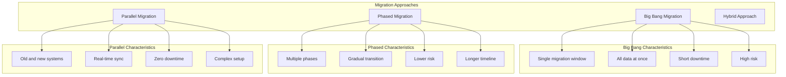

# Стратегия миграции и резервного копирования данных для системы автоматизации договоров купли-продажи земли

## Обзор

Документ описывает комплексную стратегию миграции и резервного копирования данных для системы автоматизации договоров купли-продажи земли, обеспечивающую целостность, безопасность и доступность данных на всех этапах жизненного цикла системы.

## Цели стратегии

1. **Целостность данных**: Обеспечение полной сохранности данных при миграции
2. **Минимизация простоя**: Сокращение времени простоя системы до минимума
3. **Безопасность**: Защита данных при передаче и хранении
4. **Соответствие требованиям**: Выполнение требований ФЗ-152 и других регуляторных норм
5. **Откатимость**: Возможность отката миграции в случае проблем
6. **Масштабируемость**: Поддержка роста объемов данных

## Классификация данных

### Типы данных

| Тип данных | Критичность | Требования к миграции | Требования к бэкапу |
|------------|-------------|----------------------|-------------------|
| Персональные данные | Критическая | Шифрование, валидация | Ежедневное, шифрование |
| Договоры | Критическая | Транзакционность, целостность | Ежедневное, версионирование |
| Земельные участки | Высокая | Валидация, проверка дубликатов | Ежедневное |
| Документы | Высокая | Сохранение метаданных | Ежедневное, инкрементное |
| Финансовые данные | Критическая | Точность, аудит | Ежедневное, долгосрочное |
| Логирование | Средняя | Сохранение последовательности | Еженедельное |
| Конфигурация | Средняя | Версионирование | При изменениях |

### Категории хранения

```yaml
# data/storage-categories.yml
storage_categories:
  hot_storage:
    description: Данные с частым доступом
    retention: 30 дней
    storage_class: standard
    examples:
      - Активные договоры
      - Текущие пользователи
      - Операции за последний месяц
    
  warm_storage:
    description: Данные с редким доступом
    retention: 1 год
    storage_class: infrequent_access
    examples:
      - Завершенные договоры
      - Архивные пользователи
      - Операции за последний год
    
  cold_storage:
    description: Данные для долгосрочного хранения
    retention: 7 лет
    storage_class: glacier
    examples:
      - Исторические договоры
      - Аудитные логи
      - Удаленные данные
    
  archive_storage:
    description: Данные для юридического хранения
    retention: 10 лет
    storage_class: glacier_deep_archive
    examples:
      - Удаленные персональные данные
      - Исторические документы
      - Комплаенс-данные
```

## Стратегия миграции данных

### Подходы к миграции



### План миграции по фазам

```python
# migration/migration_plan.py
from dataclasses import dataclass
from typing import List, Dict, Optional
from enum import Enum
import asyncio
import logging

class MigrationPhase(Enum):
    PREPARATION = "preparation"
    SCHEMA_MIGRATION = "schema_migration"
    DATA_MIGRATION = "data_migration"
    VALIDATION = "validation"
    CUTOVER = "cutover"
    POST_MIGRATION = "post_migration"

@dataclass
class MigrationStep:
    name: str
    phase: MigrationPhase
    description: str
    estimated_duration: int  # в минутах
    dependencies: List[str]
    rollback_available: bool
    validation_required: bool

class DataMigrationPlan:
    def __init__(self):
        self.steps = self._define_migration_steps()
        self.logger = logging.getLogger(__name__)
    
    def _define_migration_steps(self) -> List[MigrationStep]:
        """Определение шагов миграции"""
        return [
            # Фаза подготовки
            MigrationStep(
                name="backup_current_data",
                phase=MigrationPhase.PREPARATION,
                description="Создание полной резервной копии текущих данных",
                estimated_duration=120,
                dependencies=[],
                rollback_available=True,
                validation_required=True
            ),
            MigrationStep(
                name="prepare_target_environment",
                phase=MigrationPhase.PREPARATION,
                description="Подготовка целевой инфраструктуры",
                estimated_duration=60,
                dependencies=[],
                rollback_available=True,
                validation_required=True
            ),
            MigrationStep(
                name="validate_source_data",
                phase=MigrationPhase.PREPARATION,
                description="Валидация исходных данных",
                estimated_duration=90,
                dependencies=[],
                rollback_available=True,
                validation_required=True
            ),
            
            # Фаза миграции схемы
            MigrationStep(
                name="migrate_database_schema",
                phase=MigrationPhase.SCHEMA_MIGRATION,
                description="Миграция схемы базы данных",
                estimated_duration=45,
                dependencies=["backup_current_data", "prepare_target_environment"],
                rollback_available=True,
                validation_required=True
            ),
            
            # Фаза миграции данных
            MigrationStep(
                name="migrate_static_data",
                phase=MigrationPhase.DATA_MIGRATION,
                description="Миграция статических данных (справочники)",
                estimated_duration=30,
                dependencies=["migrate_database_schema"],
                rollback_available=True,
                validation_required=True
            ),
            MigrationStep(
                name="migrate_user_data",
                phase=MigrationPhase.DATA_MIGRATION,
                description="Миграция данных пользователей",
                estimated_duration=60,
                dependencies=["migrate_static_data"],
                rollback_available=True,
                validation_required=True
            ),
            MigrationStep(
                name="migrate_contracts",
                phase=MigrationPhase.DATA_MIGRATION,
                description="Миграция договоров",
                estimated_duration=180,
                dependencies=["migrate_user_data"],
                rollback_available=True,
                validation_required=True
            ),
            MigrationStep(
                name="migrate_documents",
                phase=MigrationPhase.DATA_MIGRATION,
                description="Миграция документов и файлов",
                estimated_duration=240,
                dependencies=["migrate_contracts"],
                rollback_available=True,
                validation_required=True
            ),
            
            # Фаза валидации
            MigrationStep(
                name="validate_migrated_data",
                phase=MigrationPhase.VALIDATION,
                description="Валидация перенесенных данных",
                estimated_duration=120,
                dependencies=["migrate_documents"],
                rollback_available=False,
                validation_required=True
            ),
            MigrationStep(
                name="performance_testing",
                phase=MigrationPhase.VALIDATION,
                description="Тестирование производительности",
                estimated_duration=90,
                dependencies=["validate_migrated_data"],
                rollback_available=False,
                validation_required=True
            ),
            
            # Фаза переключения
            MigrationStep(
                name="final_data_sync",
                phase=MigrationPhase.CUTOVER,
                description="Финальная синхронизация данных",
                estimated_duration=30,
                dependencies=["performance_testing"],
                rollback_available=True,
                validation_required=True
            ),
            MigrationStep(
                name="switch_traffic",
                phase=MigrationPhase.CUTOVER,
                description="Переключение трафика на новую систему",
                estimated_duration=15,
                dependencies=["final_data_sync"],
                rollback_available=True,
                validation_required=True
            ),
            
            # Пост-миграционная фаза
            MigrationStep(
                name="monitor_system",
                phase=MigrationPhase.POST_MIGRATION,
                description="Мониторинг системы после миграции",
                estimated_duration=1440,  # 24 часа
                dependencies=["switch_traffic"],
                rollback_available=False,
                validation_required=True
            ),
            MigrationStep(
                name="cleanup_old_system",
                phase=MigrationPhase.POST_MIGRATION,
                description="Очистка старой системы",
                estimated_duration=60,
                dependencies=["monitor_system"],
                rollback_available=False,
                validation_required=True
            )
        ]
    
    def get_migration_timeline(self) -> Dict:
        """Расчет временной шкалы миграции"""
        timeline = {}
        current_time = 0
        
        for step in self.steps:
            # Проверка зависимостей
            dependencies_met = all(
                dep in timeline for dep in step.dependencies
            )
            
            if dependencies_met:
                timeline[step.name] = {
                    'start_time': current_time,
                    'end_time': current_time + step.estimated_duration,
                    'phase': step.phase.value,
                    'duration': step.estimated_duration
                }
                current_time += step.estimated_duration
        
        return timeline
    
    def get_critical_path(self) -> List[str]:
        """Определение критического пути миграции"""
        # Упрощенный алгоритм для определения критического пути
        critical_steps = []
        
        for step in self.steps:
            if step.phase in [
                MigrationPhase.SCHEMA_MIGRATION,
                MigrationPhase.DATA_MIGRATION,
                MigrationPhase.CUTOVER
            ]:
                critical_steps.append(step.name)
        
        return critical_steps
```

### Инструменты миграции

```python
# migration/migration_tools.py
import asyncio
import hashlib
import json
import logging
from typing import Dict, List, Any, Optional
from dataclasses import dataclass
from datetime import datetime
import psycopg2
from psycopg2.extras import execute_values
import boto3
from botocore.exceptions import ClientError

@dataclass
class MigrationResult:
    success: bool
    records_processed: int
    errors: List[str]
    duration: float
    checksum: Optional[str] = None

class DatabaseMigrator:
    """Инструмент для миграции данных базы данных"""
    
    def __init__(self, source_config: Dict, target_config: Dict):
        self.source_config = source_config
        self.target_config = target_config
        self.logger = logging.getLogger(__name__)
        self.source_conn = None
        self.target_conn = None
    
    def __enter__(self):
        self.source_conn = psycopg2.connect(**self.source_config)
        self.target_conn = psycopg2.connect(**self.target_config)
        return self
    
    def __exit__(self, exc_type, exc_val, exc_tb):
        if self.source_conn:
            self.source_conn.close()
        if self.target_conn:
            self.target_conn.close()
    
    def migrate_table(
        self,
        table_name: str,
        batch_size: int = 1000,
        transform_func: Optional[callable] = None
    ) -> MigrationResult:
        """Миграция данных таблицы"""
        start_time = datetime.now()
        errors = []
        records_processed = 0
        
        try:
            with self.source_conn.cursor() as source_cursor:
                with self.target_conn.cursor() as target_cursor:
                    # Получение данных из исходной таблицы
                    source_cursor.execute(f"SELECT * FROM {table_name}")
                    
                    while True:
                        rows = source_cursor.fetchmany(batch_size)
                        if not rows:
                            break
                        
                        # Преобразование данных если необходимо
                        if transform_func:
                            rows = [transform_func(row) for row in rows]
                        
                        # Вставка данных в целевую таблицу
                        columns = [desc[0] for desc in source_cursor.description]
                        insert_query = f"""
                            INSERT INTO {table_name} ({', '.join(columns)})
                            VALUES %s
                            ON CONFLICT DO NOTHING
                        """
                        
                        execute_values(target_cursor, insert_query, rows)
                        self.target_conn.commit()
                        
                        records_processed += len(rows)
                        self.logger.info(f"Migrated {records_processed} records from {table_name}")
            
            # Расчет контрольной суммы
            checksum = self._calculate_table_checksum(table_name)
            
            duration = (datetime.now() - start_time).total_seconds()
            
            return MigrationResult(
                success=True,
                records_processed=records_processed,
                errors=errors,
                duration=duration,
                checksum=checksum
            )
            
        except Exception as e:
            self.target_conn.rollback()
            errors.append(str(e))
            duration = (datetime.now() - start_time).total_seconds()
            
            return MigrationResult(
                success=False,
                records_processed=records_processed,
                errors=errors,
                duration=duration
            )
    
    def _calculate_table_checksum(self, table_name: str) -> str:
        """Расчет контрольной суммы таблицы"""
        with self.target_conn.cursor() as cursor:
            cursor.execute(f"""
                SELECT md5(string_agg(row::text, ',' ORDER BY id))
                FROM (
                    SELECT * FROM {table_name}
                ) row
            """)
            result = cursor.fetchone()
            return result[0] if result else None
    
    def validate_migration(self, table_name: str) -> bool:
        """Валидация результатов миграции"""
        try:
            with self.source_conn.cursor() as source_cursor:
                with self.target_conn.cursor() as target_cursor:
                    # Сравнение количества записей
                    source_cursor.execute(f"SELECT COUNT(*) FROM {table_name}")
                    source_count = source_cursor.fetchone()[0]
                    
                    target_cursor.execute(f"SELECT COUNT(*) FROM {table_name}")
                    target_count = target_cursor.fetchone()[0]
                    
                    if source_count != target_count:
                        self.logger.error(
                            f"Count mismatch for {table_name}: "
                            f"source={source_count}, target={target_count}"
                        )
                        return False
                    
                    # Сравнение контрольных сумм
                    source_checksum = self._calculate_source_checksum(table_name)
                    target_checksum = self._calculate_table_checksum(table_name)
                    
                    if source_checksum != target_checksum:
                        self.logger.error(
                            f"Checksum mismatch for {table_name}: "
                            f"source={source_checksum}, target={target_checksum}"
                        )
                        return False
            
            return True
            
        except Exception as e:
            self.logger.error(f"Validation error for {table_name}: {e}")
            return False
    
    def _calculate_source_checksum(self, table_name: str) -> str:
        """Расчет контрольной суммы исходной таблицы"""
        with self.source_conn.cursor() as cursor:
            cursor.execute(f"""
                SELECT md5(string_agg(row::text, ',' ORDER BY id))
                FROM (
                    SELECT * FROM {table_name}
                ) row
            """)
            result = cursor.fetchone()
            return result[0] if result else None

class FileMigrator:
    """Инструмент для миграции файлов"""
    
    def __init__(self, source_bucket: str, target_bucket: str):
        self.source_bucket = source_bucket
        self.target_bucket = target_bucket
        self.s3 = boto3.client('s3')
        self.logger = logging.getLogger(__name__)
    
    async def migrate_files(
        self,
        prefix: str = "",
        batch_size: int = 10,
        preserve_metadata: bool = True
    ) -> MigrationResult:
        """Миграция файлов"""
        start_time = datetime.now()
        errors = []
        files_processed = 0
        
        try:
            # Получение списка файлов
            paginator = self.s3.get_paginator('list_objects_v2')
            pages = paginator.paginate(Bucket=self.source_bucket, Prefix=prefix)
            
            batch = []
            
            for page in pages:
                if 'Contents' in page:
                    for obj in page['Contents']:
                        batch.append(obj['Key'])
                        
                        if len(batch) >= batch_size:
                            result = await self._migrate_file_batch(
                                batch, preserve_metadata
                            )
                            files_processed += result['processed']
                            errors.extend(result['errors'])
                            batch = []
            
            # Обработка последнего батча
            if batch:
                result = await self._migrate_file_batch(batch, preserve_metadata)
                files_processed += result['processed']
                errors.extend(result['errors'])
            
            duration = (datetime.now() - start_time).total_seconds()
            
            return MigrationResult(
                success=len(errors) == 0,
                records_processed=files_processed,
                errors=errors,
                duration=duration
            )
            
        except Exception as e:
            errors.append(str(e))
            duration = (datetime.now() - start_time).total_seconds()
            
            return MigrationResult(
                success=False,
                records_processed=files_processed,
                errors=errors,
                duration=duration
            )
    
    async def _migrate_file_batch(
        self,
        file_keys: List[str],
        preserve_metadata: bool
    ) -> Dict:
        """Миграция батча файлов"""
        processed = 0
        errors = []
        
        for file_key in file_keys:
            try:
                # Копирование файла
                copy_source = {
                    'Bucket': self.source_bucket,
                    'Key': file_key
                }
                
                extra_args = {}
                if preserve_metadata:
                    # Получение метаданных
                    metadata = self.s3.head_object(
                        Bucket=self.source_bucket,
                        Key=file_key
                    )
                    extra_args['Metadata'] = metadata.get('Metadata', {})
                    extra_args['ContentType'] = metadata.get('ContentType')
                    extra_args['StorageClass'] = metadata.get('StorageClass', 'STANDARD')
                
                self.s3.copy_object(
                    CopySource=copy_source,
                    Bucket=self.target_bucket,
                    Key=file_key,
                    ExtraArgs=extra_args
                )
                
                processed += 1
                
            except ClientError as e:
                errors.append(f"Error copying {file_key}: {e}")
                self.logger.error(f"Error copying {file_key}: {e}")
        
        return {
            'processed': processed,
            'errors': errors
        }
```

## Стратегия резервного копирования

### Политика резервного копирования

```yaml
# backup/backup-policy.yml
backup_policy:
  database_backups:
    full_backups:
      schedule: "0 2 * * *"  # Ежедневно в 2:00
      retention: 30 дней
      storage_class: standard
      encryption: true
      
    incremental_backups:
      schedule: "0 */4 * * *"  # Каждые 4 часа
      retention: 7 дней
      storage_class: standard
      encryption: true
      
    transaction_log_backups:
      schedule: "*/15 * * * *"  # Каждые 15 минут
      retention: 2 дня
      storage_class: standard
      encryption: true
      
    weekly_backups:
      schedule: "0 3 * * 0"  # Еженедельно в воскресенье в 3:00
      retention: 90 дней
      storage_class: infrequent_access
      encryption: true
      
    monthly_backups:
      schedule: "0 4 1 * *"  # Ежемесячно 1-го числа в 4:00
      retention: 1 год
      storage_class: glacier
      encryption: true
      
  file_backups:
    documents:
      schedule: "0 1 * * *"  # Ежедневно в 1:00
      retention: 30 дней
      storage_class: standard
      encryption: true
      
    user_files:
      schedule: "0 3 * * 0"  # Еженедельно в воскресенье в 3:00
      retention: 90 дней
      storage_class: infrequent_access
      encryption: true
      
    system_files:
      schedule: "0 5 1 * *"  # Ежемесячно 1-го числа в 5:00
      retention: 1 год
      storage_class: glacier
      encryption: true
      
  application_backups:
    configuration:
      schedule: "0 6 * * *"  # Ежедневно в 6:00
      retention: 30 дней
      storage_class: standard
      encryption: true
      
    logs:
      schedule: "0 7 * * *"  # Ежедневно в 7:00
      retention: 90 дней
      storage_class: infrequent_access
      encryption: false
```

### Автоматизация резервного копирования

```python
# backup/backup_manager.py
import os
import subprocess
import gzip
import shutil
from datetime import datetime, timedelta
from typing import Dict, List, Optional
import boto3
from botocore.exceptions import ClientError
import logging
import json

class BackupManager:
    """Менеджер резервного копирования"""
    
    def __init__(self, config: Dict):
        self.config = config
        self.logger = logging.getLogger(__name__)
        self.s3 = boto3.client('s3')
        
    def create_database_backup(self, backup_type: str = 'full') -> Dict:
        """Создание резервной копии базы данных"""
        timestamp = datetime.now().strftime('%Y%m%d_%H%M%S')
        backup_filename = f"db_backup_{backup_type}_{timestamp}.sql"
        backup_path = f"/tmp/{backup_filename}"
        
        try:
            # Создание дампа базы данных
            self._create_database_dump(backup_path, backup_type)
            
            # Сжатие файла
            compressed_path = f"{backup_path}.gz"
            self._compress_file(backup_path, compressed_path)
            
            # Загрузка в S3
            s3_key = f"database/{backup_type}/{backup_filename}.gz"
            self._upload_to_s3(compressed_path, s3_key)
            
            # Удаление временных файлов
            os.remove(backup_path)
            os.remove(compressed_path)
            
            # Запись метаданных
            metadata = {
                'backup_type': backup_type,
                'created_at': datetime.now().isoformat(),
                'size': os.path.getsize(compressed_path),
                'checksum': self._calculate_file_checksum(compressed_path)
            }
            
            self._save_backup_metadata(s3_key, metadata)
            
            self.logger.info(f"Database backup created: {s3_key}")
            
            return {
                'success': True,
                'backup_key': s3_key,
                'metadata': metadata
            }
            
        except Exception as e:
            self.logger.error(f"Database backup failed: {e}")
            return {
                'success': False,
                'error': str(e)
            }
    
    def _create_database_dump(self, backup_path: str, backup_type: str):
        """Создание дампа базы данных"""
        db_config = self.config['database']
        
        if backup_type == 'full':
            command = [
                'pg_dump',
                f"--host={db_config['host']}",
                f"--port={db_config['port']}",
                f"--username={db_config['username']}",
                f"--dbname={db_config['database']}",
                '--no-password',
                '--verbose',
                '--clean',
                '--if-exists',
                '--format=custom',
                f"--file={backup_path}"
            ]
        elif backup_type == 'incremental':
            # Для инкрементальных бэкапов используем WAL-E или pgBackRest
            command = [
                'pg_basebackup',
                f"--host={db_config['host']}",
                f"--port={db_config['port']}",
                f"--username={db_config['username']}",
                f"--dbname={db_config['database']}",
                '--no-password',
                '--verbose',
                '--format=tar',
                '--gzip',
                f"--pgdata={backup_path}"
            ]
        else:
            raise ValueError(f"Unsupported backup type: {backup_type}")
        
        # Установка переменной окружения для пароля
        env = os.environ.copy()
        env['PGPASSWORD'] = db_config['password']
        
        result = subprocess.run(
            command,
            env=env,
            capture_output=True,
            text=True
        )
        
        if result.returncode != 0:
            raise Exception(f"Database dump failed: {result.stderr}")
    
    def _compress_file(self, source_path: str, target_path: str):
        """Сжатие файла"""
        with open(source_path, 'rb') as f_in:
            with gzip.open(target_path, 'wb') as f_out:
                shutil.copyfileobj(f_in, f_out)
    
    def _upload_to_s3(self, file_path: str, s3_key: str):
        """Загрузка файла в S3"""
        bucket_name = self.config['s3']['backup_bucket']
        
        self.s3.upload_file(
            file_path,
            bucket_name,
            s3_key,
            ExtraArgs={
                'ServerSideEncryption': 'AES256',
                'StorageClass': 'STANDARD'
            }
        )
    
    def _calculate_file_checksum(self, file_path: str) -> str:
        """Расчет контрольной суммы файла"""
        hash_md5 = hashlib.md5()
        
        with open(file_path, "rb") as f:
            for chunk in iter(lambda: f.read(4096), b""):
                hash_md5.update(chunk)
        
        return hash_md5.hexdigest()
    
    def _save_backup_metadata(self, s3_key: str, metadata: Dict):
        """Сохранение метаданных бэкапа"""
        bucket_name = self.config['s3']['backup_bucket']
        metadata_key = f"{s3_key}.metadata"
        
        self.s3.put_object(
            Bucket=bucket_name,
            Key=metadata_key,
            Body=json.dumps(metadata, indent=2),
            ServerSideEncryption='AES256'
        )
    
    def restore_database_backup(self, backup_key: str, target_db: str) -> Dict:
        """Восстановление базы данных из резервной копии"""
        try:
            # Скачивание бэкапа
            backup_path = f"/tmp/{os.path.basename(backup_key)}"
            self._download_from_s3(backup_key, backup_path)
            
            # Распаковка
            if backup_path.endswith('.gz'):
                uncompressed_path = backup_path[:-3]
                self._decompress_file(backup_path, uncompressed_path)
            else:
                uncompressed_path = backup_path
            
            # Восстановление базы данных
            self._restore_database_dump(uncompressed_path, target_db)
            
            # Очистка
            os.remove(backup_path)
            if backup_path.endswith('.gz'):
                os.remove(uncompressed_path)
            
            self.logger.info(f"Database restored from: {backup_key}")
            
            return {
                'success': True,
                'restored_from': backup_key,
                'target_database': target_db
            }
            
        except Exception as e:
            self.logger.error(f"Database restore failed: {e}")
            return {
                'success': False,
                'error': str(e)
            }
    
    def _download_from_s3(self, s3_key: str, local_path: str):
        """Скачивание файла из S3"""
        bucket_name = self.config['s3']['backup_bucket']
        
        self.s3.download_file(bucket_name, s3_key, local_path)
    
    def _decompress_file(self, source_path: str, target_path: str):
        """Распаковка файла"""
        with gzip.open(source_path, 'rb') as f_in:
            with open(target_path, 'wb') as f_out:
                shutil.copyfileobj(f_in, f_out)
    
    def _restore_database_dump(self, backup_path: str, target_db: str):
        """Восстановление дампа базы данных"""
        db_config = self.config['database']
        
        command = [
            'pg_restore',
            f"--host={db_config['host']}",
            f"--port={db_config['port']}",
            f"--username={db_config['username']}",
            f"--dbname={target_db}",
            '--no-password',
            '--verbose',
            '--clean',
            '--if-exists',
            backup_path
        ]
        
        env = os.environ.copy()
        env['PGPASSWORD'] = db_config['password']
        
        result = subprocess.run(
            command,
            env=env,
            capture_output=True,
            text=True
        )
        
        if result.returncode != 0:
            raise Exception(f"Database restore failed: {result.stderr}")
    
    def cleanup_old_backups(self):
        """Очистка старых резервных копий"""
        try:
            bucket_name = self.config['s3']['backup_bucket']
            
            # Очистка старых полных бэкапов
            self._cleanup_backups_by_type(
                bucket_name,
                'database/full/',
                timedelta(days=30)
            )
            
            # Очистка старых инкрементальных бэкапов
            self._cleanup_backups_by_type(
                bucket_name,
                'database/incremental/',
                timedelta(days=7)
            )
            
            # Очистка старых бэкапов документов
            self._cleanup_backups_by_type(
                bucket_name,
                'documents/',
                timedelta(days=30)
            )
            
            self.logger.info("Old backups cleaned up successfully")
            
        except Exception as e:
            self.logger.error(f"Backup cleanup failed: {e}")
    
    def _cleanup_backups_by_type(
        self,
        bucket_name: str,
        prefix: str,
        retention_period: timedelta
    ):
        """Очистка бэкапов по типу"""
        cutoff_date = datetime.now() - retention_period
        
        paginator = self.s3.get_paginator('list_objects_v2')
        pages = paginator.paginate(Bucket=bucket_name, Prefix=prefix)
        
        objects_to_delete = []
        
        for page in pages:
            if 'Contents' in page:
                for obj in page['Contents']:
                    if obj['LastModified'].replace(tzinfo=None) < cutoff_date:
                        objects_to_delete.append({'Key': obj['Key']})
        
        if objects_to_delete:
            self.s3.delete_objects(
                Bucket=bucket_name,
                Delete={'Objects': objects_to_delete}
            )
            
            self.logger.info(f"Deleted {len(objects_to_delete)} old backups from {prefix}")
```

### Мониторинг резервного копирования

```python
# backup/backup_monitoring.py
import boto3
from datetime import datetime, timedelta
from typing import Dict, List
import logging

class BackupMonitor:
    """Мониторинг резервного копирования"""
    
    def __init__(self, config: Dict):
        self.config = config
        self.logger = logging.getLogger(__name__)
        self.s3 = boto3.client('s3')
        self.cloudwatch = boto3.client('cloudwatch')
    
    def check_backup_status(self) -> Dict:
        """Проверка статуса резервного копирования"""
        status = {
            'overall_status': 'healthy',
            'issues': [],
            'metrics': {}
        }
        
        # Проверка полных бэкапов
        full_backup_status = self._check_backup_type('database/full/', hours=24)
        status['metrics']['full_backups'] = full_backup_status
        
        if not full_backup_status['recent_backup_exists']:
            status['overall_status'] = 'warning'
            status['issues'].append('No recent full backup found')
        
        # Проверка инкрементальных бэкапов
        incremental_backup_status = self._check_backup_type('database/incremental/', hours=4)
        status['metrics']['incremental_backups'] = incremental_backup_status
        
        if not incremental_backup_status['recent_backup_exists']:
            status['overall_status'] = 'warning'
            status['issues'].append('No recent incremental backup found')
        
        # Проверка бэкапов документов
        document_backup_status = self._check_backup_type('documents/', hours=24)
        status['metrics']['document_backups'] = document_backup_status
        
        if not document_backup_status['recent_backup_exists']:
            status['overall_status'] = 'warning'
            status['issues'].append('No recent document backup found')
        
        # Отправка метрик в CloudWatch
        self._send_metrics_to_cloudwatch(status['metrics'])
        
        return status
    
    def _check_backup_type(self, prefix: str, hours: int) -> Dict:
        """Проверка типа бэкапов"""
        bucket_name = self.config['s3']['backup_bucket']
        cutoff_time = datetime.now() - timedelta(hours=hours)
        
        try:
            paginator = self.s3.get_paginator('list_objects_v2')
            pages = paginator.paginate(Bucket=bucket_name, Prefix=prefix)
            
            recent_backups = []
            total_size = 0
            
            for page in pages:
                if 'Contents' in page:
                    for obj in page['Contents']:
                        if obj['LastModified'].replace(tzinfo=None) > cutoff_time:
                            recent_backups.append(obj)
                        total_size += obj['Size']
            
            return {
                'recent_backup_exists': len(recent_backups) > 0,
                'recent_backup_count': len(recent_backups),
                'total_size_gb': total_size / (1024 ** 3),
                'latest_backup': recent_backups[0] if recent_backups else None
            }
            
        except Exception as e:
            self.logger.error(f"Error checking backup type {prefix}: {e}")
            return {
                'recent_backup_exists': False,
                'recent_backup_count': 0,
                'total_size_gb': 0,
                'error': str(e)
            }
    
    def _send_metrics_to_cloudwatch(self, metrics: Dict):
        """Отправка метрик в CloudWatch"""
        namespace = 'LandContracts/Backup'
        
        for backup_type, data in metrics.items():
            if 'error' not in data:
                # Метрика количества бэкапов
                self.cloudwatch.put_metric_data(
                    Namespace=namespace,
                    MetricData=[
                        {
                            'MetricName': f'{backup_type}_count',
                            'Value': data['recent_backup_count'],
                            'Unit': 'Count',
                            'Timestamp': datetime.now()
                        }
                    ]
                )
                
                # Метрика размера бэкапов
                self.cloudwatch.put_metric_data(
                    Namespace=namespace,
                    MetricData=[
                        {
                            'MetricName': f'{backup_type}_size_gb',
                            'Value': data['total_size_gb'],
                            'Unit': 'Gigabytes',
                            'Timestamp': datetime.now()
                        }
                    ]
                )
                
                # Метрика наличия бэкапа
                self.cloudwatch.put_metric_data(
                    Namespace=namespace,
                    MetricData=[
                        {
                            'MetricName': f'{backup_type}_exists',
                            'Value': 1 if data['recent_backup_exists'] else 0,
                            'Unit': 'None',
                            'Timestamp': datetime.now()
                        }
                    ]
                )
```

## Заключение

Комплексная стратегия миграции и резервного копирования данных обеспечивает надежную защиту и сохранность критически важных данных системы автоматизации договоров купли-продажи земли. Регулярное тестирование процедур, автоматизация процессов и непрерывный мониторинг гарантируют готовность к любым сценариям миграции и восстановления данных.