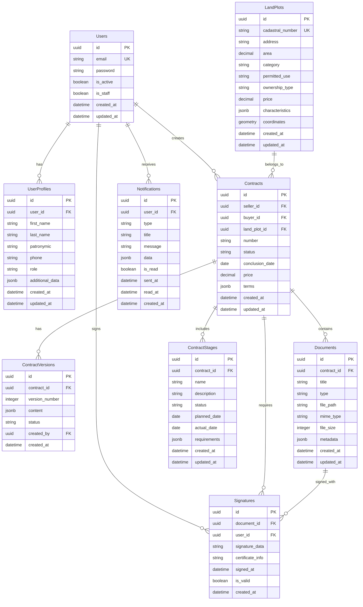

# Схема базы данных для системы автоматизации договоров купли-продажи земли

## Обзор

База данных спроектирована с использованием PostgreSQL и нормализована для обеспечения целостности данных и эффективной работы системы.

## ER-диаграмма



## Детальное описание таблиц

### Users (Пользователи)

Таблица для хранения учетных записей пользователей системы.

| Поле | Тип | Описание |
|------|-----|----------|
| id | UUID | Первичный ключ |
| email | VARCHAR(254) | Уникальный email пользователя |
| password | VARCHAR(128) | Хешированный пароль |
| is_active | BOOLEAN | Флаг активности |
| is_staff | BOOLEAN | Флаг персонала |
| created_at | TIMESTAMP | Время создания |
| updated_at | TIMESTAMP | Время обновления |

### UserProfiles (Профили пользователей)

Расширенная информация о пользователях.

| Поле | Тип | Описание |
|------|-----|----------|
| id | UUID | Первичный ключ |
| user_id | UUID | Внешний ключ на Users |
| first_name | VARCHAR(50) | Имя |
| last_name | VARCHAR(50) | Фамилия |
| patronymic | VARCHAR(50) | Отчество |
| phone | VARCHAR(20) | Телефон |
| role | VARCHAR(20) | Роль (seller, buyer, notary, registrar) |
| additional_data | JSONB | Дополнительные данные |
| created_at | TIMESTAMP | Время создания |
| updated_at | TIMESTAMP | Время обновления |

### LandPlots (Земельные участки)

Информация о земельных участках.

| Поле | Тип | Описание |
|------|-----|----------|
| id | UUID | Первичный ключ |
| cadastral_number | VARCHAR(50) | Кадастровый номер (уникальный) |
| address | TEXT | Адрес |
| area | DECIMAL(10,2) | Площадь (в гектарах) |
| category | VARCHAR(50) | Категория земель |
| permitted_use | VARCHAR(100) | Разрешенное использование |
| ownership_type | VARCHAR(50) | Тип собственности |
| price | DECIMAL(15,2) | Цена |
| characteristics | JSONB | Характеристики |
| coordinates | GEOMETRY | Географические координаты |
| created_at | TIMESTAMP | Время создания |
| updated_at | TIMESTAMP | Время обновления |

### Contracts (Договоры)

Основная информация о договорах купли-продажи.

| Поле | Тип | Описание |
|------|-----|----------|
| id | UUID | Первичный ключ |
| seller_id | UUID | ID продавца |
| buyer_id | UUID | ID покупателя |
| land_plot_id | UUID | ID земельного участка |
| number | VARCHAR(50) | Номер договора |
| status | VARCHAR(20) | Статус договора |
| conclusion_date | DATE | Дата заключения |
| price | DECIMAL(15,2) | Цена договора |
| terms | JSONB | Условия договора |
| created_at | TIMESTAMP | Время создания |
| updated_at | TIMESTAMP | Время обновления |

### ContractVersions (Версии договоров)

История изменений договоров.

| Поле | Тип | Описание |
|------|-----|----------|
| id | UUID | Первичный ключ |
| contract_id | UUID | ID договора |
| version_number | INTEGER | Номер версии |
| content | JSONB | Содержание версии |
| status | VARCHAR(20) | Статус версии |
| created_by | UUID | ID создателя |
| created_at | TIMESTAMP | Время создания |

### Documents (Документы)

Прикрепленные к договорам документы.

| Поле | Тип | Описание |
|------|-----|----------|
| id | UUID | Первичный ключ |
| contract_id | UUID | ID договора |
| title | VARCHAR(255) | Название документа |
| type | VARCHAR(50) | Тип документа |
| file_path | VARCHAR(500) | Путь к файлу |
| mime_type | VARCHAR(100) | MIME-тип |
| file_size | INTEGER | Размер файла |
| metadata | JSONB | Метаданные |
| created_at | TIMESTAMP | Время создания |
| updated_at | TIMESTAMP | Время обновления |

### Signatures (Электронные подписи)

Информация об электронных подписях документов.

| Поле | Тип | Описание |
|------|-----|----------|
| id | UUID | Первичный ключ |
| document_id | UUID | ID документа |
| user_id | UUID | ID подписавшего |
| signature_data | TEXT | Данные подписи |
| certificate_info | JSONB | Информация о сертификате |
| signed_at | TIMESTAMP | Время подписания |
| is_valid | BOOLEAN | Флаг валидности |
| created_at | TIMESTAMP | Время создания |

### ContractStages (Этапы исполнения договоров)

Этапы исполнения договора с отслеживанием статуса.

| Поле | Тип | Описание |
|------|-----|----------|
| id | UUID | Первичный ключ |
| contract_id | UUID | ID договора |
| name | VARCHAR(255) | Название этапа |
| description | TEXT | Описание этапа |
| status | VARCHAR(20) | Статус этапа |
| planned_date | DATE | Плановая дата |
| actual_date | DATE | Фактическая дата |
| requirements | JSONB | Требования этапа |
| created_at | TIMESTAMP | Время создания |
| updated_at | TIMESTAMP | Время обновления |

### Notifications (Уведомления)

Системные уведомления для пользователей.

| Поле | Тип | Описание |
|------|-----|----------|
| id | UUID | Первичный ключ |
| user_id | UUID | ID пользователя |
| type | VARCHAR(50) | Тип уведомления |
| title | VARCHAR(255) | Заголовок |
| message | TEXT | Сообщение |
| data | JSONB | Дополнительные данные |
| is_read | BOOLEAN | Флаг прочтения |
| sent_at | TIMESTAMP | Время отправки |
| read_at | TIMESTAMP | Время прочтения |
| created_at | TIMESTAMP | Время создания |

## Индексы

Для оптимизации производительности созданы следующие индексы:

```sql
-- Индексы для Users
CREATE INDEX idx_users_email ON Users(email);
CREATE INDEX idx_users_is_active ON Users(is_active);

-- Индексы для UserProfiles
CREATE INDEX idx_user_profiles_user_id ON UserProfiles(user_id);
CREATE INDEX idx_user_profiles_role ON UserProfiles(role);

-- Индексы для LandPlots
CREATE INDEX idx_land_plots_cadastral_number ON LandPlots(cadastral_number);
CREATE INDEX idx_land_plots_area ON LandPlots(area);
CREATE INDEX idx_land_plots_price ON LandPlots(price);

-- Индексы для Contracts
CREATE INDEX idx_contracts_seller_id ON Contracts(seller_id);
CREATE INDEX idx_contracts_buyer_id ON Contracts(buyer_id);
CREATE INDEX idx_contracts_land_plot_id ON Contracts(land_plot_id);
CREATE INDEX idx_contracts_status ON Contracts(status);
CREATE INDEX idx_contracts_conclusion_date ON Contracts(conclusion_date);

-- Индексы для ContractVersions
CREATE INDEX idx_contract_versions_contract_id ON ContractVersions(contract_id);
CREATE INDEX idx_contract_versions_version_number ON ContractVersions(contract_id, version_number);

-- Индексы для Documents
CREATE INDEX idx_documents_contract_id ON Documents(contract_id);
CREATE INDEX idx_documents_type ON Documents(type);

-- Индексы для Signatures
CREATE INDEX idx_signatures_document_id ON Signatures(document_id);
CREATE INDEX idx_signatures_user_id ON Signatures(user_id);
CREATE INDEX idx_signatures_signed_at ON Signatures(signed_at);

-- Индексы для ContractStages
CREATE INDEX idx_contract_stages_contract_id ON ContractStages(contract_id);
CREATE INDEX idx_contract_stages_status ON ContractStages(status);
CREATE INDEX idx_contract_stages_planned_date ON ContractStages(planned_date);

-- Индексы для Notifications
CREATE INDEX idx_notifications_user_id ON Notifications(user_id);
CREATE INDEX idx_notifications_is_read ON Notifications(is_read);
CREATE INDEX idx_notifications_sent_at ON Notifications(sent_at);
```

## Ограничения и триггеры

```sql
-- Ограничения для проверки целостности данных
ALTER TABLE Contracts ADD CONSTRAINT check_contract_price 
CHECK (price > 0);

ALTER TABLE LandPlots ADD CONSTRAINT check_land_plot_area 
CHECK (area > 0);

ALTER TABLE Contracts ADD CONSTRAINT check_conclusion_date 
CHECK (conclusion_date >= CURRENT_DATE);

-- Триггер для обновления updated_at
CREATE OR REPLACE FUNCTION update_updated_at_column()
RETURNS TRIGGER AS $$
BEGIN
    NEW.updated_at = CURRENT_TIMESTAMP;
    RETURN NEW;
END;
$$ language 'plpgsql';

CREATE TRIGGER update_users_updated_at BEFORE UPDATE ON Users
    FOR EACH ROW EXECUTE FUNCTION update_updated_at_column();

CREATE TRIGGER update_user_profiles_updated_at BEFORE UPDATE ON UserProfiles
    FOR EACH ROW EXECUTE FUNCTION update_updated_at_column();

CREATE TRIGGER update_land_plots_updated_at BEFORE UPDATE ON LandPlots
    FOR EACH ROW EXECUTE FUNCTION update_updated_at_column();

CREATE TRIGGER update_contracts_updated_at BEFORE UPDATE ON Contracts
    FOR EACH ROW EXECUTE FUNCTION update_updated_at_column();

CREATE TRIGGER update_documents_updated_at BEFORE UPDATE ON Documents
    FOR EACH ROW EXECUTE FUNCTION update_updated_at_column();

CREATE TRIGGER update_contract_stages_updated_at BEFORE UPDATE ON ContractStages
    FOR EACH ROW EXECUTE FUNCTION update_updated_at_column();
```

## Резервное копирование и восстановление

Для обеспечения надежности данных рекомендуется:

1. Ежедневное полное резервное копирование
2. Часовое инкрементальное резервное копирование
3. Хранение резервных копий в течение 30 дней
4. Тестирование восстановления данных ежемесячно