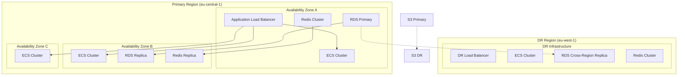

# План аварийного восстановления и непрерывности бизнеса для системы автоматизации договоров купли-продажи земли

## Обзор

Документ описывает комплексный план аварийного восстановления и обеспечения непрерывности бизнес-процессов для системы автоматизации договоров купли-продажи земли. План разработан с учетом критической важности системы для бизнеса и требований к доступности данных 24/7.

## Цели и показатели

### Цели восстановления (RTO/RPO)

| Компонент системы | RTO (Время восстановления) | RPO (Точка восстановления) | Приоритет |
|------------------|----------------------------|----------------------------|-----------|
| Основное приложение | 4 часа | 15 минут | Критический |
| База данных | 2 часа | 5 минут | Критический |
| Документы и файлы | 8 часов | 1 час | Высокий |
| API шлюз | 1 час | 15 минут | Критический |
| Система аутентификации | 2 часа | 15 минут | Критический |
| Мониторинг и логи | 4 часа | 30 минут | Средний |
| Система уведомлений | 8 часов | 1 час | Средний |

### Цели доступности

- **Доступность системы**: 99.9% (допустимое время простоя 8.76 часов в год)
- **Плановое обслуживание**: Не более 4 часов в месяц
- **Аварийное восстановление**: Не более 4 часов для критических компонентов

## Архитектура отказоустойчивости

### Многозонное развертывание



### Резервирование компонентов

1. **Вычислительные ресурсы**: Минимум 2 инстанса в разных AZ
2. **База данных**: Primary + Read Replica + Cross-Region Replica
3. **Кэш**: Redis Cluster с репликацией
4. **Файловое хранилище**: S3 с кросс-регионным реплицированием
5. **Сеть**: Multi-AZ VPC с резервными маршрутами

## Стратегии резервного копирования

### Резервное копирование базы данных

```yaml
# backup/database-backup.yml
AWSTemplateFormatVersion: '2010-09-09'
Description: Database Backup Strategy

Resources:
  BackupVault:
    Type: AWS::Backup::BackupVault
    Properties:
      BackupVaultName: land-contracts-db-vault
      EncryptionKeyArn: !Ref BackupKMSKey

  BackupKMSKey:
    Type: AWS::KMS::Key
    Properties:
      Description: KMS key for database backups
      EnableKeyRotation: true

  BackupPlan:
    Type: AWS::Backup::BackupPlan
    Properties:
      BackupPlan:
        BackupPlanName: land-contracts-db-plan
        BackupPlanRule:
          - RuleName: DailyBackups
            TargetBackupVault: !Ref BackupVault
            ScheduleExpression: "cron(0 2 ? * * *)"
            Lifecycle:
              DeleteAfterDays: 30
            RecoveryPointTags:
              Environment: Production
              Type: Daily
          - RuleName: WeeklyBackups
            TargetBackupVault: !Ref BackupVault
            ScheduleExpression: "cron(0 3 ? * 1 *)"
            Lifecycle:
              DeleteAfterDays: 90
            RecoveryPointTags:
              Environment: Production
              Type: Weekly
          - RuleName: MonthlyBackups
            TargetBackupVault: !Ref BackupVault
            ScheduleExpression: "cron(0 4 1 * ? *)"
            Lifecycle:
              DeleteAfterDays: 365
            RecoveryPointTags:
              Environment: Production
              Type: Monthly

  BackupRole:
    Type: AWS::IAM::Role
    Properties:
      AssumeRolePolicyDocument:
        Version: '2012-10-17'
        Statement:
          - Effect: Allow
            Principal:
              Service: backup.amazonaws.com
            Action: sts:AssumeRole
      ManagedPolicyArns:
        - arn:aws:iam::aws:policy/service-role/AWSBackupServiceRolePolicyForBackup
        - arn:aws:iam::aws:policy/AWSBackupServiceRolePolicyForRestores
```

### Резервное копирование файлов и документов

```python
# scripts/document_backup.py
import boto3
import os
from datetime import datetime, timedelta
from botocore.exceptions import ClientError

class DocumentBackupManager:
    def __init__(self):
        self.s3 = boto3.client('s3')
        self.source_bucket = 'land-contracts-documents'
        self.backup_bucket = 'land-contracts-documents-backup'
        
    def create_daily_backup(self):
        """Создание ежедневной резервной копии документов"""
        try:
            # Создание папки с датой
            backup_date = datetime.now().strftime('%Y-%m-%d')
            backup_prefix = f'daily/{backup_date}/'
            
            # Копирование файлов
            paginator = self.s3.get_paginator('list_objects_v2')
            pages = paginator.paginate(Bucket=self.source_bucket)
            
            for page in pages:
                if 'Contents' in page:
                    for obj in page['Contents']:
                        copy_source = {
                            'Bucket': self.source_bucket,
                            'Key': obj['Key']
                        }
                        
                        self.s3.copy_object(
                            CopySource=copy_source,
                            Bucket=self.backup_bucket,
                            Key=f'{backup_prefix}{obj["Key"]}'
                        )
            
            print(f'Daily backup created: {backup_prefix}')
            return True
            
        except ClientError as e:
            print(f'Error creating daily backup: {e}')
            return False
    
    def create_weekly_backup(self):
        """Создание еженедельной полной резервной копии"""
        try:
            backup_date = datetime.now().strftime('%Y-%m-%d')
            backup_prefix = f'weekly/{backup_date}/'
            
            # Создание полного бэкапа
            self._sync_buckets(self.source_bucket, self.backup_bucket, backup_prefix)
            
            print(f'Weekly backup created: {backup_prefix}')
            return True
            
        except ClientError as e:
            print(f'Error creating weekly backup: {e}')
            return False
    
    def cleanup_old_backups(self):
        """Удаление старых резервных копий"""
        try:
            # Удаление ежедневных бэкапов старше 30 дней
            cutoff_date = datetime.now() - timedelta(days=30)
            self._cleanup_by_prefix('daily/', cutoff_date)
            
            # Удаление еженедельных бэкапов старше 90 дней
            cutoff_date = datetime.now() - timedelta(days=90)
            self._cleanup_by_prefix('weekly/', cutoff_date)
            
            print('Old backups cleaned up successfully')
            return True
            
        except ClientError as e:
            print(f'Error cleaning up old backups: {e}')
            return False
    
    def _sync_buckets(self, source_bucket, dest_bucket, prefix):
        """Синхронизация бакетов"""
        paginator = self.s3.get_paginator('list_objects_v2')
        pages = paginator.paginate(Bucket=source_bucket)
        
        for page in pages:
            if 'Contents' in page:
                for obj in page['Contents']:
                    copy_source = {
                        'Bucket': source_bucket,
                        'Key': obj['Key']
                    }
                    
                    self.s3.copy_object(
                        CopySource=copy_source,
                        Bucket=dest_bucket,
                        Key=f'{prefix}{obj["Key"]}'
                    )
    
    def _cleanup_by_prefix(self, prefix, cutoff_date):
        """Удаление файлов по префиксу и дате"""
        paginator = self.s3.get_paginator('list_objects_v2')
        pages = paginator.paginate(Bucket=self.backup_bucket, Prefix=prefix)
        
        objects_to_delete = []
        
        for page in pages:
            if 'Contents' in page:
                for obj in page['Contents']:
                    if obj['LastModified'].replace(tzinfo=None) < cutoff_date:
                        objects_to_delete.append({'Key': obj['Key']})
        
        if objects_to_delete:
            self.s3.delete_objects(
                Bucket=self.backup_bucket,
                Delete={'Objects': objects_to_delete}
            )
```

## Процедуры аварийного восстановления

### Сценарий 1: Отказ отдельного сервиса

```yaml
# disaster-recovery/service-failure.yml
name: Service Failure Recovery
description: Процедура восстановления при отказе отдельного сервиса

steps:
  1. Обнаружение:
    - description: Мониторинг обнаруживает отказ сервиса
    - responsible: Monitoring System
    - time: 0-5 минут
    
  2. Верификация:
    - description: Проверка статуса сервиса и зависимостей
    - responsible: DevOps Engineer
    - time: 5-15 минут
    
  3. Перезапуск:
    - description: Попытка перезапуска сервиса
    - commands:
      - docker service restart service-name
      - kubectl rollout restart deployment/service-name
    - responsible: DevOps Engineer
    - time: 15-30 минут
    
  4. Откат:
    - description: Откат на предыдущую версию при необходимости
    - commands:
      - docker service rollback service-name
      - kubectl rollout undo deployment/service-name
    - responsible: DevOps Engineer
    - time: 30-60 минут
    
  5. Восстановление:
    - description: Восстановление сервиса из резервной копии
    - commands:
      - aws ecs update-service --force-new-deployment
      - kubectl apply -f backup-manifests/
    - responsible: DevOps Engineer
    - time: 60-240 минут
```

### Сценарий 2: Отказ базы данных

```python
# disaster-recovery/database_recovery.py
import boto3
import time
from botocore.exceptions import ClientError

class DatabaseRecoveryManager:
    def __init__(self):
        self.rds = boto3.client('rds')
        self.backup_client = boto3.client('backup')
        
    def promote_read_replica(self, replica_identifier):
        """Повышение реплики до основного инстанса"""
        try:
            response = self.rds.promote_read_replica(
                DBInstanceIdentifier=replica_identifier,
                BackupRetentionPeriod=7,
                PreferredBackupWindow='03:00-04:00',
                PreferredMaintenanceWindow='sun:04:00-sun:05:00'
            )
            
            print(f'Read replica {replica_identifier} promoted to primary')
            return response
            
        except ClientError as e:
            print(f'Error promoting read replica: {e}')
            return None
    
    def restore_from_snapshot(self, snapshot_identifier, new_instance_id):
        """Восстановление из снепшота"""
        try:
            response = self.rds.restore_db_instance_from_db_snapshot(
                DBInstanceIdentifier=new_instance_id,
                DBSnapshotIdentifier=snapshot_identifier,
                DBInstanceClass='db.m5.large',
                MultiAZ=True,
                PubliclyAccessible=False,
                StorageType='gp2',
                VpcSecurityGroupIds=['sg-xxxxxxxx'],
                DBSubnetGroupName='default'
            )
            
            print(f'Database instance {new_instance_id} restored from snapshot')
            return response
            
        except ClientError as e:
            print(f'Error restoring from snapshot: {e}')
            return None
    
    def restore_from_point_in_time(self, source_instance, target_instance, restore_time):
        """Восстановление на определенный момент времени"""
        try:
            response = self.rds.restore_db_instance_to_point_in_time(
                SourceDBInstanceIdentifier=source_instance,
                TargetDBInstanceIdentifier=target_instance,
                RestoreTime=restore_time,
                UseLatestRestorableTime=False,
                DBInstanceClass='db.m5.large',
                MultiAZ=True,
                PubliclyAccessible=False,
                StorageType='gp2',
                VpcSecurityGroupIds=['sg-xxxxxxxx'],
                DBSubnetGroupName='default'
            )
            
            print(f'Database instance {target_instance} restored to point in time')
            return response
            
        except ClientError as e:
            print(f'Error restoring to point in time: {e}')
            return None
    
    def wait_for_instance_available(self, instance_id):
        """Ожидание доступности инстанса"""
        try:
            waiter = self.rds.get_waiter('db_instance_available')
            waiter.wait(DBInstanceIdentifier=instance_id)
            print(f'Database instance {instance_id} is now available')
            return True
            
        except ClientError as e:
            print(f'Error waiting for instance availability: {e}')
            return False
    
    def update_application_config(self, new_endpoint):
        """Обновление конфигурации приложения"""
        # Здесь должна быть логика обновления конфигурации
        # приложения с новым эндпоинтом базы данных
        pass
```

### Сценарий 3: Отказ региона

```yaml
# disaster-recovery/region-failure.yml
name: Region Failure Recovery
description: Процедура восстановления при отказе целого региона

steps:
  1. Обнаружение:
    - description: Мониторинг обнаруживает отказ региона
    - responsible: Monitoring System
    - time: 0-10 минут
    
  2. Активация DR:
    - description: Активация инфраструктуры в резервном регионе
    - commands:
      - aws route53 change-resource-record-sets --hosted-zone-id ZXXXXXXXX --change-batch file://dr-dns-change.json
      - aws cloudformation create-stack --stack-name dr-infrastructure --template-body file://dr-infrastructure.yml
    - responsible: Disaster Recovery Team
    - time: 10-60 минут
    
  3. Восстановление данных:
    - description: Восстановление данных из кросс-регионных реплик
    - commands:
      - aws rds promote-read-replica --db-instance-identifier dr-replica
      - aws s3 sync s3://primary-backup s3://dr-backup
    - responsible: Database Administrator
    - time: 60-180 минут
    
  4. Тестирование:
    - description: Тестирование функциональности в DR регионе
    - commands:
      - ./scripts/smoke-tests.sh --region dr-region
    - responsible: QA Team
    - time: 180-240 минут
    
  5. Переключение трафика:
    - description: Полное переключение трафика на DR регион
    - commands:
      - aws route53 change-resource-record-sets --hosted-zone-id ZXXXXXXXX --change-batch file://traffic-switch.json
    - responsible: Network Engineer
    - time: 240-260 минут
```

## План непрерывности бизнеса

### Критические бизнес-процессы

| Процесс | Критичность | Альтернативный метод | Время реализации |
|---------|------------|---------------------|------------------|
| Создание договоров | Критический | Ручное создание в бумажном виде | 2 часа |
| Подписание документов | Критический | Электронная подпись через резервный провайдер | 1 час |
| Поиск участков | Высокий | Использование внешних сервисов Росреестра | 4 часа |
| Уведомления | Средний | Email/SMS через резервные каналы | 2 часа |
| Отчетность | Средний | Ручное формирование отчетов | 8 часов |

### План работы в аварийном режиме

```yaml
# business-continuity/emergency-operations.yml
name: Emergency Operations Plan
description: План работы в аварийном режиме

phases:
  phase_1:
    name: Первые 2 часа
    activities:
      - Активация аварийной команды
      - Оценка ситуации и масштаба проблемы
      - Начало восстановления критических систем
      - Уведомление ключевых стейкхолдеров
    responsible: Crisis Management Team
    
  phase_2:
    name: 2-8 часов
    activities:
      - Восстановление основной функциональности
      - Переключение на резервные системы
      - Обеспечение работы критических бизнес-процессов
      - Регулярное обновление статуса
    responsible: Technical Recovery Team
    
  phase_3:
    name: 8-24 часов
    activities:
      - Восстановление полной функциональности
      - Тестирование всех систем
      - Постепенный возврат к нормальной работе
      - Анализ инцидента
    responsible: Recovery Team
    
  phase_4:
    name: 24+ часов
    activities:
      - Полное восстановление всех систем
      - Анализ и документирование инцидента
      - Обновление планов и процедур
      - Обучение команды
    responsible: Business Continuity Team
```

## Команда аварийного восстановления

### Роли и ответственности

| Роль | Ответственный | Основные обязанности | Контакты |
|------|---------------|----------------------|----------|
| Crisis Manager | CTO | Координация аварийного восстановления | +7-XXX-XXX-XX-XX |
| Technical Lead | DevOps Lead | Техническое восстановление систем | +7-XXX-XXX-XX-XX |
| Database Admin | DBA | Восстановление баз данных | +7-XXX-XXX-XX-XX |
| Network Engineer | Network Lead | Восстановление сетевой инфраструктуры | +7-XXX-XXX-XX-XX |
| Security Officer | CISO | Обеспечение безопасности при восстановлении | +7-XXX-XXX-XX-XX |
| Business Lead | COO | Координация бизнес-процессов | +7-XXX-XXX-XX-XX |
| Communications | PR Manager | Внешние коммуникации | +7-XXX-XXX-XX-XX |

### Матрица эскалации

```yaml
# escalation-matrix.yml
levels:
  level_1:
    name: Operational
    trigger: Отказ некритического сервиса
    response_time: 30 минут
    escalation_time: 2 часа
    team: DevOps Team
    
  level_2:
    name: Significant
    trigger: Отказ критического сервиса
    response_time: 15 минут
    escalation_time: 1 час
    team: Technical Lead + DevOps Team
    
  level_3:
    name: Critical
    trigger: Отказ системы или региона
    response_time: 5 минут
    escalation_time: 30 минут
    team: Crisis Management Team
    
  level_4:
    name: Catastrophic
    trigger: Полный отказ инфраструктуры
    response_time: Немедленно
    escalation_time: 15 минут
    team: Executive Management
```

## Тестирование планов

### Регулярное тестирование

```python
# disaster-recovery/dr_testing.py
import boto3
import time
import logging
from datetime import datetime

class DisasterRecoveryTester:
    def __init__(self):
        self.logger = logging.getLogger(__name__)
        self.ec2 = boto3.client('ec2')
        self.rds = boto3.client('rds')
        self.s3 = boto3.client('s3')
        
    def run_failover_test(self):
        """Тестирование отработки отказа"""
        try:
            self.logger.info("Starting failover test")
            
            # 1. Создание тестовой среды
            test_env = self.create_test_environment()
            
            # 2. Имитация отказа
            self.simulate_failure()
            
            # 3. Запуск процедур восстановления
            recovery_time = self.test_recovery_procedures()
            
            # 4. Проверка функциональности
            functionality_test = self.test_functionality()
            
            # 5. Очистка тестовой среды
            self.cleanup_test_environment(test_env)
            
            # 6. Генерация отчета
            self.generate_test_report(recovery_time, functionality_test)
            
            return True
            
        except Exception as e:
            self.logger.error(f"Failover test failed: {e}")
            return False
    
    def test_backup_recovery(self):
        """Тестирование восстановления из резервных копий"""
        try:
            self.logger.info("Starting backup recovery test")
            
            # 1. Создание тестовых данных
            test_data = self.create_test_data()
            
            # 2. Создание резервной копии
            backup_id = self.create_backup()
            
            # 3. Модификация данных
            self.modify_data()
            
            # 4. Восстановление из бэкапа
            recovery_time = self.restore_from_backup(backup_id)
            
            # 5. Проверка целостности данных
            integrity_check = self.verify_data_integrity(test_data)
            
            # 6. Очистка
            self.cleanup()
            
            return {
                'recovery_time': recovery_time,
                'integrity_check': integrity_check
            }
            
        except Exception as e:
            self.logger.error(f"Backup recovery test failed: {e}")
            return None
    
    def test_dr_region_activation(self):
        """Тестирование активации DR региона"""
        try:
            self.logger.info("Starting DR region activation test")
            
            # 1. Подготовка тестового сценария
            self.prepare_dr_test_scenario()
            
            # 2. Активация DR региона
            activation_time = self.activate_dr_region()
            
            # 3. Тестирование функциональности
            dr_functionality = self.test_dr_functionality()
            
            # 4. Возврат в основной регион
            fallback_time = self.fallback_to_primary()
            
            # 5. Очистка
            self.cleanup_dr_test()
            
            return {
                'activation_time': activation_time,
                'dr_functionality': dr_functionality,
                'fallback_time': fallback_time
            }
            
        except Exception as e:
            self.logger.error(f"DR region activation test failed: {e}")
            return None
    
    def generate_test_report(self, test_results):
        """Генерация отчета о тестировании"""
        report = {
            'test_date': datetime.now().isoformat(),
            'test_type': 'disaster_recovery',
            'results': test_results,
            'recommendations': self.generate_recommendations(test_results)
        }
        
        # Сохранение отчета
        self.save_report(report)
        
        # Отправка уведомлений
        self.send_notifications(report)
```

### График тестирования

| Тип теста | Частота | Продолжительность | Участники |
|-----------|---------|------------------|------------|
| Тест отказа базы данных | Ежемесячно | 2 часа | DBA, DevOps |
| Тест восстановления из бэкапа | Ежемесячно | 4 часа | DBA, DevOps |
| Тест активации DR региона | Ежеквартально | 8 часов | Вся команда |
| Полное тестирование DR | Раз в год | 24 часа | Все отделы |
| Тестирование бизнес-процессов | Раз в полгода | 4 часа | Бизнес-команда |

## Мониторинг и оповещения

### Метрики аварийного восстановления

```yaml
# monitoring/dr-metrics.yml
metrics:
  rto_compliance:
    description: Соответствие RTO
    query: avg(time_to_recovery) <= target_rto
    threshold: 95%
    
  rpo_compliance:
    description: Соответствие RPO
    query: avg(data_loss_time) <= target_rpo
    threshold: 95%
    
  backup_success_rate:
    description: Успешность резервного копирования
    query: sum(successful_backups) / sum(total_backups)
    threshold: 99%
    
  dr_test_success:
    description: Успешность DR тестов
    query: sum(successful_dr_tests) / sum(total_dr_tests)
    threshold: 90%
    
  recovery_time:
    description: Время восстановления
    query: avg(recovery_time_minutes)
    threshold: 240
    
  availability:
    description: Доступность системы
    query: avg(uptime_percentage)
    threshold: 99.9%
```

### Оповещения

```python
# monitoring/dr_alerts.py
import boto3
import json
from datetime import datetime

class DisasterRecoveryAlerts:
    def __init__(self):
        self.sns = boto3.client('sns')
        self.slack_webhook = 'https://hooks.slack.com/services/...'
        
    def send_dr_alert(self, alert_type, message, severity):
        """Отправка DR оповещения"""
        alert = {
            'timestamp': datetime.now().isoformat(),
            'type': alert_type,
            'message': message,
            'severity': severity,
            'service': 'land-contracts'
        }
        
        # Отправка в SNS
        self.sns.publish(
            TopicArn='arn:aws:sns:region:account:dr-alerts',
            Message=json.dumps(alert),
            Subject=f'DR Alert: {alert_type}'
        )
        
        # Отправка в Slack
        self.send_slack_alert(alert)
        
        # Отправка email критическим оповещениям
        if severity in ['critical', 'high']:
            self.send_email_alert(alert)
    
    def send_slack_alert(self, alert):
        """Отправка оповещения в Slack"""
        color = {
            'critical': 'danger',
            'high': 'warning',
            'medium': 'good',
            'low': 'good'
        }.get(alert['severity'], 'good')
        
        payload = {
            'attachments': [{
                'color': color,
                'title': f'DR Alert: {alert["type"]}',
                'text': alert['message'],
                'fields': [
                    {'title': 'Severity', 'value': alert['severity'], 'short': True},
                    {'title': 'Service', 'value': alert['service'], 'short': True},
                    {'title': 'Timestamp', 'value': alert['timestamp'], 'short': True}
                ]
            }]
        }
        
        # Отправка в Slack
        # requests.post(self.slack_webhook, json=payload)
```

## Документация и обучение

### Обучение команды

```yaml
# training/dr-training.yml
training_program:
  basic_training:
    audience: All technical staff
    duration: 4 hours
    topics:
      - Основы аварийного восстановления
      - План аварийного восстановления
      - Процедуры эскалации
      - Использование инструментов DR
    
  advanced_training:
    audience: DevOps, DBA, Network engineers
    duration: 8 hours
    topics:
      - Технические детали восстановления
      - Работа с AWS DR сервисами
      - Автоматизация восстановления
      - Тестирование DR планов
    
  business_training:
    audience: Business stakeholders
    duration: 2 hours
    topics:
      - Влияние отказов на бизнес
      - План непрерывности бизнеса
      - Роли и ответственности
      - Коммуникации в кризисной ситуации
    
  hands_on_training:
    audience: DR team
    duration: 16 hours
    topics:
      - Практическое восстановление систем
      - Тестирование DR сценариев
      - Устранение проблем
      - Оптимизация RTO/RPO
```

### Обновление документации

```python
# documentation/dr_docs_updater.py
import os
import json
from datetime import datetime

class DRDocumentationUpdater:
    def __init__(self):
        self.docs_path = 'disaster-recovery-docs'
        
    def update_procedures(self, incident_data):
        """Обновление процедур на основе инцидента"""
        # Анализ инцидента
        analysis = self.analyze_incident(incident_data)
        
        # Обновление процедур
        if analysis['procedure_changes_needed']:
            self.update_recovery_procedures(analysis)
        
        # Обновление контактов
        if analysis['contact_changes_needed']:
            self.update_contact_list(analysis)
        
        # Обновление метрик
        if analysis['metric_changes_needed']:
            self.update_metrics(analysis)
    
    def generate_post_incident_report(self, incident_data):
        """Генерация пост-инцидентного отчета"""
        report = {
            'incident_id': incident_data['id'],
            'date': datetime.now().isoformat(),
            'summary': incident_data['summary'],
            'timeline': incident_data['timeline'],
            'impact': incident_data['impact'],
            'root_cause': incident_data['root_cause'],
            'resolution': incident_data['resolution'],
            'lessons_learned': incident_data['lessons_learned'],
            'action_items': incident_data['action_items']
        }
        
        # Сохранение отчета
        report_path = os.path.join(self.docs_path, 'reports', f"{incident_data['id']}.json")
        with open(report_path, 'w') as f:
            json.dump(report, f, indent=2)
        
        return report
```

## Заключение

Комплексный план аварийного восстановления и непрерывности бизнеса обеспечивает надежную защиту системы автоматизации договоров купли-продажи земли от сбоев и катастроф. Регулярное тестирование, обучение команды и непрерывное улучшение процедур гарантируют готовность к любым нештатным ситуациям и минимизируют влияние на бизнес-процессы.