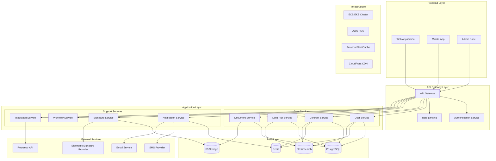
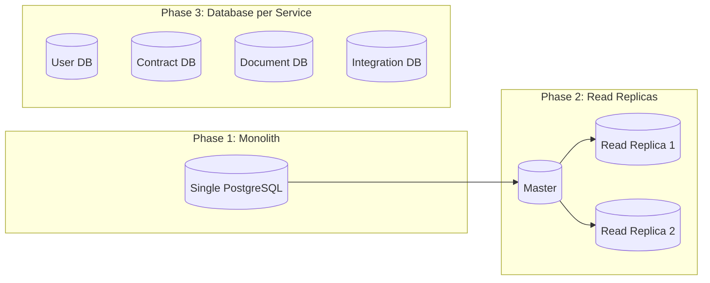

# Расширенная архитектура системы автоматизации договоров купли-продажи земли

## Обзор архитектуры

На основе существующей монолитной архитектуры предлагается гибридный подход, который позволит начать с монолитной структуры и постепенно переходить к микросервисам по мере роста системы. Архитектура спроектирована для масштаба 100-1000 пользователей с 50-500 договорами в месяц, с учетом требований российских регуляторов и интеграции с Росреестром.

## Архитектурные принципы

1. **Постепенная эволюция**: Монолит → Модульный монолит → Микросервисы
2. **Отказоустойчивость**: Изоляция сбоев и быстрая восстановимость
3. **Масштабируемость**: Горизонтальное масштабирование критических компонентов
4. **Безопасность**: Соответствие ФЗ-152 и требованиям к ЭП в РФ
5. **Наблюдаемость**: Комплексный мониторинг и логирование

## Расширенная системная архитектура

## Детальная архитектура сервисов

### 1. API Gateway
- **Функции**: Маршрутизация, аутентификация, ограничение запросов, кэширование
- **Технологии**: Kong/AWS API Gateway
- **Особенности**: Валидация токенов, трансформация запросов, агрегация ответов

### 2. Сервис аутентификации (Authentication Service)
- **Функции**: JWT-токены, управление сессиями, RBAC
- **Технологии**: Django-allauth, Redis для сессий
- **Особенности**: Многофакторная аутентификация, SSO для будущих интеграций

### 3. Пользовательский сервис (User Service)
- **Функции**: Управление профилями, ролями, настройками
- **База данных**: PostgreSQL
- **Кэширование**: Redis для часто запрашиваемых данных

### 4. Сервис договоров (Contract Service)
- **Функции**: Жизненный цикл договоров, версионирование, статусы
- **База данных**: PostgreSQL
- **Очередь**: Celery для асинхронных операций

### 5. Сервис земельных участков (Land Plot Service)
- **Функции**: Каталог участков, геолокация, характеристики
- **База данных**: PostgreSQL + PostGIS
- **Поиск**: Elasticsearch для полнотекстового поиска

### 6. Документный сервис (Document Service)
- **Функции**: Хранение, версионирование, генерация PDF
- **Хранилище**: AWS S3
- **Обработка**: Lambda для конвертации документов

### 7. Сервис уведомлений (Notification Service)
- **Функции**: Email, SMS, push-уведомления
- **Очередь**: Celery + Redis
- **Интеграции**: AWS SES, SMS-провайдеры

### 8. Сервис электронных подписей (Signature Service)
- **Функции**: Создание, проверка, хранение ЭП
- **Интеграции**: КриптоПро, УЦ
- **Безопасность**: HSM для ключей

### 9. Сервис рабочих процессов (Workflow Service)
- **Функции**: Автоматизация этапов, бизнес-правила
- **Движок**: Camunda/Custom workflow engine
- **События**: Event-driven архитектура

### 10. Сервис интеграций (Integration Service)
- **Функции**: Внешние API, трансформация данных
- **Интеграции**: Росреестр, государственные сервисы
- **Протоколы**: REST, SOAP, XML

## Архитектура данных

### База данных
- **Основная**: PostgreSQL 14+ с репликацией
- **Геоданные**: PostGIS для пространственных данных
- **Кэш**: Redis для сессий и кэширования
- **Поиск**: Elasticsearch для полнотекстового поиска

### Хранилище файлов
- **Документы**: AWS S3 с версионированием
- **Резервное копирование**: Glacier для долгосрочного хранения
- **CDN**: CloudFront для быстрой доставки

### Стратегия разделения данных

## Архитектура безопасности

### Сетевая безопасность
- **VPC**: Изолированная сеть в AWS
- **Подсети**: Публичные и приватные подсети
- **Security Groups**: Фильтрация трафика на уровне экземпляров
- **WAF**: AWS WAF для защиты от атак

### Аутентификация и авторизация
- **JWT**: Краткосрочные access токены (15 мин)
- **Refresh токены**: Долгосрочные токены обновления (7 дней)
- **RBAC**: Ролевая модель доступа
- **MFA**: Двухфакторная аутентификация

### Защита данных
- **Шифрование**: TLS 1.3 для трафика, AES-256 для данных
- **Ключи**: AWS KMS для управления ключами
- **Маскирование**: Чувствительные данные в логах
- **Аудит**: Полное логирование действий

### Соответствие требованиям РФ
- **ФЗ-152**: Защита персональных данных
- **ЭП**: Квалифицированные электронные подписи
- **Локализация**: Данные на территории РФ
- **Резервирование**: Резервные центры обработки данных

## Архитектура производительности

### Масштабирование
- **Горизонтальное**: Auto Scaling Groups для веб-серверов
- **Вертикальное**: RDS instances с возможностью апгрейда
- **Кэширование**: Многоуровневое кэширование
- **CDN**: CloudFront для статических ресурсов

### Оптимизация
- **База данных**: Индексы, query optimization, connection pooling
- **API**: Pagination, filtering, response compression
- **Асинхронность**: Celery для тяжелых операций
- **Кэширование**: Redis для частых запросов

## Архитектура отказоустойчивости

### Отказоустойчивость компонентов
- **Load Balancer**: Application Load Balancer с health checks
- **Auto Scaling**: Автоматическое восстановление инстансов
- **Multi-AZ**: Размещение в нескольких зонах доступности
- **Circuit Breaker**: Hystrix/Sentinel для защиты от каскадных сбоев

### Резервное копирование
- **База данных**: Автоматические бэкапы RDS, point-in-time recovery
- **Файлы**: Версионирование S3, cross-region replication
- **Конфигурация**: Infrastructure as Code (Terraform)

## Архитектура мониторинга

### Метрики и логирование
- **Метрики**: CloudWatch, Prometheus + Grafana
- **Логи**: CloudWatch Logs, ELK Stack
- **Трейсинг**: AWS X-Ray, Jaeger
- **Алертинг**: CloudWatch Alarms, PagerDuty

### Health Checks
- **Приложение**: Custom health endpoints
- **База данных**: Connection checks
- **Внешние сервисы**: Integration health checks
- **Пользовательский опыт**: Synthetic monitoring

## План миграции

### Фаза 1: Усиление монолита (Месяцы 1-2)
- Оптимизация существующего кода
- Внедрение кэширования
- Улучшение мониторинга
- Подготовка к разделению

### Фаза 2: Модульный монолит (Месяцы 2-3)
- Выделение модулей в приложении
- Внедрение API Gateway
- Разделение баз данных
- Подготовка к микросервисам

### Фаза 3: Поэтапный переход к микросервисам (Месяцы 3-6)
- Выделение сервисов аутентификации и пользователей
- Сервис документов и подписей
- Сервис интеграций
- Сервис уведомлений

## Технологический стек

### Backend
- **Framework**: Django 4.2+ / FastAPI для новых сервисов
- **База данных**: PostgreSQL 14+ с PostGIS
- **Кэш**: Redis 7+
- **Очередь**: Celery + Redis
- **API**: REST + GraphQL для сложных запросов

### Infrastructure
- **Облако**: AWS
- **Контейнеризация**: Docker + ECS/EKS
- **CI/CD**: GitHub Actions / GitLab CI
- **IaC**: Terraform + AWS CloudFormation
- **Мониторинг**: CloudWatch + Prometheus

### DevOps
- **Репозиторий**: GitHub/GitLab
- **Пакетный менеджер**: Poetry
- **Тестирование**: pytest + coverage
- **Качество кода**: SonarQube, pre-commit hooks

## Заключение

Предложенная архитектура обеспечивает баланс между сложностью и функциональностью для указанного масштаба системы. Она позволяет начать с относительно простой монолитной структуры и постепенно эволюционировать к микросервисной архитектуре по мере роста требований и нагрузки.