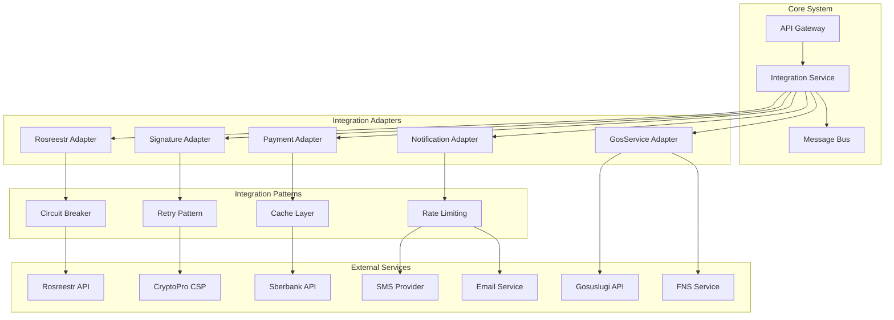

# Паттерны интеграции с внешними сервисами

## Обзор

Документ описывает архитектурные паттерны и подходы к интеграции системы автоматизации договоров купли-продажи земли с внешними сервисами, включая Росреестр, поставщиков электронных подписей, платежные системы и другие государственные сервисы.

## Архитектура интеграций



## 1. Интеграция с Росреестром

### 1.1 Архитектура адаптера Росреестра
```python
# integrations/rosreestr/adapter.py
import asyncio
import aiohttp
from typing import Optional, Dict, Any
from dataclasses import dataclass
from datetime import datetime
import xml.etree.ElementTree as ET
from cryptography.fernet import Fernet
import logging

logger = logging.getLogger(__name__)

@dataclass
class RosreestrConfig:
    api_url: str
    cert_path: str
    key_path: str
    timeout: int = 30
    retry_count: int = 3
    retry_delay: float = 1.0

class RosreestrAdapter:
    def __init__(self, config: RosreestrConfig):
        self.config = config
        self.session = None
        self.encryption_key = Fernet.generate_key()
        self.cipher_suite = Fernet(self.encryption_key)
        
    async def __aenter__(self):
        self.session = aiohttp.ClientSession(
            timeout=aiohttp.ClientTimeout(total=self.config.timeout),
            connector=aiohttp.TCPConnector(ssl=self.config.cert_path)
        )
        return self
        
    async def __aexit__(self, exc_type, exc_val, exc_tb):
        if self.session:
            await self.session.close()
    
    async def get_land_plot_info(self, cadastral_number: str) -> Dict[str, Any]:
        """Получение информации о земельном участке по кадастровому номеру"""
        for attempt in range(self.config.retry_count):
            try:
                xml_request = self._build_cadastral_request(cadastral_number)
                encrypted_request = self.cipher_suite.encrypt(xml_request.encode())
                
                async with self.session.post(
                    f"{self.config.api_url}/cadaster/info",
                    data=encrypted_request,
                    headers={"Content-Type": "application/xml"}
                ) as response:
                    if response.status == 200:
                        encrypted_response = await response.read()
                        decrypted_response = self.cipher_suite.decrypt(encrypted_response)
                        return self._parse_cadastral_response(decrypted_response.decode())
                    else:
                        logger.error(f"Rosreestr API error: {response.status}")
                        raise RosreestrException(f"API error: {response.status}")
                        
            except (aiohttp.ClientError, asyncio.TimeoutError) as e:
                logger.warning(f"Attempt {attempt + 1} failed: {str(e)}")
                if attempt < self.config.retry_count - 1:
                    await asyncio.sleep(self.config.retry_delay * (2 ** attempt))
                else:
                    raise RosreestrException(f"Failed after {self.config.retry_count} attempts")
    
    async def check_ownership_rights(self, cadastral_number: str) -> Dict[str, Any]:
        """Проверка прав собственности"""
        try:
            xml_request = self._build_ownership_request(cadastral_number)
            encrypted_request = self.cipher_suite.encrypt(xml_request.encode())
            
            async with self.session.post(
                f"{self.config.api_url}/rights/check",
                data=encrypted_request,
                headers={"Content-Type": "application/xml"}
            ) as response:
                if response.status == 200:
                    encrypted_response = await response.read()
                    decrypted_response = self.cipher_suite.decrypt(encrypted_response)
                    return self._parse_ownership_response(decrypted_response.decode())
                else:
                    raise RosreestrException(f"Rights check failed: {response.status}")
                    
        except Exception as e:
            logger.error(f"Ownership check error: {str(e)}")
            raise RosreestrException(f"Ownership check failed: {str(e)}")
    
    async def submit_registration_request(self, contract_data: Dict[str, Any]) -> str:
        """Подача заявления на регистрацию перехода права"""
        try:
            xml_request = self._build_registration_request(contract_data)
            encrypted_request = self.cipher_suite.encrypt(xml_request.encode())
            
            async with self.session.post(
                f"{self.config.api_url}/registration/submit",
                data=encrypted_request,
                headers={"Content-Type": "application/xml"}
            ) as response:
                if response.status == 200:
                    encrypted_response = await response.read()
                    decrypted_response = self.cipher_suite.decrypt(encrypted_response)
                    return self._parse_registration_response(decrypted_response.decode())
                else:
                    raise RosreestrException(f"Registration submission failed: {response.status}")
                    
        except Exception as e:
            logger.error(f"Registration submission error: {str(e)}")
            raise RosreestrException(f"Registration submission failed: {str(e)}")
    
    async def get_registration_status(self, request_id: str) -> Dict[str, Any]:
        """Получение статуса регистрации"""
        try:
            xml_request = self._build_status_request(request_id)
            encrypted_request = self.cipher_suite.encrypt(xml_request.encode())
            
            async with self.session.post(
                f"{self.config.api_url}/registration/status",
                data=encrypted_request,
                headers={"Content-Type": "application/xml"}
            ) as response:
                if response.status == 200:
                    encrypted_response = await response.read()
                    decrypted_response = self.cipher_suite.decrypt(encrypted_response)
                    return self._parse_status_response(decrypted_response.decode())
                else:
                    raise RosreestrException(f"Status check failed: {response.status}")
                    
        except Exception as e:
            logger.error(f"Status check error: {str(e)}")
            raise RosreestrException(f"Status check failed: {str(e)}")
    
    def _build_cadastral_request(self, cadastral_number: str) -> str:
        """Формирование XML-запроса для получения кадастровой информации"""
        return f"""<?xml version="1.0" encoding="UTF-8"?>
        <CadastralRequest>
            <RequestType>GetLandPlotInfo</RequestType>
            <CadastralNumber>{cadastral_number}</CadastralNumber>
            <RequestDate>{datetime.now().isoformat()}</RequestDate>
        </CadastralRequest>"""
    
    def _build_ownership_request(self, cadastral_number: str) -> str:
        """Формирование XML-запроса для проверки прав собственности"""
        return f"""<?xml version="1.0" encoding="UTF-8"?>
        <OwnershipRequest>
            <RequestType>CheckOwnershipRights</RequestType>
            <CadastralNumber>{cadastral_number}</CadastralNumber>
            <RequestDate>{datetime.now().isoformat()}</RequestDate>
        </OwnershipRequest>"""
    
    def _build_registration_request(self, contract_data: Dict[str, Any]) -> str:
        """Формирование XML-запроса для регистрации перехода права"""
        return f"""<?xml version="1.0" encoding="UTF-8"?>
        <RegistrationRequest>
            <RequestType>RegisterRightTransfer</RequestType>
            <Contract>
                <Number>{contract_data.get('number')}</Number>
                <Date>{contract_data.get('date')}</Date>
                <Price>{contract_data.get('price')}</Price>
            </Contract>
            <Seller>
                <INN>{contract_data.get('seller_inn')}</INN>
                <FullName>{contract_data.get('seller_name')}</FullName>
            </Seller>
            <Buyer>
                <INN>{contract_data.get('buyer_inn')}</INN>
                <FullName>{contract_data.get('buyer_name')}</FullName>
            </Buyer>
            <LandPlot>
                <CadastralNumber>{contract_data.get('cadastral_number')}</CadastralNumber>
            </LandPlot>
            <RequestDate>{datetime.now().isoformat()}</RequestDate>
        </RegistrationRequest>"""
    
    def _parse_cadastral_response(self, xml_response: str) -> Dict[str, Any]:
        """Парсинг XML-ответа с кадастровой информацией"""
        try:
            root = ET.fromstring(xml_response)
            return {
                'cadastral_number': root.find('.//CadastralNumber').text,
                'address': root.find('.//Address').text,
                'area': float(root.find('.//Area').text),
                'category': root.find('.//Category').text,
                'permitted_use': root.find('.//PermittedUse').text,
                'ownership_type': root.find('.//OwnershipType').text,
                'last_registration_date': root.find('.//LastRegistrationDate').text
            }
        except Exception as e:
            logger.error(f"XML parsing error: {str(e)}")
            raise RosreestrException(f"Response parsing failed: {str(e)}")
    
    def _parse_ownership_response(self, xml_response: str) -> Dict[str, Any]:
        """Парсинг XML-ответа с информацией о правах собственности"""
        try:
            root = ET.fromstring(xml_response)
            rights = []
            for right in root.findall('.//Right'):
                rights.append({
                    'type': right.find('Type').text,
                    'owner': right.find('Owner').text,
                    'registration_date': right.find('RegistrationDate').text,
                    'number': right.find('Number').text
                })
            return {'rights': rights}
        except Exception as e:
            logger.error(f"Ownership response parsing error: {str(e)}")
            raise RosreestrException(f"Response parsing failed: {str(e)}")
    
    def _parse_registration_response(self, xml_response: str) -> str:
        """Парсинг XML-ответа с ID запроса на регистрацию"""
        try:
            root = ET.fromstring(xml_response)
            return root.find('.//RequestID').text
        except Exception as e:
            logger.error(f"Registration response parsing error: {str(e)}")
            raise RosreestrException(f"Response parsing failed: {str(e)}")
    
    def _parse_status_response(self, xml_response: str) -> Dict[str, Any]:
        """Парсинг XML-ответа со статусом регистрации"""
        try:
            root = ET.fromstring(xml_response)
            return {
                'request_id': root.find('.//RequestID').text,
                'status': root.find('.//Status').text,
                'status_date': root.find('.//StatusDate').text,
                'completion_date': root.find('.//CompletionDate').text if root.find('.//CompletionDate') is not None else None,
                'registration_number': root.find('.//RegistrationNumber').text if root.find('.//RegistrationNumber') is not None else None
            }
        except Exception as e:
            logger.error(f"Status response parsing error: {str(e)}")
            raise RosreestrException(f"Response parsing failed: {str(e)}")

class RosreestrException(Exception):
    """Исключение для ошибок интеграции с Росреестром"""
    pass
```

### 1.2 Circuit Breaker для Росреестра
```python
# integrations/rosreestr/circuit_breaker.py
import asyncio
import time
from enum import Enum
from typing import Callable, Any
import logging

logger = logging.getLogger(__name__)

class CircuitState(Enum):
    CLOSED = "closed"
    OPEN = "open"
    HALF_OPEN = "half_open"

class CircuitBreaker:
    def __init__(
        self,
        failure_threshold: int = 5,
        recovery_timeout: float = 60.0,
        expected_exception: type = Exception
    ):
        self.failure_threshold = failure_threshold
        self.recovery_timeout = recovery_timeout
        self.expected_exception = expected_exception
        
        self.failure_count = 0
        self.last_failure_time = None
        self.state = CircuitState.CLOSED
    
    async def call(self, func: Callable, *args, **kwargs) -> Any:
        if self.state == CircuitState.OPEN:
            if self._should_attempt_reset():
                self.state = CircuitState.HALF_OPEN
            else:
                raise CircuitBreakerException("Circuit breaker is OPEN")
        
        try:
            result = await func(*args, **kwargs)
            self._on_success()
            return result
        except self.expected_exception as e:
            self._on_failure()
            raise e
    
    def _should_attempt_reset(self) -> bool:
        return time.time() - self.last_failure_time >= self.recovery_timeout
    
    def _on_success(self):
        self.failure_count = 0
        self.state = CircuitState.CLOSED
    
    def _on_failure(self):
        self.failure_count += 1
        self.last_failure_time = time.time()
        
        if self.failure_count >= self.failure_threshold:
            self.state = CircuitState.OPEN
            logger.warning(f"Circuit breaker opened after {self.failure_count} failures")

class CircuitBreakerException(Exception):
    """Исключение для разомкнутого circuit breaker"""
    pass

# Декоратор для использования circuit breaker
def with_circuit_breaker(circuit_breaker: CircuitBreaker):
    def decorator(func):
        async def wrapper(*args, **kwargs):
            return await circuit_breaker.call(func, *args, **kwargs)
        return wrapper
    return decorator
```

## 2. Интеграция с провайдерами электронных подписей

### 2.1 Адаптер для КриптоПро
```python
# integrations/signatures/crypto_pro_adapter.py
import asyncio
import subprocess
from typing import Dict, Any, Optional
from dataclasses import dataclass
import tempfile
import os
import base64
from cryptography.hazmat.primitives import hashes
from cryptography.hazmat.primitives.asymmetric import padding
from cryptography.hazmat.backends import default_backend
import logging

logger = logging.getLogger(__name__)

@dataclass
class CryptoProConfig:
    csp_path: str = "C:\\Program Files\\Crypto Pro\\CSP\\csptest.exe"
    cert_store: str = "MY"
    timeout: int = 30

class CryptoProAdapter:
    def __init__(self, config: CryptoProConfig):
        self.config = config
    
    async def get_certificates(self) -> list[Dict[str, Any]]:
        """Получение списка установленных сертификатов"""
        try:
            cmd = [
                self.config.csp_path,
                "-certs",
                "-store", self.config.cert_store,
                "-silent"
            ]
            
            process = await asyncio.create_subprocess_exec(
                *cmd,
                stdout=asyncio.subprocess.PIPE,
                stderr=asyncio.subprocess.PIPE
            )
            
            stdout, stderr = await process.communicate()
            
            if process.returncode != 0:
                raise CryptoProException(f"Failed to get certificates: {stderr.decode()}")
            
            return self._parse_certificates(stdout.decode())
            
        except Exception as e:
            logger.error(f"Certificate listing error: {str(e)}")
            raise CryptoProException(f"Certificate listing failed: {str(e)}")
    
    async def sign_document(
        self,
        document_content: bytes,
        certificate_thumbprint: str,
        pin: Optional[str] = None
    ) -> Dict[str, Any]:
        """Подписание документа с использованием КриптоПро"""
        try:
            # Создание временного файла для документа
            with tempfile.NamedTemporaryFile(delete=False) as temp_file:
                temp_file.write(document_content)
                temp_file_path = temp_file.name
            
            # Создание временного файла для подписи
            with tempfile.NamedTemporaryFile(delete=False, suffix=".sig") as sig_file:
                sig_file_path = sig_file.name
            
            try:
                # Формирование команды для подписания
                cmd = [
                    self.config.csp_path,
                    "-signf",
                    "-in", temp_file_path,
                    "-out", sig_file_path,
                    "-cert", certificate_thumbprint,
                    "-silent"
                ]
                
                if pin:
                    cmd.extend(["-pin", pin])
                
                process = await asyncio.create_subprocess_exec(
                    *cmd,
                    stdout=asyncio.subprocess.PIPE,
                    stderr=asyncio.subprocess.PIPE
                )
                
                stdout, stderr = await process.communicate()
                
                if process.returncode != 0:
                    raise CryptoProException(f"Signing failed: {stderr.decode()}")
                
                # Чтение подписи
                with open(sig_file_path, 'rb') as f:
                    signature_data = f.read()
                
                # Валидация подписи
                validation_result = await self.verify_signature(
                    document_content,
                    signature_data,
                    certificate_thumbprint
                )
                
                return {
                    'signature_data': base64.b64encode(signature_data).decode(),
                    'certificate_thumbprint': certificate_thumbprint,
                    'validation_result': validation_result,
                    'signing_time': asyncio.get_event_loop().time()
                }
                
            finally:
                # Удаление временных файлов
                os.unlink(temp_file_path)
                os.unlink(sig_file_path)
                
        except Exception as e:
            logger.error(f"Document signing error: {str(e)}")
            raise CryptoProException(f"Document signing failed: {str(e)}")
    
    async def verify_signature(
        self,
        document_content: bytes,
        signature_data: bytes,
        certificate_thumbprint: str
    ) -> Dict[str, Any]:
        """Проверка электронной подписи"""
        try:
            # Создание временных файлов
            with tempfile.NamedTemporaryFile(delete=False) as doc_file:
                doc_file.write(document_content)
                doc_path = doc_file.name
            
            with tempfile.NamedTemporaryFile(delete=False) as sig_file:
                sig_file.write(signature_data)
                sig_path = sig_file.name
            
            try:
                # Формирование команды для проверки
                cmd = [
                    self.config.csp_path,
                    "-verify",
                    "-in", doc_path,
                    "-sig", sig_path,
                    "-cert", certificate_thumbprint,
                    "-silent"
                ]
                
                process = await asyncio.create_subprocess_exec(
                    *cmd,
                    stdout=asyncio.subprocess.PIPE,
                    stderr=asyncio.subprocess.PIPE
                )
                
                stdout, stderr = await process.communicate()
                
                if process.returncode == 0:
                    return {
                        'is_valid': True,
                        'verification_time': asyncio.get_event_loop().time(),
                        'certificate_info': await self._get_certificate_info(certificate_thumbprint)
                    }
                else:
                    return {
                        'is_valid': False,
                        'error': stderr.decode(),
                        'verification_time': asyncio.get_event_loop().time()
                    }
                    
            finally:
                os.unlink(doc_path)
                os.unlink(sig_path)
                
        except Exception as e:
            logger.error(f"Signature verification error: {str(e)}")
            raise CryptoProException(f"Signature verification failed: {str(e)}")
    
    async def _get_certificate_info(self, thumbprint: str) -> Dict[str, Any]:
        """Получение информации о сертификате"""
        try:
            cmd = [
                self.config.csp_path,
                "-cert",
                "-thumbprint", thumbprint,
                "-store", self.config.cert_store,
                "-silent"
            ]
            
            process = await asyncio.create_subprocess_exec(
                *cmd,
                stdout=asyncio.subprocess.PIPE,
                stderr=asyncio.subprocess.PIPE
            )
            
            stdout, stderr = await process.communicate()
            
            if process.returncode != 0:
                raise CryptoProException(f"Failed to get certificate info: {stderr.decode()}")
            
            return self._parse_certificate_info(stdout.decode())
            
        except Exception as e:
            logger.error(f"Certificate info error: {str(e)}")
            raise CryptoProException(f"Certificate info failed: {str(e)}")
    
    def _parse_certificates(self, output: str) -> list[Dict[str, Any]]:
        """Парсинг вывода списка сертификатов"""
        certificates = []
        lines = output.split('\n')
        
        for line in lines:
            if '=======' in line:
                cert_info = {}
                # Парсинг информации о сертификате
                # Реализация зависит от формата вывода КриптоПро
                certificates.append(cert_info)
        
        return certificates
    
    def _parse_certificate_info(self, output: str) -> Dict[str, Any]:
        """Парсинг информации о сертификате"""
        # Реализация парсинга информации о сертификате
        return {
            'subject': '',
            'issuer': '',
            'valid_from': '',
            'valid_to': '',
            'serial_number': ''
        }

class CryptoProException(Exception):
    """Исключение для ошибок КриптоПро"""
    pass
```

## 3. Интеграция с платежными системами

### 3.1 Адаптер для Сбербанка
```python
# integrations/payments/sberbank_adapter.py
import asyncio
import aiohttp
from typing import Dict, Any, Optional
from dataclasses import dataclass
from datetime import datetime
import hashlib
import hmac
import json
import logging

logger = logging.getLogger(__name__)

@dataclass
class SberbankConfig:
    api_url: str
    username: str
    password: str
    token: Optional[str] = None
    timeout: int = 30
    retry_count: int = 3

class SberbankAdapter:
    def __init__(self, config: SberbankConfig):
        self.config = config
        self.session = None
        self.access_token = None
    
    async def __aenter__(self):
        self.session = aiohttp.ClientSession(
            timeout=aiohttp.ClientTimeout(total=self.config.timeout)
        )
        if not self.access_token:
            await self._authenticate()
        return self
    
    async def __aexit__(self, exc_type, exc_val, exc_tb):
        if self.session:
            await self.session.close()
    
    async def _authenticate(self):
        """Аутентификация в API Сбербанка"""
        try:
            auth_data = {
                'username': self.config.username,
                'password': self.config.password
            }
            
            async with self.session.post(
                f"{self.config.api_url}/oauth/token",
                data=auth_data
            ) as response:
                if response.status == 200:
                    result = await response.json()
                    self.access_token = result.get('access_token')
                else:
                    raise SberbankException(f"Authentication failed: {response.status}")
                    
        except Exception as e:
            logger.error(f"Sberbank authentication error: {str(e)}")
            raise SberbankException(f"Authentication failed: {str(e)}")
    
    async def create_payment(
        self,
        amount: float,
        order_number: str,
        description: str,
        return_url: str,
        client_id: Optional[str] = None
    ) -> Dict[str, Any]:
        """Создание платежа"""
        try:
            payment_data = {
                'amount': int(amount * 100),  # В копейках
                'orderNumber': order_number,
                'description': description,
                'returnUrl': return_url,
                'currency': '643'  # RUB
            }
            
            if client_id:
                payment_data['clientId'] = client_id
            
            headers = {
                'Authorization': f'Bearer {self.access_token}',
                'Content-Type': 'application/json'
            }
            
            async with self.session.post(
                f"{self.config.api_url}/payment/rest/register.do",
                json=payment_data,
                headers=headers
            ) as response:
                if response.status == 200:
                    result = await response.json()
                    return {
                        'payment_id': result.get('orderId'),
                        'payment_url': result.get('formUrl'),
                        'status': 'created'
                    }
                else:
                    raise SberbankException(f"Payment creation failed: {response.status}")
                    
        except Exception as e:
            logger.error(f"Payment creation error: {str(e)}")
            raise SberbankException(f"Payment creation failed: {str(e)}")
    
    async def get_payment_status(self, payment_id: str) -> Dict[str, Any]:
        """Получение статуса платежа"""
        try:
            params = {
                'orderId': payment_id
            }
            
            headers = {
                'Authorization': f'Bearer {self.access_token}'
            }
            
            async with self.session.get(
                f"{self.config.api_url}/payment/rest/getOrderStatusExtended.do",
                params=params,
                headers=headers
            ) as response:
                if response.status == 200:
                    result = await response.json()
                    return {
                        'payment_id': result.get('orderId'),
                        'status': self._map_sberbank_status(result.get('orderStatus')),
                        'amount': result.get('amount') / 100,
                        'currency': result.get('currency'),
                        'payment_date': result.get('paymentDate'),
                        'approval_code': result.get('approvalCode')
                    }
                else:
                    raise SberbankException(f"Status check failed: {response.status}")
                    
        except Exception as e:
            logger.error(f"Payment status check error: {str(e)}")
            raise SberbankException(f"Payment status check failed: {str(e)}")
    
    async def refund_payment(
        self,
        payment_id: str,
        amount: float,
        reason: Optional[str] = None
    ) -> Dict[str, Any]:
        """Возврат платежа"""
        try:
            refund_data = {
                'orderId': payment_id,
                'amount': int(amount * 100)  # В копейках
            }
            
            if reason:
                refund_data['description'] = reason
            
            headers = {
                'Authorization': f'Bearer {self.access_token}',
                'Content-Type': 'application/json'
            }
            
            async with self.session.post(
                f"{self.config.api_url}/payment/rest/refund.do",
                json=refund_data,
                headers=headers
            ) as response:
                if response.status == 200:
                    result = await response.json()
                    return {
                        'refund_id': result.get('orderId'),
                        'status': 'processed',
                        'amount': amount
                    }
                else:
                    raise SberbankException(f"Refund failed: {response.status}")
                    
        except Exception as e:
            logger.error(f"Payment refund error: {str(e)}")
            raise SberbankException(f"Payment refund failed: {str(e)}")
    
    def _map_sberbank_status(self, sberbank_status: int) -> str:
        """Маппинг статусов Сбербанка во внутренние статусы"""
        status_mapping = {
            0: 'created',
            1: 'approved',
            2: 'declined',
            3: 'refunded',
            4: 'authorized',
            5: 'reversed',
            6: 'partial_refunded'
        }
        return status_mapping.get(sberbank_status, 'unknown')

class SberbankException(Exception):
    """Исключение для ошибок Сбербанка"""
    pass
```

## 4. Интеграция с нотификационными сервисами

### 4.1 SMS-адаптер
```python
# integrations/notifications/sms_adapter.py
import asyncio
import aiohttp
from typing import Dict, Any, List
from dataclasses import dataclass
from datetime import datetime
import logging

logger = logging.getLogger(__name__)

@dataclass
class SMSConfig:
    provider_url: str
    api_key: str
    sender_name: str
    timeout: int = 30
    retry_count: int = 3

class SMSAdapter:
    def __init__(self, config: SMSConfig):
        self.config = config
        self.session = None
    
    async def __aenter__(self):
        self.session = aiohttp.ClientSession(
            timeout=aiohttp.ClientTimeout(total=self.config.timeout)
        )
        return self
    
    async def __aexit__(self, exc_type, exc_val, exc_tb):
        if self.session:
            await self.session.close()
    
    async def send_sms(
        self,
        phone: str,
        message: str,
        priority: str = 'normal'
    ) -> Dict[str, Any]:
        """Отправка SMS"""
        try:
            data = {
                'api_key': self.config.api_key,
                'sender': self.config.sender_name,
                'phone': phone,
                'message': message,
                'priority': priority
            }
            
            async with self.session.post(
                f"{self.config.provider_url}/sms/send",
                data=data
            ) as response:
                if response.status == 200:
                    result = await response.json()
                    return {
                        'message_id': result.get('message_id'),
                        'status': 'sent',
                        'cost': result.get('cost'),
                        'parts': result.get('parts')
                    }
                else:
                    raise SMSException(f"SMS sending failed: {response.status}")
                    
        except Exception as e:
            logger.error(f"SMS sending error: {str(e)}")
            raise SMSException(f"SMS sending failed: {str(e)}")
    
    async def send_bulk_sms(
        self,
        phones: List[str],
        message: str,
        priority: str = 'normal'
    ) -> Dict[str, Any]:
        """Массовая отправка SMS"""
        try:
            data = {
                'api_key': self.config.api_key,
                'sender': self.config.sender_name,
                'phones': ','.join(phones),
                'message': message,
                'priority': priority
            }
            
            async with self.session.post(
                f"{self.config.provider_url}/sms/send_bulk",
                data=data
            ) as response:
                if response.status == 200:
                    result = await response.json()
                    return {
                        'campaign_id': result.get('campaign_id'),
                        'status': 'sent',
                        'total_phones': len(phones),
                        'cost': result.get('cost')
                    }
                else:
                    raise SMSException(f"Bulk SMS sending failed: {response.status}")
                    
        except Exception as e:
            logger.error(f"Bulk SMS sending error: {str(e)}")
            raise SMSException(f"Bulk SMS sending failed: {str(e)}")
    
    async def get_delivery_status(self, message_id: str) -> Dict[str, Any]:
        """Получение статуса доставки SMS"""
        try:
            params = {
                'api_key': self.config.api_key,
                'message_id': message_id
            }
            
            async with self.session.get(
                f"{self.config.provider_url}/sms/status",
                params=params
            ) as response:
                if response.status == 200:
                    result = await response.json()
                    return {
                        'message_id': message_id,
                        'status': result.get('status'),
                        'delivery_time': result.get('delivery_time'),
                        'error_code': result.get('error_code')
                    }
                else:
                    raise SMSException(f"Status check failed: {response.status}")
                    
        except Exception as e:
            logger.error(f"SMS status check error: {str(e)}")
            raise SMSException(f"SMS status check failed: {str(e)}")

class SMSException(Exception):
    """Исключение для ошибок SMS"""
    pass
```

### 4.2 Email-адаптер
```python
# integrations/notifications/email_adapter.py
import asyncio
import aiohttp
from typing import Dict, Any, List, Optional
from dataclasses import dataclass
from datetime import datetime
import json
import logging

logger = logging.getLogger(__name__)

@dataclass
class EmailConfig:
    provider_url: str
    api_key: str
    sender_email: str
    sender_name: str
    timeout: int = 30
    retry_count: int = 3

class EmailAdapter:
    def __init__(self, config: EmailConfig):
        self.config = config
        self.session = None
    
    async def __aenter__(self):
        self.session = aiohttp.ClientSession(
            timeout=aiohttp.ClientTimeout(total=self.config.timeout)
        )
        return self
    
    async def __aexit__(self, exc_type, exc_val, exc_tb):
        if self.session:
            await self.session.close()
    
    async def send_email(
        self,
        to_email: str,
        subject: str,
        html_content: str,
        text_content: Optional[str] = None,
        attachments: Optional[List[Dict[str, Any]]] = None
    ) -> Dict[str, Any]:
        """Отправка email"""
        try:
            data = {
                'api_key': self.config.api_key,
                'from': {
                    'email': self.config.sender_email,
                    'name': self.config.sender_name
                },
                'to': [{'email': to_email}],
                'subject': subject,
                'html': html_content
            }
            
            if text_content:
                data['text'] = text_content
            
            if attachments:
                data['attachments'] = attachments
            
            headers = {
                'Content-Type': 'application/json'
            }
            
            async with self.session.post(
                f"{self.config.provider_url}/email/send",
                json=data,
                headers=headers
            ) as response:
                if response.status == 200:
                    result = await response.json()
                    return {
                        'message_id': result.get('message_id'),
                        'status': 'sent',
                        'delivery_time': result.get('delivery_time')
                    }
                else:
                    raise EmailException(f"Email sending failed: {response.status}")
                    
        except Exception as e:
            logger.error(f"Email sending error: {str(e)}")
            raise EmailException(f"Email sending failed: {str(e)}")
    
    async def send_template_email(
        self,
        to_email: str,
        template_id: str,
        template_data: Dict[str, Any]
    ) -> Dict[str, Any]:
        """Отправка email на основе шаблона"""
        try:
            data = {
                'api_key': self.config.api_key,
                'from': {
                    'email': self.config.sender_email,
                    'name': self.config.sender_name
                },
                'to': [{'email': to_email}],
                'template_id': template_id,
                'template_data': template_data
            }
            
            headers = {
                'Content-Type': 'application/json'
            }
            
            async with self.session.post(
                f"{self.config.provider_url}/email/send_template",
                json=data,
                headers=headers
            ) as response:
                if response.status == 200:
                    result = await response.json()
                    return {
                        'message_id': result.get('message_id'),
                        'status': 'sent',
                        'template_id': template_id
                    }
                else:
                    raise EmailException(f"Template email sending failed: {response.status}")
                    
        except Exception as e:
            logger.error(f"Template email sending error: {str(e)}")
            raise EmailException(f"Template email sending failed: {str(e)}")

class EmailException(Exception):
    """Исключение для ошибок Email"""
    pass
```

## 5. Общий сервис интеграций

### 5.1 Integration Service
```python
# integration_service/main.py
from fastapi import FastAPI, HTTPException, Depends, BackgroundTasks
from pydantic import BaseModel
from typing import Dict, Any, Optional
import asyncio
import logging

from integrations.rosreestr.adapter import RosreestrAdapter, RosreestrConfig
from integrations.signatures.crypto_pro_adapter import CryptoProAdapter, CryptoProConfig
from integrations.payments.sberbank_adapter import SberbankAdapter, SberbankConfig
from integrations.notifications.sms_adapter import SMSAdapter, SMSConfig
from integrations.notifications.email_adapter import EmailAdapter, EmailConfig

logger = logging.getLogger(__name__)

app = FastAPI(title="Integration Service")

# Конфигурации интеграций
rosreestr_config = RosreestrConfig(
    api_url="https://api.rosreestr.ru/api",
    cert_path="/path/to/cert.pem",
    key_path="/path/to/key.pem"
)

crypto_pro_config = CryptoProConfig()

sberbank_config = SberbankConfig(
    api_url="https://3dsec.sberbank.ru/payment/rest",
    username="your_username",
    password="your_password"
)

sms_config = SMSConfig(
    provider_url="https://sms-provider.com/api",
    api_key="your_sms_api_key",
    sender_name="LandContracts"
)

email_config = EmailConfig(
    provider_url="https://email-provider.com/api",
    api_key="your_email_api_key",
    sender_email="noreply@landcontracts.ru",
    sender_name="LandContracts"
)

class LandPlotInfoRequest(BaseModel):
    cadastral_number: str

class PaymentRequest(BaseModel):
    amount: float
    order_number: str
    description: str
    return_url: str
    client_id: Optional[str] = None

class SignatureRequest(BaseModel):
    document_content: str  # base64 encoded
    certificate_thumbprint: str
    pin: Optional[str] = None

class NotificationRequest(BaseModel):
    recipient: str
    subject: str
    message: str
    notification_type: str  # sms, email
    priority: str = "normal"

@app.post("/integrations/rosreestr/land-plot-info")
async def get_land_plot_info(request: LandPlotInfoRequest):
    """Получение информации о земельном участке из Росреестра"""
    try:
        async with RosreestrAdapter(rosreestr_config) as adapter:
            result = await adapter.get_land_plot_info(request.cadastral_number)
            return {"success": True, "data": result}
    except Exception as e:
        logger.error(f"Rosreestr integration error: {str(e)}")
        raise HTTPException(status_code=500, detail=str(e))

@app.post("/integrations/payments/create")
async def create_payment(request: PaymentRequest):
    """Создание платежа через Сбербанк"""
    try:
        async with SberbankAdapter(sberbank_config) as adapter:
            result = await adapter.create_payment(
                amount=request.amount,
                order_number=request.order_number,
                description=request.description,
                return_url=request.return_url,
                client_id=request.client_id
            )
            return {"success": True, "data": result}
    except Exception as e:
        logger.error(f"Payment integration error: {str(e)}")
        raise HTTPException(status_code=500, detail=str(e))

@app.post("/integrations/signatures/sign")
async def sign_document(request: SignatureRequest):
    """Подписание документа через КриптоПро"""
    try:
        document_content = base64.b64decode(request.document_content)
        
        async with CryptoProAdapter(crypto_pro_config) as adapter:
            result = await adapter.sign_document(
                document_content=document_content,
                certificate_thumbprint=request.certificate_thumbprint,
                pin=request.pin
            )
            return {"success": True, "data": result}
    except Exception as e:
        logger.error(f"Signature integration error: {str(e)}")
        raise HTTPException(status_code=500, detail=str(e))

@app.post("/integrations/notifications/send")
async def send_notification(
    request: NotificationRequest,
    background_tasks: BackgroundTasks
):
    """Отправка уведомления"""
    try:
        if request.notification_type == "sms":
            background_tasks.add_task(send_sms_notification, request)
        elif request.notification_type == "email":
            background_tasks.add_task(send_email_notification, request)
        else:
            raise HTTPException(status_code=400, detail="Invalid notification type")
        
        return {"success": True, "message": "Notification queued"}
    except Exception as e:
        logger.error(f"Notification integration error: {str(e)}")
        raise HTTPException(status_code=500, detail=str(e))

async def send_sms_notification(request: NotificationRequest):
    """Отправка SMS уведомления"""
    try:
        async with SMSAdapter(sms_config) as adapter:
            await adapter.send_sms(
                phone=request.recipient,
                message=request.message,
                priority=request.priority
            )
    except Exception as e:
        logger.error(f"SMS notification error: {str(e)}")

async def send_email_notification(request: NotificationRequest):
    """Отправка email уведомления"""
    try:
        async with EmailAdapter(email_config) as adapter:
            await adapter.send_email(
                to_email=request.recipient,
                subject=request.subject,
                html_content=request.message
            )
    except Exception as e:
        logger.error(f"Email notification error: {str(e)}")

@app.get("/integrations/health")
async def health_check():
    """Проверка здоровья интеграционных сервисов"""
    health_status = {
        "rosreestr": "unknown",
        "sberbank": "unknown",
        "crypto_pro": "unknown",
        "sms": "unknown",
        "email": "unknown"
    }
    
    # Проверка доступности сервисов
    # Реализация health check для каждого сервиса
    
    return {"status": "healthy", "services": health_status}
```

## 6. Обработка ошибок и повторные попытки

### 6.1 Retry Pattern
```python
# integrations/common/retry.py
import asyncio
import functools
import random
from typing import Callable, Any, Type, Tuple
import logging

logger = logging.getLogger(__name__)

def retry(
    max_attempts: int = 3,
    initial_delay: float = 1.0,
    max_delay: float = 60.0,
    exponential_base: float = 2.0,
    jitter: bool = True,
    exceptions: Tuple[Type[Exception], ...] = (Exception,)
):
    """Декоратор для повторных попыток выполнения функции"""
    def decorator(func: Callable) -> Callable:
        @functools.wraps(func)
        async def wrapper(*args, **kwargs) -> Any:
            last_exception = None
            
            for attempt in range(max_attempts):
                try:
                    return await func(*args, **kwargs)
                except exceptions as e:
                    last_exception = e
                    
                    if attempt == max_attempts - 1:
                        logger.error(f"Function {func.__name__} failed after {max_attempts} attempts")
                        raise e
                    
                    delay = min(
                        initial_delay * (exponential_base ** attempt),
                        max_delay
                    )
                    
                    if jitter:
                        delay *= (0.5 + random.random() * 0.5)
                    
                    logger.warning(
                        f"Function {func.__name__} failed (attempt {attempt + 1}/{max_attempts}), "
                        f"retrying in {delay:.2f} seconds. Error: {str(e)}"
                    )
                    
                    await asyncio.sleep(delay)
            
            raise last_exception
        
        return wrapper
    return decorator
```

## Заключение

Предложенные паттерны интеграции обеспечивают надежную и масштабируемую архитектуру для взаимодействия с внешними сервисами. Ключевые особенности:

1. **Асинхронность**: Все адаптеры используют async/await для эффективной работы с I/O
2. **Отказоустойчивость**: Circuit breaker и retry patterns для обработки сбоев
3. **Безопасность**: Шифрование данных и безопасное хранение учетных данных
4. **Масштабируемость**: Возможность горизонтального масштабирования сервисов интеграции
5. **Мониторинг**: Комплексное логирование и метрики производительности

Эта архитектура позволяет эффективно интегрироваться с российскими государственными сервисами, включая Росреестр, и обеспечивает соответствие требованиям законодательства РФ.