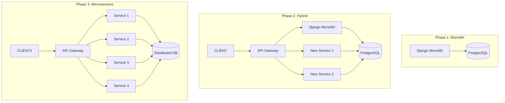
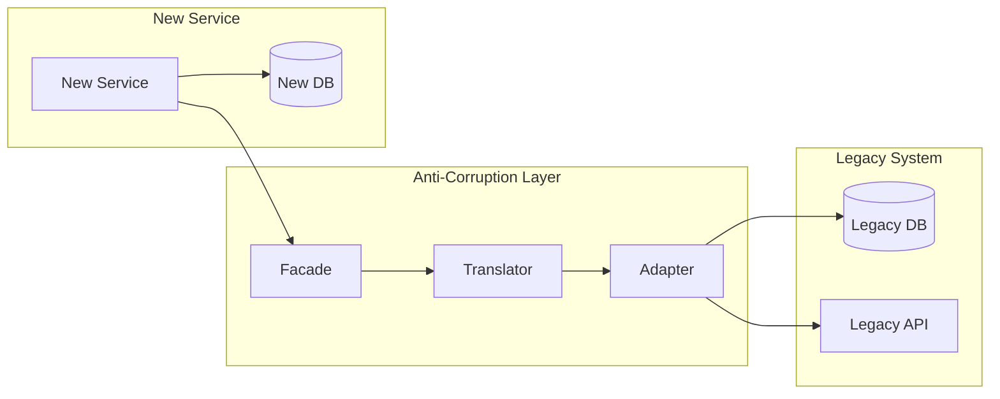
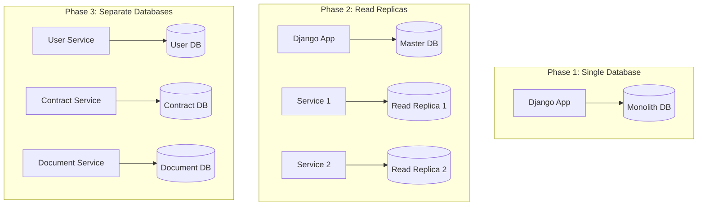

# Стратегия миграции на микросервисную архитектуру

## Обзор стратегии

Документ описывает поэтапный подход к миграции существующей монолитной Django-системы в микросервисную архитектуру. Стратегия основана на паттерне "Strangler Fig" и обеспечивает непрерывность работы системы во время перехода.

## Принципы миграции

1. **Инкрементальность**: Поэтапное выделение сервисов без остановки системы
2. **Обратная совместимость**: Сохранение работоспособности существующих функций
3. **Параллельная работа**: Старый и новый код работают одновременно
4. **Минимальный риск**: Тестирование в продакшене с feature flags
5. **Откат**: Возможность быстрого возврата к предыдущей версии

## Паттерны миграции

### 1. Strangler Fig Pattern


### 2. Anti-Corruption Layer Pattern


## Детальный план миграции

### Фаза 1: Подготовка (Недели 1-2)

#### 1.1 Инфраструктурная подготовка
```yaml
# docker-compose.migration.yml
version: '3.8'
services:
  api-gateway:
    image: kong:latest
    ports:
      - "8000:8000"
      - "8001:8001"
    environment:
      KONG_DATABASE: postgres
      KONG_PG_HOST: postgres
    depends_on:
      - postgres
      
  postgres:
    image: postgres:14
    environment:
      POSTGRES_DB: kong
      POSTGRES_USER: kong
      POSTGRES_PASSWORD: kong
      
  redis:
    image: redis:7-alpine
    ports:
      - "6379:6379"
```

#### 1.2 Настройка API Gateway
```yaml
# kong.yml
_format_version: "3.0"
_transform: true

services:
- name: auth-service
  url: http://host.docker.internal:8001/api/v1/auth/
  plugins:
  - name: rate-limiting
    config:
      minute: 100
      hour: 1000
      
- name: users-service
  url: http://host.docker.internal:8001/api/v1/users/
  plugins:
  - name: jwt
    config:
      secret_is_base64: false
      
routes:
- name: auth-route
  service: auth-service
  paths:
  - /api/auth
  
- name: users-route
  service: users-service
  paths:
  - /api/users
```

#### 1.3 Feature Flags System
```python
# apps/core/feature_flags.py
from django.conf import settings
import redis

class FeatureFlags:
    def __init__(self):
        self.redis_client = redis.Redis(
            host=settings.REDIS_HOST,
            port=settings.REDIS_PORT,
            decode_responses=True
        )
    
    def is_enabled(self, feature_name, user_id=None):
        key = f"feature:{feature_name}"
        if user_id:
            key += f":user:{user_id}"
        return self.redis_client.get(key) == "true"
    
    def enable_feature(self, feature_name, user_id=None):
        key = f"feature:{feature_name}"
        if user_id:
            key += f":user:{user_id}"
        self.redis_client.set(key, "true")
    
    def disable_feature(self, feature_name, user_id=None):
        key = f"feature:{feature_name}"
        if user_id:
            key += f":user:{user_id}"
        self.redis_client.delete(key)

# apps/core/decorators.py
from functools import wraps
from .feature_flags import FeatureFlags

def feature_flag(feature_name):
    def decorator(func):
        @wraps(func)
        def wrapper(request, *args, **kwargs):
            ff = FeatureFlags()
            if ff.is_enabled(feature_name, request.user.id):
                return func(request, *args, **kwargs)
            else:
                # Fallback to legacy implementation
                return legacy_handler(request, *args, **kwargs)
        return wrapper
    return decorator
```

### Фаза 2: Выделение первого сервиса - Аутентификация (Недели 3-4)

#### 2.1 Создание Auth Service
```python
# auth_service/main.py
from fastapi import FastAPI, HTTPException, Depends
from fastapi.security import HTTPBearer
from pydantic import BaseModel
import jwt
from datetime import datetime, timedelta

app = FastAPI(title="Authentication Service")
security = HTTPBearer()

class LoginRequest(BaseModel):
    email: str
    password: str

class TokenResponse(BaseModel):
    access_token: str
    refresh_token: str
    token_type: str = "bearer"

@app.post("/auth/login", response_model=TokenResponse)
async def login(request: LoginRequest):
    # Аутентификация пользователя
    user = authenticate_user(request.email, request.password)
    if not user:
        raise HTTPException(status_code=401, detail="Invalid credentials")
    
    # Генерация токенов
    access_token = create_access_token(data={"sub": user.id})
    refresh_token = create_refresh_token(data={"sub": user.id})
    
    return TokenResponse(
        access_token=access_token,
        refresh_token=refresh_token
    )

@app.post("/auth/refresh", response_model=TokenResponse)
async def refresh_token(refresh_token: str = Depends(security)):
    # Обновление токена
    pass

@app.get("/auth/me")
async def get_current_user(token: str = Depends(security)):
    # Получение текущего пользователя
    pass
```

#### 2.2 Адаптер для монолита
```python
# apps/authentication/adapters.py
import requests
from django.conf import settings

class AuthAdapter:
    def __init__(self):
        self.auth_service_url = settings.AUTH_SERVICE_URL
    
    def authenticate(self, email, password):
        try:
            response = requests.post(
                f"{self.auth_service_url}/auth/login",
                json={"email": email, "password": password}
            )
            if response.status_code == 200:
                return response.json()
            return None
        except requests.RequestException:
            # Fallback to legacy authentication
            return self.legacy_authenticate(email, password)
    
    def legacy_authenticate(self, email, password):
        # Старая логика аутентификации
        pass
```

#### 2.3 Постепенное переключение
```python
# apps/authentication/views.py
from rest_framework.views import APIView
from rest_framework.response import Response
from .adapters import AuthAdapter
from ..core.feature_flags import FeatureFlags

class LoginView(APIView):
    def post(self, request):
        ff = FeatureFlags()
        adapter = AuthAdapter()
        
        if ff.is_enabled("new_auth_service"):
            # Используем новый сервис
            result = adapter.authenticate(
                request.data.get("email"),
                request.data.get("password")
            )
            return Response(result)
        else:
            # Используем старую логику
            return self.legacy_login(request)
```

### Фаза 3: Выделение сервисов документов и подписей (Недели 5-6)

#### 3.1 Document Service
```python
# document_service/main.py
from fastapi import FastAPI, UploadFile, File, HTTPException
from fastapi.middleware.cors import CORSMiddleware
import boto3
import uuid

app = FastAPI(title="Document Service")
app.add_middleware(CORSMiddleware, allow_origins=["*"])

s3_client = boto3.client('s3')

@app.post("/documents/upload")
async def upload_document(
    file: UploadFile = File(...),
    contract_id: str = None,
    document_type: str = None
):
    # Валидация файла
    if not validate_file(file):
        raise HTTPException(status_code=400, detail="Invalid file")
    
    # Генерация уникального имени
    document_id = str(uuid.uuid4())
    file_key = f"documents/{document_id}/{file.filename}"
    
    # Загрузка в S3
    s3_client.upload_fileobj(
        file.file,
        "land-contracts-docs",
        file_key
    )
    
    # Сохранение метаданных в базу
    document = save_document_metadata(
        document_id=document_id,
        contract_id=contract_id,
        document_type=document_type,
        file_key=file_key,
        original_filename=file.filename,
        file_size=file.size,
        mime_type=file.content_type
    )
    
    return {"document_id": document_id, "status": "uploaded"}

@app.get("/documents/{document_id}")
async def get_document(document_id: str):
    # Получение информации о документе
    pass

@app.get("/documents/{document_id}/download")
async def download_document(document_id: str):
    # Генерация подписанного URL для скачивания
    pass
```

#### 3.2 Signature Service
```python
# signature_service/main.py
from fastapi import FastAPI, HTTPException
from pydantic import BaseModel
import base64
from cryptography.hazmat.primitives import hashes
from cryptography.hazmat.primitives.asymmetric import padding

app = FastAPI(title="Signature Service")

class SignRequest(BaseModel):
    document_id: str
    signature_data: str
    certificate_info: dict

class SignatureResponse(BaseModel):
    signature_id: str
    status: str
    verification_result: dict

@app.post("/signatures/sign", response_model=SignatureResponse)
async def sign_document(request: SignRequest):
    # Валидация сертификата
    if not validate_certificate(request.certificate_info):
        raise HTTPException(status_code=400, detail="Invalid certificate")
    
    # Проверка подписи
    signature_data = base64.b64decode(request.signature_data)
    document_content = get_document_content(request.document_id)
    
    verification_result = verify_signature(
        signature_data,
        document_content,
        request.certificate_info
    )
    
    # Сохранение подписи
    signature_id = save_signature(
        document_id=request.document_id,
        signature_data=request.signature_data,
        certificate_info=request.certificate_info,
        verification_result=verification_result
    )
    
    return SignatureResponse(
        signature_id=signature_id,
        status="signed",
        verification_result=verification_result
    )

@app.get("/signatures/{signature_id}/verify")
async def verify_signature_endpoint(signature_id: str):
    # Повторная проверка подписи
    pass
```

### Фаза 4: Выделение бизнес-логики (Недели 7-8)

#### 4.1 Contract Service
```python
# contract_service/main.py
from fastapi import FastAPI, HTTPException, Depends
from pydantic import BaseModel
from typing import List, Optional
import uuid

app = FastAPI(title="Contract Service")

class ContractCreate(BaseModel):
    seller_id: str
    buyer_id: str
    land_plot_id: str
    price: float
    terms: dict

class ContractResponse(BaseModel):
    id: str
    seller_id: str
    buyer_id: str
    land_plot_id: str
    price: float
    status: str
    terms: dict
    created_at: str
    updated_at: str

@app.post("/contracts", response_model=ContractResponse)
async def create_contract(contract: ContractCreate):
    # Валидация данных
    if not validate_contract_data(contract):
        raise HTTPException(status_code=400, detail="Invalid contract data")
    
    # Создание договора
    contract_id = str(uuid.uuid4())
    new_contract = save_contract(
        contract_id=contract_id,
        seller_id=contract.seller_id,
        buyer_id=contract.buyer_id,
        land_plot_id=contract.land_plot_id,
        price=contract.price,
        terms=contract.terms
    )
    
    # Запуск рабочего процесса
    await start_contract_workflow(contract_id)
    
    return ContractResponse(**new_contract)

@app.get("/contracts/{contract_id}", response_model=ContractResponse)
async def get_contract(contract_id: str):
    contract = get_contract_by_id(contract_id)
    if not contract:
        raise HTTPException(status_code=404, detail="Contract not found")
    return ContractResponse(**contract)

@app.patch("/contracts/{contract_id}/status")
async def update_contract_status(
    contract_id: str,
    status: str,
    comment: Optional[str] = None
):
    # Обновление статуса
    updated_contract = update_status(
        contract_id=contract_id,
        status=status,
        comment=comment
    )
    
    # Отправка уведомлений
    await send_status_change_notification(updated_contract)
    
    return {"status": "updated"}
```

#### 4.2 Workflow Service
```python
# workflow_service/main.py
from fastapi import FastAPI, HTTPException
from pydantic import BaseModel
import asyncio
from datetime import datetime

app = FastAPI(title="Workflow Service")

class WorkflowStart(BaseModel):
    contract_id: str
    workflow_type: str = "land_sale"

class StageUpdate(BaseModel):
    stage_id: str
    status: str
    actual_date: Optional[datetime] = None
    comment: Optional[str] = None

@app.post("/workflows/start")
async def start_workflow(workflow: WorkflowStart):
    # Создание экземпляра рабочего процесса
    workflow_instance = create_workflow_instance(
        contract_id=workflow.contract_id,
        workflow_type=workflow.workflow_type
    )
    
    # Создание этапов
    stages = create_workflow_stages(
        workflow_instance.id,
        workflow.workflow_type
    )
    
    # Запуск первого этапа
    await start_first_stage(workflow_instance.id)
    
    return {"workflow_id": workflow_instance.id, "status": "started"}

@app.post("/workflows/{workflow_id}/stages/{stage_id}/update")
async def update_stage(
    workflow_id: str,
    stage_id: str,
    update: StageUpdate
):
    # Обновление этапа
    updated_stage = update_workflow_stage(
        stage_id=stage_id,
        status=update.status,
        actual_date=update.actual_date,
        comment=update.comment
    )
    
    # Проверка условий перехода к следующему этапу
    if can_proceed_to_next_stage(updated_stage):
        await start_next_stage(workflow_id, updated_stage.order + 1)
    
    return {"status": "updated"}
```

### Фаза 5: Разделение базы данных (Недели 9-10)

#### 5.1 Стратегия разделения данных


#### 5.2 Data Synchronization Service
```python
# data_sync_service/main.py
from fastapi import FastAPI, BackgroundTasks
from pydantic import BaseModel
import asyncio

app = FastAPI(title="Data Synchronization Service")

class SyncRequest(BaseModel):
    source_table: str
    target_service: str
    sync_type: str = "full"  # full, incremental

class SyncResponse(BaseModel):
    sync_id: str
    status: str
    records_processed: int

@app.post("/sync/start", response_model=SyncResponse)
async def start_sync(
    request: SyncRequest,
    background_tasks: BackgroundTasks
):
    sync_id = str(uuid.uuid4())
    
    # Запуск фоновой задачи синхронизации
    background_tasks.add_task(
        perform_sync,
        sync_id=sync_id,
        source_table=request.source_table,
        target_service=request.target_service,
        sync_type=request.sync_type
    )
    
    return SyncResponse(
        sync_id=sync_id,
        status="started",
        records_processed=0
    )

async def perform_sync(sync_id, source_table, target_service, sync_type):
    # Логика синхронизации данных
    if sync_type == "full":
        await full_sync(sync_id, source_table, target_service)
    else:
        await incremental_sync(sync_id, source_table, target_service)

async def full_sync(sync_id, source_table, target_service):
    # Полная синхронизация таблицы
    pass

async def incremental_sync(sync_id, source_table, target_service):
    # Инкрементальная синхронизация
    pass
```

### Фаза 6: Завершение миграции (Недели 11-12)

#### 6.1 Decommissioning Plan
```python
# decommissioning/checklist.py
class DecommissioningChecklist:
    def __init__(self):
        self.checks = [
            "all_services_migrated",
            "data_sync_completed",
            "monitoring_configured",
            "backup_verified",
            "documentation_updated",
            "team_trained"
        ]
    
    def run_checks(self):
        results = {}
        for check in self.checks:
            results[check] = getattr(self, f"check_{check}")()
        return results
    
    def check_all_services_migrated(self):
        # Проверка, что все сервисы перенесены
        pass
    
    def check_data_sync_completed(self):
        # Проверка завершения синхронизации данных
        pass
    
    def check_monitoring_configured(self):
        # Проверка настройки мониторинга
        pass
```

## Стратегия тестирования

### 1. Canary Testing
```python
# canary/deployment.py
class CanaryDeployment:
    def __init__(self, service_name, new_version):
        self.service_name = service_name
        self.new_version = new_version
        self.traffic_percentage = 5  # Начать с 5% трафика
    
    def deploy_canary(self):
        # Развертывание canary версии
        pass
    
    def analyze_metrics(self):
        # Анализ метрик производительности
        pass
    
    def promote_or_rollback(self):
        # Продвижение или откат на основе метрик
        pass
```

### 2. Contract Testing
```python
# contract_tests/test_api.py
import pytest
from pact import Consumer, Provider

def test_user_service_contract():
    pact = Consumer('UserService').has_pact_with(Provider('AuthService'))
    
    pact.given('user exists') \
        .upon_receiving('a request for user authentication') \
        .with_request('method', 'POST') \
        .with_request('path', '/auth/login') \
        .with_request('body', {'email': 'test@example.com', 'password': 'password'}) \
        .will_respond_with(200) \
        .with_header('Content-Type', 'application/json') \
        .with_body({
            'access_token': 'token',
            'refresh_token': 'refresh_token'
        })
    
    with pact:
        result = client.post('/auth/login', json={
            'email': 'test@example.com',
            'password': 'password'
        })
        assert result.status_code == 200
```

## Мониторинг миграции

### 1. Migration Dashboard
```python
# monitoring/migration_dashboard.py
class MigrationDashboard:
    def __init__(self):
        self.metrics = {
            'services_migrated': 0,
            'total_services': 8,
            'data_sync_progress': 0,
            'error_rate': 0,
            'performance_impact': 0
        }
    
    def update_metrics(self):
        # Обновление метрик миграции
        pass
    
    def generate_report(self):
        # Генерация отчета о прогрессе миграции
        pass
```

### 2. Alerting Rules
```yaml
# alerting/migration_rules.yml
groups:
- name: migration_alerts
  rules:
  - alert: ServiceMigrationHighErrorRate
    expr: rate(http_requests_total{status=~"5.."}[5m]) > 0.1
    for: 2m
    labels:
      severity: critical
    annotations:
      summary: "High error rate during service migration"
      
  - alert: DataSyncDelay
    expr: data_sync_delay_seconds > 300
    for: 5m
    labels:
      severity: warning
    annotations:
      summary: "Data synchronization delay detected"
```

## Риски и митигация

| Риск | Вероятность | Влияние | Митигация |
|------|-------------|---------|-----------|
| Потеря данных при миграции | Средняя | Высокое | Регулярные бэкапы, тестирование на копии данных |
| Деградация производительности | Высокая | Среднее | Постепенное переключение, мониторинг |
| Сложность отладки | Высокая | Среднее | Централизованное логирование, трейсинг |
| Увеличение задержек | Средняя | Среднее | Оптимизация сетевых вызовов, кэширование |
| Проблемы с совместимостью | Средняя | Высокое | Контрактное тестирование, versioning API |

## Заключение

Предложенная стратегия миграции обеспечивает поэтапный переход к микросервисной архитектуре с минимальными рисками для бизнеса. Ключевые факторы успеха:

1. Постепенное выделение сервисов по принципу доменных границ
2. Использование API Gateway для управления трафиком
3. Feature flags для безопасного переключения
4. Комплексное тестирование на каждом этапе
5. Мониторинг и быстрое реагирование на проблемы

Этот подход позволит завершить миграцию в течение 12 недель с сохранением работоспособности системы на всех этапах.