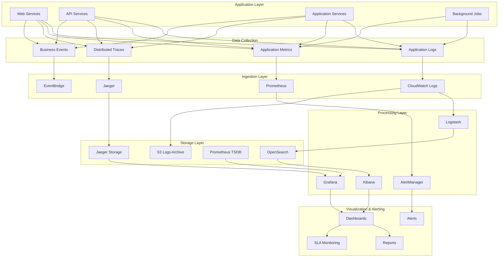

# Стратегия мониторинга и логирования для системы автоматизации договоров купли-продажи земли

## Обзор

Документ описывает комплексную стратегию мониторинга и логирования, обеспечивающую полную наблюдаемость системы, быстрое обнаружение проблем и соответствие требованиям аудита.

## Архитектура мониторинга



## 1. Стратегия логирования

### 1.1 Структурированное логирование
```python
# logging/structured_logger.py
import json
import logging
import time
import traceback
from datetime import datetime
from typing import Dict, Any, Optional
from dataclasses import dataclass, asdict
from enum import Enum
import uuid

class LogLevel(Enum):
    DEBUG = "DEBUG"
    INFO = "INFO"
    WARNING = "WARNING"
    ERROR = "ERROR"
    CRITICAL = "CRITICAL"

class LogCategory(Enum):
    AUTHENTICATION = "authentication"
    AUTHORIZATION = "authorization"
    BUSINESS_LOGIC = "business_logic"
    DATABASE = "database"
    EXTERNAL_API = "external_api"
    PERFORMANCE = "performance"
    SECURITY = "security"
    SYSTEM = "system"

@dataclass
class LogContext:
    request_id: str
    user_id: Optional[str] = None
    session_id: Optional[str] = None
    service_name: str = "land-contracts"
    environment: str = "production"
    version: str = "1.0.0"
    trace_id: Optional[str] = None
    span_id: Optional[str] = None

@dataclass
class LogEntry:
    timestamp: str
    level: LogLevel
    category: LogCategory
    message: str
    context: LogContext
    details: Optional[Dict[str, Any]] = None
    error: Optional[Dict[str, Any]] = None
    duration_ms: Optional[float] = None

class StructuredLogger:
    def __init__(self, service_name: str = "land-contracts"):
        self.service_name = service_name
        self.logger = logging.getLogger(service_name)
        
        # Настройка формата для CloudWatch
        formatter = logging.Formatter('%(message)s')
        handler = logging.StreamHandler()
        handler.setFormatter(formatter)
        self.logger.addHandler(handler)
        self.logger.setLevel(logging.INFO)
    
    def _create_context(self, **kwargs) -> LogContext:
        """Создание контекста логирования"""
        return LogContext(
            request_id=kwargs.get('request_id', str(uuid.uuid4())),
            user_id=kwargs.get('user_id'),
            session_id=kwargs.get('session_id'),
            service_name=self.service_name,
            environment=kwargs.get('environment', 'production'),
            version=kwargs.get('version', '1.0.0'),
            trace_id=kwargs.get('trace_id'),
            span_id=kwargs.get('span_id')
        )
    
    def _log(self, level: LogLevel, category: LogCategory, message: str, 
             context: LogContext, details: Dict[str, Any] = None, 
             error: Exception = None, duration_ms: float = None):
        """Создание и отправка лога"""
        log_entry = LogEntry(
            timestamp=datetime.utcnow().isoformat(),
            level=level,
            category=category,
            message=message,
            context=context,
            details=details,
            error=self._serialize_error(error) if error else None,
            duration_ms=duration_ms
        )
        
        # Отправка в CloudWatch
        self.logger.info(json.dumps(asdict(log_entry), default=str))
    
    def debug(self, category: LogCategory, message: str, **kwargs):
        context = self._create_context(**kwargs)
        self._log(LogLevel.DEBUG, category, message, context, kwargs.get('details'))
    
    def info(self, category: LogCategory, message: str, **kwargs):
        context = self._create_context(**kwargs)
        self._log(LogLevel.INFO, category, message, context, kwargs.get('details'))
    
    def warning(self, category: LogCategory, message: str, **kwargs):
        context = self._create_context(**kwargs)
        self._log(LogLevel.WARNING, category, message, context, kwargs.get('details'))
    
    def error(self, category: LogCategory, message: str, error: Exception = None, **kwargs):
        context = self._create_context(**kwargs)
        self._log(LogLevel.ERROR, category, message, context, kwargs.get('details'), error)
    
    def critical(self, category: LogCategory, message: str, error: Exception = None, **kwargs):
        context = self._create_context(**kwargs)
        self._log(LogLevel.CRITICAL, category, message, context, kwargs.get('details'), error)
    
    def log_performance(self, operation: str, duration_ms: float, **kwargs):
        """Логирование производительности"""
        context = self._create_context(**kwargs)
        details = {
            'operation': operation,
            'duration_ms': duration_ms
        }
        self._log(LogLevel.INFO, LogCategory.PERFORMANCE, f"Operation: {operation}", 
                 context, details, duration_ms=duration_ms)
    
    def log_api_call(self, method: str, url: str, status_code: int, 
                    duration_ms: float, **kwargs):
        """Логирование API вызовов"""
        context = self._create_context(**kwargs)
        details = {
            'method': method,
            'url': url,
            'status_code': status_code,
            'duration_ms': duration_ms
        }
        self._log(LogLevel.INFO, LogCategory.EXTERNAL_API, 
                 f"API call: {method} {url}", context, details, duration_ms=duration_ms)
    
    def log_database_query(self, query_type: str, table: str, duration_ms: float, 
                          rows_affected: int = None, **kwargs):
        """Логирование запросов к базе данных"""
        context = self._create_context(**kwargs)
        details = {
            'query_type': query_type,
            'table': table,
            'duration_ms': duration_ms,
            'rows_affected': rows_affected
        }
        self._log(LogLevel.DEBUG, LogCategory.DATABASE, 
                 f"Database query: {query_type} on {table}", context, details, duration_ms=duration_ms)
    
    def log_security_event(self, event_type: str, user_id: str = None, 
                          ip_address: str = None, **kwargs):
        """Логирование событий безопасности"""
        context = self._create_context(user_id=user_id, **kwargs)
        details = {
            'event_type': event_type,
            'ip_address': ip_address,
            'user_agent': kwargs.get('user_agent')
        }
        self._log(LogLevel.INFO, LogCategory.SECURITY, 
                 f"Security event: {event_type}", context, details)
    
    def _serialize_error(self, error: Exception) -> Dict[str, Any]:
        """Сериализация ошибки"""
        return {
            'type': type(error).__name__,
            'message': str(error),
            'traceback': traceback.format_exc()
        }

# Декоратор для логирования производительности
def log_performance(logger: StructuredLogger, operation: str):
    def decorator(func):
        def wrapper(*args, **kwargs):
            start_time = time.time()
            try:
                result = func(*args, **kwargs)
                duration_ms = (time.time() - start_time) * 1000
                logger.log_performance(operation, duration_ms)
                return result
            except Exception as e:
                duration_ms = (time.time() - start_time) * 1000
                logger.error(LogCategory.BUSINESS_LOGIC, 
                           f"Operation failed: {operation}", e, duration_ms=duration_ms)
                raise
        return wrapper
    return decorator

# Декоратор для логирования API вызовов
def log_api_call(logger: StructuredLogger):
    def decorator(func):
        def wrapper(request, *args, **kwargs):
            start_time = time.time()
            method = request.method
            url = request.get_full_path()
            
            try:
                response = func(request, *args, **kwargs)
                duration_ms = (time.time() - start_time) * 1000
                logger.log_api_call(method, url, response.status_code, duration_ms)
                return response
            except Exception as e:
                duration_ms = (time.time() - start_time) * 1000
                logger.log_api_call(method, url, 500, duration_ms)
                raise
        return wrapper
    return decorator
```

### 1.2 Централизованный сбор логов
```python
# logging/log_collector.py
import asyncio
import boto3
import json
from datetime import datetime, timedelta
from typing import List, Dict, Any, Optional
import logging

class CloudWatchLogCollector:
    def __init__(self, region: str = 'eu-west-1'):
        self.logs_client = boto3.client('logs', region_name=region)
        self.logger = logging.getLogger(__name__)
    
    async def collect_logs(
        self,
        log_group_name: str,
        start_time: datetime,
        end_time: datetime,
        filter_pattern: str = None
    ) -> List[Dict[str, Any]]:
        """Сбор логов из CloudWatch"""
        try:
            start_timestamp = int(start_time.timestamp() * 1000)
            end_timestamp = int(end_time.timestamp() * 1000)
            
            logs = []
            next_token = None
            
            while True:
                kwargs = {
                    'logGroupName': log_group_name,
                    'startTime': start_timestamp,
                    'endTime': end_timestamp
                }
                
                if filter_pattern:
                    kwargs['filterPattern'] = filter_pattern
                
                if next_token:
                    kwargs['nextToken'] = next_token
                
                response = self.logs_client.filter_log_events(**kwargs)
                
                for event in response.get('events', []):
                    try:
                        log_entry = json.loads(event['message'])
                        log_entry['timestamp'] = event['timestamp']
                        logs.append(log_entry)
                    except json.JSONDecodeError:
                        # Обработка неструктурированных логов
                        logs.append({
                            'message': event['message'],
                            'timestamp': event['timestamp'],
                            'raw': True
                        })
                
                next_token = response.get('nextToken')
                if not next_token:
                    break
            
            return logs
            
        except Exception as e:
            self.logger.error(f"Error collecting logs from {log_group_name}: {str(e)}")
            raise
    
    async def search_logs(
        self,
        log_group_name: str,
        query: str,
        start_time: datetime,
        end_time: datetime
    ) -> List[Dict[str, Any]]:
        """Поиск логов по запросу"""
        try:
            start_timestamp = int(start_time.timestamp() * 1000)
            end_timestamp = int(end_time.timestamp() * 1000)
            
            response = self.logs_client.start_query(
                logGroupName=log_group_name,
                startTime=start_timestamp,
                endTime=end_timestamp,
                queryString=query
            )
            
            query_id = response['queryId']
            
            # Ожидание завершения запроса
            while True:
                response = self.logs_client.get_query_results(queryId=query_id)
                
                if response['status'] in ['Complete', 'Failed', 'Cancelled']:
                    break
                
                await asyncio.sleep(1)
            
            if response['status'] == 'Complete':
                return response['results']
            else:
                raise Exception(f"Query failed with status: {response['status']}")
                
        except Exception as e:
            self.logger.error(f"Error searching logs in {log_group_name}: {str(e)}")
            raise
    
    async def create_log_stream(self, log_group_name: str, stream_name: str):
        """Создание потока логов"""
        try:
            self.logs_client.create_log_stream(
                logGroupName=log_group_name,
                logStreamName=stream_name
            )
        except self.logs_client.exceptions.ResourceAlreadyExistsException:
            pass  # Поток уже существует
    
    async def put_log_events(
        self,
        log_group_name: str,
        stream_name: str,
        log_events: List[Dict[str, Any]]
    ):
        """Отправка событий лога"""
        try:
            # Убедимся, что поток существует
            await self.create_log_stream(log_group_name, stream_name)
            
            # Форматирование событий
            formatted_events = []
            for event in log_events:
                formatted_events.append({
                    'timestamp': int(event['timestamp'] * 1000),
                    'message': json.dumps(event) if isinstance(event, dict) else event
                })
            
            self.logs_client.put_log_events(
                logGroupName=log_group_name,
                logStreamName=stream_name,
                logEvents=formatted_events
            )
            
        except Exception as e:
            self.logger.error(f"Error putting log events: {str(e)}")
            raise

class LogAggregator:
    def __init__(self):
        self.collector = CloudWatchLogCollector()
        self.logger = logging.getLogger(__name__)
    
    async def aggregate_service_logs(
        self,
        service_name: str,
        start_time: datetime,
        end_time: datetime
    ) -> Dict[str, Any]:
        """Агрегация логов сервиса"""
        try:
            log_groups = [
                f"/aws/ecs/production/{service_name}",
                f"/aws/rds/instance/production-{service_name}-db/postgresql"
            ]
            
            aggregated_logs = {
                'service_name': service_name,
                'period': {
                    'start': start_time.isoformat(),
                    'end': end_time.isoformat()
                },
                'logs': {},
                'summary': {
                    'total_entries': 0,
                    'error_count': 0,
                    'warning_count': 0,
                    'performance_issues': 0
                }
            }
            
            for log_group in log_groups:
                logs = await self.collector.collect_logs(log_group, start_time, end_time)
                aggregated_logs['logs'][log_group] = logs
                aggregated_logs['summary']['total_entries'] += len(logs)
                
                # Анализ логов
                for log in logs:
                    if isinstance(log, dict):
                        level = log.get('level', 'INFO')
                        if level == 'ERROR':
                            aggregated_logs['summary']['error_count'] += 1
                        elif level == 'WARNING':
                            aggregated_logs['summary']['warning_count'] += 1
                        
                        category = log.get('category')
                        if category == 'performance':
                            duration = log.get('duration_ms', 0)
                            if duration > 5000:  # Больше 5 секунд
                                aggregated_logs['summary']['performance_issues'] += 1
            
            return aggregated_logs
            
        except Exception as e:
            self.logger.error(f"Error aggregating logs for {service_name}: {str(e)}")
            raise
    
    async def generate_daily_report(self, date: datetime) -> Dict[str, Any]:
        """Генерация ежедневного отчета по логам"""
        try:
            start_time = date.replace(hour=0, minute=0, second=0, microsecond=0)
            end_time = start_time + timedelta(days=1)
            
            services = ['web', 'api', 'contract', 'document', 'user']
            
            report = {
                'date': date.isoformat(),
                'services': {},
                'overall_summary': {
                    'total_entries': 0,
                    'total_errors': 0,
                    'total_warnings': 0,
                    'total_performance_issues': 0
                }
            }
            
            for service in services:
                service_logs = await self.aggregate_service_logs(service, start_time, end_time)
                report['services'][service] = service_logs
                
                # Обновление общего summary
                summary = service_logs['summary']
                report['overall_summary']['total_entries'] += summary['total_entries']
                report['overall_summary']['total_errors'] += summary['error_count']
                report['overall_summary']['total_warnings'] += summary['warning_count']
                report['overall_summary']['total_performance_issues'] += summary['performance_issues']
            
            return report
            
        except Exception as e:
            self.logger.error(f"Error generating daily report: {str(e)}")
            raise
```

## 2. Стратегия метрик

### 2.1 Сбор бизнес-метрик
```python
# monitoring/metrics_collector.py
import time
import asyncio
from datetime import datetime, timedelta
from typing import Dict, Any, List, Optional
from dataclasses import dataclass
from enum import Enum
import boto3
import logging

class MetricType(Enum):
    COUNTER = "counter"
    GAUGE = "gauge"
    HISTOGRAM = "histogram"
    TIMER = "timer"

@dataclass
class Metric:
    name: str
    value: float
    metric_type: MetricType
    timestamp: datetime
    dimensions: Dict[str, str] = None
    unit: str = "None"
    
    def __post_init__(self):
        if self.dimensions is None:
            self.dimensions = {}

class MetricsCollector:
    def __init__(self, namespace: str = "LandContracts"):
        self.namespace = namespace
        self.cloudwatch = boto3.client('cloudwatch')
        self.metrics = []
        self.logger = logging.getLogger(__name__)
    
    def increment_counter(self, name: str, value: float = 1.0, **dimensions):
        """Увеличение счетчика"""
        metric = Metric(
            name=name,
            value=value,
            metric_type=MetricType.COUNTER,
            timestamp=datetime.utcnow(),
            dimensions=dimensions
        )
        self.metrics.append(metric)
    
    def set_gauge(self, name: str, value: float, **dimensions):
        """Установка значения gauge"""
        metric = Metric(
            name=name,
            value=value,
            metric_type=MetricType.GAUGE,
            timestamp=datetime.utcnow(),
            dimensions=dimensions
        )
        self.metrics.append(metric)
    
    def record_histogram(self, name: str, value: float, **dimensions):
        """Запись значения гистограммы"""
        metric = Metric(
            name=name,
            value=value,
            metric_type=MetricType.HISTOGRAM,
            timestamp=datetime.utcnow(),
            dimensions=dimensions
        )
        self.metrics.append(metric)
    
    def record_timer(self, name: str, duration_ms: float, **dimensions):
        """Запись времени выполнения"""
        metric = Metric(
            name=f"{name}_duration",
            value=duration_ms,
            metric_type=MetricType.TIMER,
            timestamp=datetime.utcnow(),
            dimensions=dimensions,
            unit="Milliseconds"
        )
        self.metrics.append(metric)
    
    async def flush_metrics(self):
        """Отправка метрик в CloudWatch"""
        if not self.metrics:
            return
        
        try:
            # Группировка метрик по имени и размерностям
            metric_data = {}
            
            for metric in self.metrics:
                key = (metric.name, tuple(sorted(metric.dimensions.items())))
                
                if key not in metric_data:
                    metric_data[key] = {
                        'MetricName': metric.name,
                        'Dimensions': [
                            {'Name': k, 'Value': v} for k, v in metric.dimensions.items()
                        ],
                        'Values': [],
                        'Timestamps': [],
                        'Unit': metric.unit
                    }
                
                metric_data[key]['Values'].append(metric.value)
                metric_data[key]['Timestamps'].append(metric.timestamp)
            
            # Отправка метрик в CloudWatch
            for metric_info in metric_data.values():
                # Для счетчиков суммируем значения
                if len(metric_info['Values']) > 1:
                    # Используем статистику для агрегации
                    self.cloudwatch.put_metric_data(
                        Namespace=self.namespace,
                        MetricData=[{
                            'MetricName': metric_info['MetricName'],
                            'Dimensions': metric_info['Dimensions'],
                            'StatisticValues': {
                                'SampleCount': len(metric_info['Values']),
                                'Sum': sum(metric_info['Values']),
                                'Minimum': min(metric_info['Values']),
                                'Maximum': max(metric_info['Values'])
                            },
                            'Unit': metric_info['Unit']
                        }]
                    )
                else:
                    # Для одиночных значений
                    self.cloudwatch.put_metric_data(
                        Namespace=self.namespace,
                        MetricData=[{
                            'MetricName': metric_info['MetricName'],
                            'Dimensions': metric_info['Dimensions'],
                            'Value': metric_info['Values'][0],
                            'Timestamp': metric_info['Timestamps'][0],
                            'Unit': metric_info['Unit']
                        }]
                    )
            
            # Очистка отправленных метрик
            self.metrics.clear()
            
        except Exception as e:
            self.logger.error(f"Error flushing metrics: {str(e)}")
            raise

class BusinessMetricsCollector:
    def __init__(self):
        self.metrics = MetricsCollector()
        self.logger = logging.getLogger(__name__)
    
    def track_user_registration(self, user_role: str):
        """Отслеживание регистрации пользователя"""
        self.metrics.increment_counter(
            "user_registrations",
            role=user_role
        )
    
    def track_contract_creation(self, contract_value: float, user_role: str):
        """Отслеживание создания договора"""
        self.metrics.increment_counter(
            "contracts_created",
            role=user_role
        )
        
        self.metrics.record_histogram(
            "contract_value",
            contract_value,
            role=user_role
        )
    
    def track_contract_signing(self, signing_duration_ms: float, user_role: str):
        """Отслеживание подписания договора"""
        self.metrics.increment_counter(
            "contracts_signed",
            role=user_role
        )
        
        self.metrics.record_timer(
            "contract_signing",
            signing_duration_ms,
            role=user_role
        )
    
    def track_document_upload(self, file_size_mb: float, document_type: str):
        """Отслеживание загрузки документа"""
        self.metrics.increment_counter(
            "documents_uploaded",
            type=document_type
        )
        
        self.metrics.record_histogram(
            "document_size",
            file_size_mb,
            type=document_type
        )
    
    def track_api_request(self, endpoint: str, method: str, status_code: int, duration_ms: float):
        """Отслеживание API запросов"""
        self.metrics.increment_counter(
            "api_requests",
            endpoint=endpoint,
            method=method,
            status_code=str(status_code)
        )
        
        self.metrics.record_timer(
            "api_request_duration",
            duration_ms,
            endpoint=endpoint,
            method=method
        )
    
    def track_database_query(self, query_type: str, table: str, duration_ms: float, rows_affected: int = None):
        """Отслеживание запросов к базе данных"""
        self.metrics.record_timer(
            "database_query_duration",
            duration_ms,
            query_type=query_type,
            table=table
        )
        
        if rows_affected is not None:
            self.metrics.record_histogram(
                "database_rows_affected",
                rows_affected,
                query_type=query_type,
                table=table
            )
    
    def track_external_api_call(self, service: str, endpoint: str, status_code: int, duration_ms: float):
        """Отслеживание вызовов внешних API"""
        self.metrics.increment_counter(
            "external_api_calls",
            service=service,
            endpoint=endpoint,
            status_code=str(status_code)
        )
        
        self.metrics.record_timer(
            "external_api_duration",
            duration_ms,
            service=service,
            endpoint=endpoint
        )
    
    def track_user_session(self, user_id: str, session_duration_minutes: float):
        """Отслеживание пользовательских сессий"""
        self.metrics.record_histogram(
            "user_session_duration",
            session_duration_minutes
        )
    
    def track_system_resources(self, cpu_usage: float, memory_usage: float, disk_usage: float, service_name: str):
        """Отслеживание системных ресурсов"""
        self.metrics.set_gauge(
            "cpu_usage_percent",
            cpu_usage,
            service=service_name
        )
        
        self.metrics.set_gauge(
            "memory_usage_percent",
            memory_usage,
            service=service_name
        )
        
        self.metrics.set_gauge(
            "disk_usage_percent",
            disk_usage,
            service=service_name
        )
    
    def track_business_kpi(self, active_users: int, daily_contracts: int, conversion_rate: float):
        """Отслеживание бизнес KPI"""
        self.metrics.set_gauge("active_users", active_users)
        self.metrics.set_gauge("daily_contracts", daily_contracts)
        self.metrics.set_gauge("conversion_rate", conversion_rate)
    
    async def generate_metrics_report(self, start_time: datetime, end_time: datetime) -> Dict[str, Any]:
        """Генерация отчета по метрикам"""
        try:
            report = {
                'period': {
                    'start': start_time.isoformat(),
                    'end': end_time.isoformat()
                },
                'metrics': {}
            }
            
            # Получение метрик из CloudWatch
            metrics_to_collect = [
                'user_registrations',
                'contracts_created',
                'contracts_signed',
                'documents_uploaded',
                'api_requests',
                'active_users',
                'daily_contracts'
            ]
            
            for metric_name in metrics_to_collect:
                try:
                    response = self.metrics.cloudwatch.get_metric_statistics(
                        Namespace=self.metrics.namespace,
                        MetricName=metric_name,
                        StartTime=start_time,
                        EndTime=end_time,
                        Period=3600,  # 1 час
                        Statistics=['Sum', 'Average', 'Maximum']
                    )
                    
                    report['metrics'][metric_name] = response['Datapoints']
                    
                except Exception as e:
                    self.logger.warning(f"Error getting metric {metric_name}: {str(e)}")
                    report['metrics'][metric_name] = []
            
            return report
            
        except Exception as e:
            self.logger.error(f"Error generating metrics report: {str(e)}")
            raise

# Декоратор для отслеживания производительности
def track_performance(metrics_collector: BusinessMetricsCollector, operation: str):
    def decorator(func):
        async def wrapper(*args, **kwargs):
            start_time = time.time()
            try:
                result = await func(*args, **kwargs)
                duration_ms = (time.time() - start_time) * 1000
                metrics_collector.metrics.record_timer(operation, duration_ms)
                return result
            except Exception as e:
                duration_ms = (time.time() - start_time) * 1000
                metrics_collector.metrics.record_timer(f"{operation}_error", duration_ms)
                raise
        return wrapper
    return decorator
```

## 3. Стратегия трейсинга

### 3.1 Распределенный трейсинг
```python
# tracing/distributed_tracing.py
import asyncio
import time
import uuid
from datetime import datetime
from typing import Dict, Any, Optional, List
from dataclasses import dataclass, asdict
from enum import Enum
import boto3
import logging

class SpanKind(Enum):
    INTERNAL = "internal"
    SERVER = "server"
    CLIENT = "client"
    PRODUCER = "producer"
    CONSUMER = "consumer"

class SpanStatus(Enum):
    OK = "ok"
    ERROR = "error"
    TIMEOUT = "timeout"
    CANCELLED = "cancelled"

@dataclass
class Span:
    trace_id: str
    span_id: str
    parent_span_id: Optional[str]
    operation_name: str
    start_time: datetime
    end_time: Optional[datetime]
    duration_ms: Optional[float]
    kind: SpanKind
    status: SpanStatus
    tags: Dict[str, Any]
    logs: List[Dict[str, Any]]
    service_name: str
    resource: str
    
    def __post_init__(self):
        if not self.tags:
            self.tags = {}
        if not self.logs:
            self.logs = []

class DistributedTracer:
    def __init__(self, service_name: str):
        self.service_name = service_name
        self.xray = boto3.client('xray')
        self.logger = logging.getLogger(__name__)
        self.active_spans = {}
    
    def start_trace(self, operation_name: str, resource: str = None, 
                   parent_span_id: str = None, **tags) -> str:
        """Начало нового трейса"""
        trace_id = str(uuid.uuid4())
        span_id = str(uuid.uuid4())
        
        span = Span(
            trace_id=trace_id,
            span_id=span_id,
            parent_span_id=parent_span_id,
            operation_name=operation_name,
            start_time=datetime.utcnow(),
            end_time=None,
            duration_ms=None,
            kind=SpanKind.SERVER,
            status=SpanStatus.OK,
            tags=tags,
            logs=[],
            service_name=self.service_name,
            resource=resource or operation_name
        )
        
        self.active_spans[span_id] = span
        
        # Отправка сегмента в X-Ray
        self._send_segment_to_xray(span)
        
        return span_id
    
    def finish_span(self, span_id: str, status: SpanStatus = SpanStatus.OK, **tags):
        """Завершение спана"""
        if span_id not in self.active_spans:
            return
        
        span = self.active_spans[span_id]
        span.end_time = datetime.utcnow()
        span.duration_ms = (span.end_time - span.start_time).total_seconds() * 1000
        span.status = status
        span.tags.update(tags)
        
        # Отправка завершенного сегмента в X-Ray
        self._send_segment_to_xray(span)
        
        # Удаление из активных спанов
        del self.active_spans[span_id]
    
    def add_span_tag(self, span_id: str, key: str, value: Any):
        """Добавление тега к спану"""
        if span_id in self.active_spans:
            self.active_spans[span_id].tags[key] = value
    
    def add_span_log(self, span_id: str, level: str, message: str, **fields):
        """Добавление лога к спану"""
        if span_id in self.active_spans:
            log_entry = {
                'timestamp': datetime.utcnow().isoformat(),
                'level': level,
                'message': message,
                'fields': fields
            }
            self.active_spans[span_id].logs.append(log_entry)
    
    def create_child_span(self, parent_span_id: str, operation_name: str, 
                         kind: SpanKind = SpanKind.INTERNAL, **tags) -> str:
        """Создание дочернего спана"""
        if parent_span_id not in self.active_spans:
            return None
        
        parent_span = self.active_spans[parent_span_id]
        span_id = str(uuid.uuid4())
        
        span = Span(
            trace_id=parent_span.trace_id,
            span_id=span_id,
            parent_span_id=parent_span_id,
            operation_name=operation_name,
            start_time=datetime.utcnow(),
            end_time=None,
            duration_ms=None,
            kind=kind,
            status=SpanStatus.OK,
            tags=tags,
            logs=[],
            service_name=self.service_name,
            resource=operation_name
        )
        
        self.active_spans[span_id] = span
        
        # Отправка сегмента в X-Ray
        self._send_segment_to_xray(span)
        
        return span_id
    
    def _send_segment_to_xray(self, span: Span):
        """Отправка сегмента в AWS X-Ray"""
        try:
            segment = {
                'trace_id': span.trace_id,
                'id': span.span_id,
                'parent_id': span.parent_span_id,
                'name': span.service_name,
                'start_time': span.start_time.timestamp(),
                'end_time': span.end_time.timestamp() if span.end_time else None,
                'metadata': {
                    'operation_name': span.operation_name,
                    'resource': span.resource,
                    'kind': span.kind.value,
                    'status': span.status.value,
                    'tags': span.tags,
                    'logs': span.logs
                }
            }
            
            if span.duration_ms:
                segment['duration'] = span.duration_ms / 1000  # X-Ray использует секунды
            
            # Отправка в X-Ray
            self.xray.put_trace_segments(
                TraceSegmentDocuments=[json.dumps(segment)]
            )
            
        except Exception as e:
            self.logger.error(f"Error sending segment to X-Ray: {str(e)}")
    
    def get_trace_summary(self, trace_id: str) -> Dict[str, Any]:
        """Получение сводки по трейсу"""
        try:
            response = self.xray.batch_get_traces(
                TraceIds=[trace_id]
            )
            
            if not response['Traces']:
                return {}
            
            trace = response['Traces'][0]
            
            summary = {
                'trace_id': trace_id,
                'duration': trace.get('Duration'),
                'segments': []
            }
            
            for segment in trace.get('Segments', []):
                segment_doc = json.loads(segment['Document'])
                summary['segments'].append({
                    'id': segment_doc.get('id'),
                    'name': segment_doc.get('name'),
                    'start_time': segment_doc.get('start_time'),
                    'end_time': segment_doc.get('end_time'),
                    'duration': segment_doc.get('duration'),
                    'metadata': segment_doc.get('metadata', {})
                })
            
            return summary
            
        except Exception as e:
            self.logger.error(f"Error getting trace summary: {str(e)}")
            return {}

# Декоратор для трейсинга функций
def trace_operation(tracer: DistributedTracer, operation_name: str, 
                   resource: str = None, kind: SpanKind = SpanKind.INTERNAL):
    def decorator(func):
        async def wrapper(*args, **kwargs):
            # Начало трейса
            span_id = tracer.start_trace(
                operation_name=operation_name,
                resource=resource,
                kind=kind
            )
            
            try:
                # Добавление информации о функции
                tracer.add_span_tag(span_id, 'function.name', func.__name__)
                tracer.add_span_tag(span_id, 'function.module', func.__module__)
                
                # Выполнение функции
                result = await func(*args, **kwargs)
                
                # Завершение спана
                tracer.finish_span(span_id, SpanStatus.OK)
                
                return result
                
            except Exception as e:
                # Добавление информации об ошибке
                tracer.add_span_tag(span_id, 'error.type', type(e).__name__)
                tracer.add_span_tag(span_id, 'error.message', str(e))
                tracer.add_span_log(span_id, 'ERROR', str(e), exception_type=type(e).__name__)
                
                # Завершение спана с ошибкой
                tracer.finish_span(span_id, SpanStatus.ERROR)
                
                raise
        
        return wrapper
    return decorator

# Декоратор для трейсинга API запросов
def trace_api_request(tracer: DistributedTracer):
    def decorator(func):
        async def wrapper(request, *args, **kwargs):
            # Начало трейса
            span_id = tracer.start_trace(
                operation_name=f"{request.method} {request.path}",
                resource=request.path,
                kind=SpanKind.SERVER
            )
            
            try:
                # Добавление информации о запросе
                tracer.add_span_tag(span_id, 'http.method', request.method)
                tracer.add_span_tag(span_id, 'http.url', request.get_full_path())
                tracer.add_span_tag(span_id, 'http.user_agent', request.META.get('HTTP_USER_AGENT'))
                tracer.add_span_tag(span_id, 'http.remote_addr', get_client_ip(request))
                
                # Выполнение функции
                response = func(request, *args, **kwargs)
                
                # Добавление информации об ответе
                tracer.add_span_tag(span_id, 'http.status_code', response.status_code)
                
                # Завершение спана
                status = SpanStatus.OK if response.status_code < 400 else SpanStatus.ERROR
                tracer.finish_span(span_id, status)
                
                return response
                
            except Exception as e:
                # Добавление информации об ошибке
                tracer.add_span_tag(span_id, 'error.type', type(e).__name__)
                tracer.add_span_tag(span_id, 'error.message', str(e))
                
                # Завершение спана с ошибкой
                tracer.finish_span(span_id, SpanStatus.ERROR)
                
                raise
        
        return wrapper
    return decorator

def get_client_ip(request) -> str:
    """Получение IP адреса клиента"""
    x_forwarded_for = request.META.get('HTTP_X_FORWARDED_FOR')
    if x_forwarded_for:
        ip = x_forwarded_for.split(',')[0]
    else:
        ip = request.META.get('REMOTE_ADDR')
    return ip
```

## 4. Стратегия алертинга

### 4.1 Система алертинга
```python
# monitoring/alerting_system.py
import asyncio
import boto3
import json
from datetime import datetime, timedelta
from typing import Dict, Any, List, Optional, Callable
from dataclasses import dataclass
from enum import Enum
import logging

class AlertSeverity(Enum):
    INFO = "info"
    WARNING = "warning"
    ERROR = "error"
    CRITICAL = "critical"

class AlertStatus(Enum):
    FIRING = "firing"
    RESOLVED = "resolved"

@dataclass
class Alert:
    name: str
    severity: AlertSeverity
    status: AlertStatus
    message: str
    details: Dict[str, Any]
    timestamp: datetime
    labels: Dict[str, str]
    annotations: Dict[str, str]
    
    def __post_init__(self):
        if not self.labels:
            self.labels = {}
        if not self.annotations:
            self.annotations = {}

class AlertManager:
    def __init__(self):
        self.sns = boto3.client('sns')
        self.cloudwatch = boto3.client('cloudwatch')
        self.logger = logging.getLogger(__name__)
        self.alert_rules = {}
        self.alert_handlers = {}
    
    def register_alert_rule(self, rule_name: str, rule_config: Dict[str, Any]):
        """Регистрация правила алерта"""
        self.alert_rules[rule_name] = rule_config
    
    def register_alert_handler(self, alert_type: str, handler: Callable):
        """Регистрация обработчика алерта"""
        self.alert_handlers[alert_type] = handler
    
    async def check_alert_rules(self):
        """Проверка правил алертов"""
        for rule_name, rule_config in self.alert_rules.items():
            try:
                await self._evaluate_rule(rule_name, rule_config)
            except Exception as e:
                self.logger.error(f"Error evaluating rule {rule_name}: {str(e)}")
    
    async def _evaluate_rule(self, rule_name: str, rule_config: Dict[str, Any]):
        """Оценка правила алерта"""
        metric_name = rule_config['metric']
        threshold = rule_config['threshold']
        comparison = rule_config['comparison']  # gt, lt, eq
        duration_minutes = rule_config.get('duration_minutes', 5)
        severity = AlertSeverity(rule_config.get('severity', 'warning'))
        
        # Получение метрики из CloudWatch
        end_time = datetime.utcnow()
        start_time = end_time - timedelta(minutes=duration_minutes)
        
        response = self.cloudwatch.get_metric_statistics(
            Namespace=rule_config.get('namespace', 'LandContracts'),
            MetricName=metric_name,
            Dimensions=rule_config.get('dimensions', []),
            StartTime=start_time,
            EndTime=end_time,
            Period=60,  # 1 минута
            Statistics=[rule_config.get('statistic', 'Average')]
        )
        
        if not response['Datapoints']:
            return
        
        # Проверка условия
        latest_value = response['Datapoints'][-1]['Average']
        
        is_triggered = False
        if comparison == 'gt' and latest_value > threshold:
            is_triggered = True
        elif comparison == 'lt' and latest_value < threshold:
            is_triggered = True
        elif comparison == 'eq' and latest_value == threshold:
            is_triggered = True
        
        if is_triggered:
            await self._trigger_alert(rule_name, severity, latest_value, rule_config)
    
    async def _trigger_alert(self, rule_name: str, severity: AlertSeverity, 
                           current_value: float, rule_config: Dict[str, Any]):
        """Активация алерта"""
        alert = Alert(
            name=rule_name,
            severity=severity,
            status=AlertStatus.FIRING,
            message=rule_config.get('message', f"Alert {rule_name} triggered"),
            details={
                'current_value': current_value,
                'threshold': rule_config['threshold'],
                'comparison': rule_config['comparison'],
                'metric': rule_config['metric']
            },
            timestamp=datetime.utcnow(),
            labels=rule_config.get('labels', {}),
            annotations=rule_config.get('annotations', {})
        )
        
        # Отправка алерта
        await self._send_alert(alert)
        
        # Вызов обработчика
        alert_type = rule_config.get('type', 'default')
        if alert_type in self.alert_handlers:
            await self.alert_handlers[alert_type](alert)
    
    async def _send_alert(self, alert: Alert):
        """Отправка алерта"""
        try:
            # Формирование сообщения
            subject = f"[{alert.severity.value.upper()}] {alert.name}"
            message = self._format_alert_message(alert)
            
            # Отправка через SNS
            self.sns.publish(
                TopicArn='arn:aws:sns:eu-west-1:123456789012:land-contracts-alerts',
                Subject=subject,
                Message=message,
                MessageAttributes={
                    'severity': {
                        'DataType': 'String',
                        'StringValue': alert.severity.value
                    },
                    'alert_name': {
                        'DataType': 'String',
                        'StringValue': alert.name
                    }
                }
            )
            
            self.logger.info(f"Alert sent: {alert.name}")
            
        except Exception as e:
            self.logger.error(f"Error sending alert: {str(e)}")
    
    def _format_alert_message(self, alert: Alert) -> str:
        """Форматирование сообщения алерта"""
        message = f"""
Alert: {alert.name}
Severity: {alert.severity.value}
Status: {alert.status.value}
Time: {alert.timestamp.isoformat()}

Message: {alert.message}

Details:
{json.dumps(alert.details, indent=2)}

Labels:
{json.dumps(alert.labels, indent=2)}

Annotations:
{json.dumps(alert.annotations, indent=2)}
        """.strip()
        
        return message
    
    async def create_sla_alert(self, service_name: str, sla_percentage: float, 
                              current_percentage: float):
        """Создание SLA алерта"""
        alert = Alert(
            name=f"SLA Breach - {service_name}",
            severity=AlertSeverity.ERROR if current_percentage < sla_percentage else AlertSeverity.WARNING,
            status=AlertStatus.FIRING,
            message=f"SLA for {service_name} is {current_percentage:.2f}% (target: {sla_percentage:.2f}%)",
            details={
                'service_name': service_name,
                'sla_target': sla_percentage,
                'current_sla': current_percentage,
                'breach_percentage': sla_percentage - current_percentage
            },
            timestamp=datetime.utcnow(),
            labels={
                'service': service_name,
                'alert_type': 'sla'
            },
            annotations={
                'runbook_url': f"https://wiki.company.com/runbooks/{service_name}-sla"
            }
        )
        
        await self._send_alert(alert)
    
    async def create_security_alert(self, event_type: str, user_id: str = None, 
                                 ip_address: str = None, details: Dict[str, Any] = None):
        """Создание алерта безопасности"""
        alert = Alert(
            name=f"Security Event - {event_type}",
            severity=AlertSeverity.CRITICAL,
            status=AlertStatus.FIRING,
            message=f"Security event detected: {event_type}",
            details=details or {},
            timestamp=datetime.utcnow(),
            labels={
                'event_type': event_type,
                'user_id': user_id or 'unknown',
                'ip_address': ip_address or 'unknown',
                'alert_type': 'security'
            },
            annotations={
                'runbook_url': 'https://wiki.company.com/runbooks/security-events'
            }
        )
        
        await self._send_alert(alert)
    
    async def create_performance_alert(self, service_name: str, metric_name: str, 
                                    current_value: float, threshold: float):
        """Создание алерта производительности"""
        alert = Alert(
            name=f"Performance Issue - {service_name}",
            severity=AlertSeverity.WARNING,
            status=AlertStatus.FIRING,
            message=f"Performance issue in {service_name}: {metric_name} = {current_value}",
            details={
                'service_name': service_name,
                'metric_name': metric_name,
                'current_value': current_value,
                'threshold': threshold
            },
            timestamp=datetime.utcnow(),
            labels={
                'service': service_name,
                'metric': metric_name,
                'alert_type': 'performance'
            },
            annotations={
                'runbook_url': f'https://wiki.company.com/runbooks/{service_name}-performance'
            }
        )
        
        await self._send_alert(alert)

# Преднастроенные правила алертов
class DefaultAlertRules:
    @staticmethod
    def get_system_rules() -> Dict[str, Dict[str, Any]]:
        """Получение системных правил алертов"""
        return {
            'high_cpu_usage': {
                'metric': 'cpu_usage_percent',
                'threshold': 80,
                'comparison': 'gt',
                'duration_minutes': 5,
                'severity': 'warning',
                'message': 'High CPU usage detected',
                'type': 'performance',
                'labels': {'resource_type': 'system'},
                'annotations': {'runbook_url': 'https://wiki.company.com/runbooks/high-cpu'}
            },
            'high_memory_usage': {
                'metric': 'memory_usage_percent',
                'threshold': 85,
                'comparison': 'gt',
                'duration_minutes': 5,
                'severity': 'warning',
                'message': 'High memory usage detected',
                'type': 'performance',
                'labels': {'resource_type': 'system'},
                'annotations': {'runbook_url': 'https://wiki.company.com/runbooks/high-memory'}
            },
            'high_error_rate': {
                'metric': 'error_rate',
                'threshold': 5,
                'comparison': 'gt',
                'duration_minutes': 2,
                'severity': 'error',
                'message': 'High error rate detected',
                'type': 'availability',
                'labels': {'resource_type': 'application'},
                'annotations': {'runbook_url': 'https://wiki.company.com/runbooks/high-error-rate'}
            },
            'slow_api_requests': {
                'metric': 'api_request_duration',
                'threshold': 5000,
                'comparison': 'gt',
                'duration_minutes': 5,
                'severity': 'warning',
                'message': 'Slow API requests detected',
                'type': 'performance',
                'labels': {'resource_type': 'api'},
                'annotations': {'runbook_url': 'https://wiki.company.com/runbooks/slow-api'}
            },
            'database_connections_high': {
                'metric': 'database_connections',
                'threshold': 75,
                'comparison': 'gt',
                'duration_minutes': 3,
                'severity': 'warning',
                'message': 'High database connections',
                'type': 'database',
                'labels': {'resource_type': 'database'},
                'annotations': {'runbook_url': 'https://wiki.company.com/runbooks/db-connections'}
            }
        }
    
    @staticmethod
    def get_business_rules() -> Dict[str, Dict[str, Any]]:
        """Получение бизнес-правил алертов"""
        return {
            'low_user_registrations': {
                'metric': 'user_registrations',
                'threshold': 1,
                'comparison': 'lt',
                'duration_minutes': 60,
                'severity': 'warning',
                'message': 'Low user registration rate',
                'type': 'business',
                'labels': {'resource_type': 'business'},
                'annotations': {'runbook_url': 'https://wiki.company.com/runbooks/low-registrations'}
            },
            'contract_creation_failure': {
                'metric': 'contract_creation_errors',
                'threshold': 3,
                'comparison': 'gt',
                'duration_minutes': 10,
                'severity': 'error',
                'message': 'Contract creation failures detected',
                'type': 'business',
                'labels': {'resource_type': 'business'},
                'annotations': {'runbook_url': 'https://wiki.company.com/runbooks/contract-failures'}
            }
        }
```

## 5. Dashboard и визуализация

### 5.1 Конфигурация Grafana
```json
{
  "dashboard": {
    "title": "Land Contracts System Overview",
    "tags": ["land-contracts", "overview"],
    "timezone": "browser",
    "panels": [
      {
        "title": "Request Rate",
        "type": "graph",
        "targets": [
          {
            "expr": "rate(api_requests_total[5m])",
            "legendFormat": "{{method}} {{endpoint}}"
          }
        ],
        "gridPos": {"x": 0, "y": 0, "w": 12, "h": 8}
      },
      {
        "title": "Response Time",
        "type": "graph",
        "targets": [
          {
            "expr": "histogram_quantile(0.95, rate(api_request_duration_seconds_bucket[5m]))",
            "legendFormat": "95th percentile"
          },
          {
            "expr": "histogram_quantile(0.50, rate(api_request_duration_seconds_bucket[5m]))",
            "legendFormat": "50th percentile"
          }
        ],
        "gridPos": {"x": 12, "y": 0, "w": 12, "h": 8}
      },
      {
        "title": "Error Rate",
        "type": "graph",
        "targets": [
          {
            "expr": "rate(api_requests_total{status_code=~\"5..\"}[5m]) / rate(api_requests_total[5m])",
            "legendFormat": "Error Rate"
          }
        ],
        "gridPos": {"x": 0, "y": 8, "w": 12, "h": 8}
      },
      {
        "title": "Active Users",
        "type": "stat",
        "targets": [
          {
            "expr": "active_users",
            "legendFormat": "Active Users"
          }
        ],
        "gridPos": {"x": 12, "y": 8, "w": 6, "h": 8}
      },
      {
        "title": "Contracts Created",
        "type": "stat",
        "targets": [
          {
            "expr": "increase(contracts_created_total[1h])",
            "legendFormat": "Contracts per Hour"
          }
        ],
        "gridPos": {"x": 18, "y": 8, "w": 6, "h": 8}
      },
      {
        "title": "Database Performance",
        "type": "graph",
        "targets": [
          {
            "expr": "rate(database_query_duration_seconds_sum[5m]) / rate(database_query_duration_seconds_count[5m])",
            "legendFormat": "Average Query Time"
          },
          {
            "expr": "rate(database_connections[5m])",
            "legendFormat": "Connections"
          }
        ],
        "gridPos": {"x": 0, "y": 16, "w": 24, "h": 8}
      }
    ],
    "time": {
      "from": "now-1h",
      "to": "now"
    },
    "refresh": "30s"
  }
}
```

## Заключение

Предложенная стратегия мониторинга и логирования обеспечивает:

1. **Полную наблюдаемость**: Логи, метрики и трейсы для всех компонентов системы
2. **Проактивное обнаружение проблем**: Автоматические алерты на основе метрик
3. **Быструю диагностику**: Распределенный трейсинг для отслеживания запросов
4. **Бизнес-аналитику**: Отслеживание ключевых бизнес-метрик
5. **Соответствие требованиям**: Аудитные логи и отчеты для регуляторов

Эта стратегия позволяет обеспечить надежную работу системы и быстро реагировать на любые инциденты.