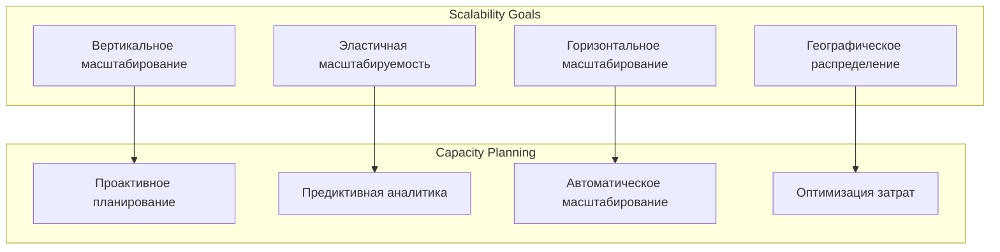
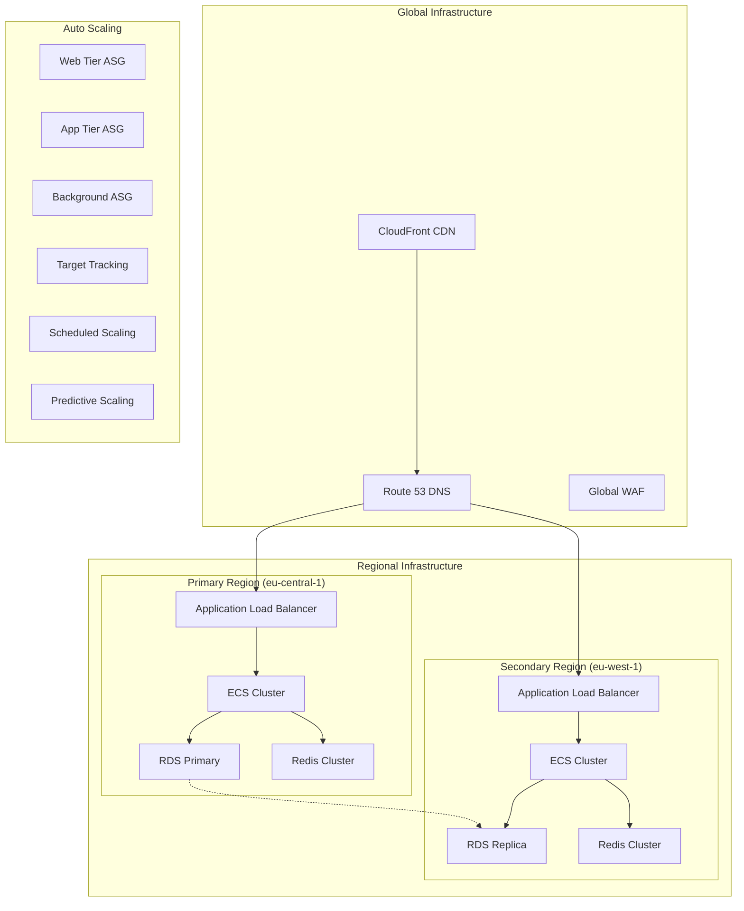

# Стратегия масштабируемости и планирования емкости для системы автоматизации договоров купли-продажи земли

## Обзор

Документ описывает комплексную стратегию масштабируемости и планирования емкости для системы автоматизации договоров купли-продажи земли, обеспечивающую способность системы обрабатывать растущую нагрузку и адаптироваться к изменяющимся требованиям бизнеса.

## Цели масштабируемости

### Бизнес-цели

| Метрика | Текущее значение | Целевое значение (1 год) | Целевое значение (3 года) |
|----------|------------------|--------------------------|---------------------------|
| Активные пользователи | 100-1000 | 5000 | 25000 |
| Договоров в месяц | 50-500 | 2000 | 10000 |
| Одновременных сессий | 50 | 500 | 2500 |
| Время отклика (p95) | 200мс | 150мс | 100мс |
| Доступность | 99.9% | 99.95% | 99.99% |

### Технические цели



## Архитектура масштабируемости

### Многоуровневая масштабируемость



### Стратегии масштабирования

```python
# scalability/scaling_strategies.py
import boto3
import json
import time
from datetime import datetime, timedelta
from typing import Dict, List, Any, Optional
from dataclasses import dataclass
from enum import Enum

class ScalingType(Enum):
    HORIZONTAL = "horizontal"
    VERTICAL = "vertical"
    ELASTIC = "elastic"
    PREDICTIVE = "predictive"

@dataclass
class ScalingPolicy:
    policy_name: str
    resource_type: str
    resource_id: str
    scaling_type: ScalingType
    min_capacity: int
    max_capacity: int
    target_utilization: float
    scale_up_cooldown: int
    scale_down_cooldown: int
    predictive_scaling: bool

class ScalabilityManager:
    """Менеджер масштабируемости"""
    
    def __init__(self, config: Dict):
        self.config = config
        self.autoscaling = boto3.client('autoscaling')
        self.application_autoscaling = boto3.client('application-autoscaling')
        self.cloudwatch = boto3.client('cloudwatch')
        self.ecs = boto3.client('ecs')
        self.rds = boto3.client('rds')
        self.elasticache = boto3.client('elasticache')
        
    def create_scaling_policy(self, policy: ScalingPolicy) -> bool:
        """Создание политики масштабирования"""
        try:
            if policy.resource_type == 'ecs_service':
                return self._create_ecs_scaling_policy(policy)
            elif policy.resource_type == 'rds_instance':
                return self._create_rds_scaling_policy(policy)
            elif policy.resource_type == 'elasticache_cluster':
                return self._create_elasticache_scaling_policy(policy)
            else:
                raise ValueError(f"Unsupported resource type: {policy.resource_type}")
                
        except Exception as e:
            print(f"Error creating scaling policy: {e}")
            return False
    
    def _create_ecs_scaling_policy(self, policy: ScalingPolicy) -> bool:
        """Создание политики масштабирования для ECS сервиса"""
        try:
            # Регистрация цели масштабирования
            response = self.application_autoscaling.register_scalable_target(
                ServiceNamespace='ecs',
                ResourceId=policy.resource_id,
                ScalableDimension='ecs:service:DesiredCount',
                MinCapacity=policy.min_capacity,
                MaxCapacity=policy.max_capacity
            )
            
            # Создание политики отслеживания цели
            self.application_autoscaling.put_scaling_policy(
                PolicyName=policy.policy_name,
                ServiceNamespace='ecs',
                ResourceId=policy.resource_id,
                ScalableDimension='ecs:service:DesiredCount',
                PolicyType='TargetTrackingScaling',
                TargetTrackingScalingPolicyConfiguration={
                    'TargetValue': policy.target_utilization,
                    'PredefinedMetricSpecification': {
                        'PredefinedMetricType': 'ECSServiceAverageCPUUtilization'
                    },
                    'ScaleInCooldown': policy.scale_down_cooldown,
                    'ScaleOutCooldown': policy.scale_up_cooldown,
                    'DisableScaleIn': False
                }
            )
            
            # Включение предиктивного масштабирования если необходимо
            if policy.predictive_scaling:
                self._enable_predictive_scaling(policy)
            
            return True
            
        except Exception as e:
            print(f"Error creating ECS scaling policy: {e}")
            return False
    
    def _create_rds_scaling_policy(self, policy: ScalingPolicy) -> bool:
        """Создание политики масштабирования для RDS"""
        try:
            # Изменение класса инстанса для вертикального масштабирования
            if policy.scaling_type == ScalingType.VERTICAL:
                self.rds.modify_db_instance(
                    DBInstanceIdentifier=policy.resource_id,
                    DBInstanceClass='db.m5.large',  # Целевой класс
                    ApplyImmediately=True
                )
            
            # Настройка Auto Scaling для горизонтального масштабирования
            elif policy.scaling_type == ScalingType.HORIZONTAL:
                # RDS поддерживает только read replica для горизонтального масштабирования
                self.rds.create_db_instance_read_replica(
                    DBInstanceIdentifier=f"{policy.resource_id}-replica",
                    SourceDBInstanceIdentifier=policy.resource_id,
                    DBInstanceClass='db.m5.large',
                    PubliclyAccessible=False
                )
            
            return True
            
        except Exception as e:
            print(f"Error creating RDS scaling policy: {e}")
            return False
    
    def _create_elasticache_scaling_policy(self, policy: ScalingPolicy) -> bool:
        """Создание политики масштабирования для ElastiCache"""
        try:
            # Изменение типа узла для вертикального масштабирования
            if policy.scaling_type == ScalingType.VERTICAL:
                self.elasticache.modify_replication_group(
                    ReplicationGroupId=policy.resource_id,
                    CacheNodeType='cache.m5.large',
                    ApplyImmediately=True
                )
            
            # Изменение количества узлов для горизонтального масштабирования
            elif policy.scaling_type == ScalingType.HORIZONTAL:
                self.elasticache.modify_replication_group_shard_configuration(
                    ReplicationGroupId=policy.resource_id,
                    NodeGroupCount=policy.max_capacity,
                    ApplyImmediately=True
                )
            
            return True
            
        except Exception as e:
            print(f"Error creating ElastiCache scaling policy: {e}")
            return False
    
    def _enable_predictive_scaling(self, policy: ScalingPolicy):
        """Включение предиктивного масштабирования"""
        try:
            self.application_autoscaling.put_scaling_policy(
                PolicyName=f"{policy.policy_name}-predictive",
                ServiceNamespace='ecs',
                ResourceId=policy.resource_id,
                ScalableDimension='ecs:service:DesiredCount',
                PolicyType='PredictiveScaling',
                PredictiveScalingPolicyConfiguration={
                    'MetricSpecifications': [
                        {
                            'TargetValue': policy.target_utilization,
                            'PredefinedMetricSpecification': {
                                'PredefinedMetricType': 'ECSServiceAverageCPUUtilization'
                            }
                        }
                    ],
                    'Mode': 'ForecastAndScale'
                }
            )
            
        except Exception as e:
            print(f"Error enabling predictive scaling: {e}")
```

## Планирование емкости

### Анализ текущей емкости

```python
# capacity_planning/capacity_analyzer.py
import boto3
import pandas as pd
import numpy as np
from datetime import datetime, timedelta
from typing import Dict, List, Any, Tuple
from dataclasses import dataclass

@dataclass
class CapacityMetrics:
    resource_type: str
    resource_id: str
    current_utilization: float
    peak_utilization: float
    average_utilization: float
    trend: float  # тренд за последние 30 дней
    forecast_utilization: float  # прогноз на 30 дней
    recommended_capacity: int
    time_to_capacity_exhaustion: int  # дней до исчерпания емкости

class CapacityAnalyzer:
    """Анализатор емкости"""
    
    def __init__(self, config: Dict):
        self.config = config
        self.cloudwatch = boto3.client('cloudwatch')
        self.ecs = boto3.client('ecs')
        self.rds = boto3.client('rds')
        self.elasticache = boto3.client('elasticache')
        
    def analyze_capacity(self) -> Dict[str, List[CapacityMetrics]]:
        """Анализ текущей емкости"""
        capacity_analysis = {
            'ecs_services': [],
            'rds_instances': [],
            'elasticache_clusters': []
        }
        
        # Анализ ECS сервисов
        ecs_services = self._get_ecs_services()
        for service in ecs_services:
            metrics = self._analyze_ecs_service_capacity(service)
            capacity_analysis['ecs_services'].append(metrics)
        
        # Анализ RDS инстансов
        rds_instances = self._get_rds_instances()
        for instance in rds_instances:
            metrics = self._analyze_rds_capacity(instance)
            capacity_analysis['rds_instances'].append(metrics)
        
        # Анализ ElastiCache кластеров
        cache_clusters = self._get_elasticache_clusters()
        for cluster in cache_clusters:
            metrics = self._analyze_elasticache_capacity(cluster)
            capacity_analysis['elasticache_clusters'].append(metrics)
        
        return capacity_analysis
    
    def _analyze_ecs_service_capacity(self, service: Dict) -> CapacityMetrics:
        """Анализ емкости ECS сервиса"""
        service_name = service['serviceName']
        cluster_name = service['clusterArn'].split('/')[-1]
        
        # Получение метрик CPU за последние 30 дней
        cpu_metrics = self._get_cloudwatch_metrics(
            'AWS/ECS',
            'CPUUtilization',
            {
                'ServiceName': service_name,
                'ClusterName': cluster_name
            },
            30
        )
        
        # Получение метрик памяти за последние 30 дней
        memory_metrics = self._get_cloudwatch_metrics(
            'AWS/ECS',
            'MemoryUtilization',
            {
                'ServiceName': service_name,
                'ClusterName': cluster_name
            },
            30
        )
        
        # Расчет показателей
        current_cpu = cpu_metrics[-1] if cpu_metrics else 0
        peak_cpu = max(cpu_metrics) if cpu_metrics else 0
        avg_cpu = np.mean(cpu_metrics) if cpu_metrics else 0
        
        current_memory = memory_metrics[-1] if memory_metrics else 0
        peak_memory = max(memory_metrics) if memory_metrics else 0
        avg_memory = np.mean(memory_metrics) if memory_metrics else 0
        
        # Расчет тренда
        cpu_trend = self._calculate_trend(cpu_metrics)
        memory_trend = self._calculate_trend(memory_metrics)
        
        # Прогноз на 30 дней
        cpu_forecast = self._forecast_utilization(cpu_metrics, 30)
        memory_forecast = self._forecast_utilization(memory_metrics, 30)
        
        # Рекомендации по емкости
        recommended_capacity = self._calculate_recommended_capacity(
            max(cpu_forecast, memory_forecast)
        )
        
        # Расчет времени до исчерпания емкости
        time_to_exhaustion = self._calculate_time_to_exhaustion(
            max(cpu_forecast, memory_forecast)
        )
        
        return CapacityMetrics(
            resource_type='ecs_service',
            resource_id=f"{cluster_name}/{service_name}",
            current_utilization=max(current_cpu, current_memory),
            peak_utilization=max(peak_cpu, peak_memory),
            average_utilization=max(avg_cpu, avg_memory),
            trend=max(cpu_trend, memory_trend),
            forecast_utilization=max(cpu_forecast, memory_forecast),
            recommended_capacity=recommended_capacity,
            time_to_capacity_exhaustion=time_to_exhaustion
        )
    
    def _analyze_rds_capacity(self, instance: Dict) -> CapacityMetrics:
        """Анализ емкости RDS инстанса"""
        instance_id = instance['DBInstanceIdentifier']
        
        # Получение метрик CPU
        cpu_metrics = self._get_cloudwatch_metrics(
            'AWS/RDS',
            'CPUUtilization',
            {'DBInstanceIdentifier': instance_id},
            30
        )
        
        # Получение метрик памяти
        memory_metrics = self._get_cloudwatch_metrics(
            'AWS/RDS',
            'FreeableMemory',
            {'DBInstanceIdentifier': instance_id},
            30
        )
        
        # Получение метрик хранилища
        storage_metrics = self._get_cloudwatch_metrics(
            'AWS/RDS',
            'FreeStorageSpace',
            {'DBInstanceIdentifier': instance_id},
            30
        )
        
        # Расчет показателей
        current_cpu = cpu_metrics[-1] if cpu_metrics else 0
        peak_cpu = max(cpu_metrics) if cpu_metrics else 0
        avg_cpu = np.mean(cpu_metrics) if cpu_metrics else 0
        
        # Преобразование памяти в процент использования
        total_memory = self._get_instance_memory(instance['DBInstanceClass'])
        memory_usage = [(total_memory - m) / total_memory * 100 for m in memory_metrics] if memory_metrics else []
        current_memory = memory_usage[-1] if memory_usage else 0
        peak_memory = max(memory_usage) if memory_usage else 0
        avg_memory = np.mean(memory_usage) if memory_usage else 0
        
        # Преобразование хранилища в процент использования
        total_storage = instance['AllocatedStorage'] * 1024 * 1024 * 1024  # GB to bytes
        storage_usage = [(total_storage - s) / total_storage * 100 for s in storage_metrics] if storage_metrics else []
        current_storage = storage_usage[-1] if storage_usage else 0
        peak_storage = max(storage_usage) if storage_usage else 0
        avg_storage = np.mean(storage_usage) if storage_usage else 0
        
        # Расчет трендов
        cpu_trend = self._calculate_trend(cpu_metrics)
        memory_trend = self._calculate_trend(memory_usage)
        storage_trend = self._calculate_trend(storage_usage)
        
        # Прогноз на 30 дней
        cpu_forecast = self._forecast_utilization(cpu_metrics, 30)
        memory_forecast = self._forecast_utilization(memory_usage, 30)
        storage_forecast = self._forecast_utilization(storage_usage, 30)
        
        # Рекомендации по емкости
        max_forecast = max(cpu_forecast, memory_forecast, storage_forecast)
        recommended_instance_class = self._recommend_rds_instance_class(max_forecast)
        recommended_storage = self._recommend_rds_storage(storage_forecast)
        
        # Расчет времени до исчерпания емкости
        time_to_exhaustion = self._calculate_time_to_exhaustion(max_forecast)
        
        return CapacityMetrics(
            resource_type='rds_instance',
            resource_id=instance_id,
            current_utilization=max(current_cpu, current_memory, current_storage),
            peak_utilization=max(peak_cpu, peak_memory, peak_storage),
            average_utilization=max(avg_cpu, avg_memory, avg_storage),
            trend=max(cpu_trend, memory_trend, storage_trend),
            forecast_utilization=max_forecast,
            recommended_capacity=recommended_instance_class,
            time_to_capacity_exhaustion=time_to_exhaustion
        )
    
    def _get_cloudwatch_metrics(
        self,
        namespace: str,
        metric_name: str,
        dimensions: Dict,
        days: int
    ) -> List[float]:
        """Получение метрик из CloudWatch"""
        try:
            end_time = datetime.now()
            start_time = end_time - timedelta(days=days)
            
            response = self.cloudwatch.get_metric_statistics(
                Namespace=namespace,
                MetricName=metric_name,
                Dimensions=[
                    {'Name': k, 'Value': v}
                    for k, v in dimensions.items()
                ],
                StartTime=start_time,
                EndTime=end_time,
                Period=3600,  # 1 час
                Statistics=['Average']
            )
            
            return [dp['Average'] for dp in response['Datapoints']]
            
        except Exception as e:
            print(f"Error getting CloudWatch metrics: {e}")
            return []
    
    def _calculate_trend(self, metrics: List[float]) -> float:
        """Расчет тренда метрики"""
        if len(metrics) < 2:
            return 0.0
        
        # Простая линейная регрессия
        x = np.arange(len(metrics))
        y = np.array(metrics)
        
        # Удаление NaN значений
        mask = ~np.isnan(y)
        x = x[mask]
        y = y[mask]
        
        if len(x) < 2:
            return 0.0
        
        # Расчет коэффициента наклона
        slope = np.polyfit(x, y, 1)[0]
        
        return slope
    
    def _forecast_utilization(self, metrics: List[float], days: int) -> float:
        """Прогноз использования на указанное количество дней"""
        if len(metrics) < 2:
            return metrics[-1] if metrics else 0.0
        
        # Расчет тренда
        trend = self._calculate_trend(metrics)
        current_value = metrics[-1] if metrics else 0.0
        
        # Прогноз на основе тренда
        forecast_value = current_value + (trend * days)
        
        # Ограничение диапазоном 0-100%
        return max(0.0, min(100.0, forecast_value))
    
    def _calculate_recommended_capacity(self, forecast_utilization: float) -> int:
        """Расчет рекомендуемой емкости"""
        if forecast_utilization < 70:
            return 1  # Текущая емкость достаточна
        elif forecast_utilization < 85:
            return 2  # Увеличить на 50%
        else:
            return 3  # Увеличить на 100%
    
    def _calculate_time_to_exhaustion(self, forecast_utilization: float) -> int:
        """Расчет времени до исчерпания емкости в днях"""
        if forecast_utilization < 80:
            return 999  # Емкость достаточна
        elif forecast_utilization < 90:
            return 30  # 1 месяц
        elif forecast_utilization < 95:
            return 14  # 2 недели
        else:
            return 7  # 1 неделя
```

### Предиктивное планирование

```python
# capacity_planning/predictive_planning.py
import boto3
import pandas as pd
import numpy as np
from datetime import datetime, timedelta
from typing import Dict, List, Any, Tuple
from sklearn.linear_model import LinearRegression
from sklearn.ensemble import RandomForestRegressor
from sklearn.preprocessing import StandardScaler

class PredictivePlanner:
    """Предиктивный планировщик емкости"""
    
    def __init__(self, config: Dict):
        self.config = config
        self.cloudwatch = boto3.client('cloudwatch')
        self.forecast = boto3.client('forecast')
        
    def predict_capacity_needs(
        self,
        resource_type: str,
        resource_id: str,
        forecast_days: int = 90
    ) -> Dict[str, Any]:
        """Предсказание потребностей в емкости"""
        
        # Получение исторических данных
        historical_data = self._get_historical_data(resource_type, resource_id)
        
        # Подготовка признаков для модели
        features, target = self._prepare_features(historical_data)
        
        # Обучение моделей
        models = self._train_models(features, target)
        
        # Генерация прогноза
        forecast = self._generate_forecast(models, features, forecast_days)
        
        # Анализ сезонности
        seasonality = self._analyze_seasonality(historical_data)
        
        # Рекомендации по масштабированию
        recommendations = self._generate_scaling_recommendations(
            forecast, seasonality, resource_type
        )
        
        return {
            'resource_type': resource_type,
            'resource_id': resource_id,
            'forecast_days': forecast_days,
            'historical_data': historical_data,
            'forecast': forecast,
            'seasonality': seasonality,
            'recommendations': recommendations,
            'confidence_interval': self._calculate_confidence_interval(models, forecast)
        }
    
    def _get_historical_data(
        self,
        resource_type: str,
        resource_id: str
    ) -> pd.DataFrame:
        """Получение исторических данных"""
        # Получение данных за последние 6 месяцев
        end_time = datetime.now()
        start_time = end_time - timedelta(days=180)
        
        # Определение метрик на основе типа ресурса
        if resource_type == 'ecs_service':
            metrics = ['CPUUtilization', 'MemoryUtilization']
            namespace = 'AWS/ECS'
        elif resource_type == 'rds_instance':
            metrics = ['CPUUtilization', 'DatabaseConnections', 'FreeStorageSpace']
            namespace = 'AWS/RDS'
        else:
            metrics = ['CPUUtilization']
            namespace = 'AWS/ECS'
        
        # Сбор данных
        all_data = []
        
        for metric in metrics:
            response = self.cloudwatch.get_metric_statistics(
                Namespace=namespace,
                MetricName=metric,
                Dimensions=[
                    {'Name': 'ResourceId', 'Value': resource_id}
                ],
                StartTime=start_time,
                EndTime=end_time,
                Period=3600,  # 1 час
                Statistics=['Average', 'Maximum', 'Minimum']
            )
            
            for datapoint in response['Datapoints']:
                all_data.append({
                    'timestamp': datapoint['Timestamp'],
                    'metric': metric,
                    'average': datapoint['Average'],
                    'maximum': datapoint['Maximum'],
                    'minimum': datapoint['Minimum']
                })
        
        # Преобразование в DataFrame
        df = pd.DataFrame(all_data)
        
        # Pivot таблица для получения метрик в колонках
        df_pivot = df.pivot_table(
            index='timestamp',
            columns='metric',
            values=['average', 'maximum', 'minimum']
        )
        
        # Заполнение пропусков
        df_pivot = df_pivot.fillna(method='ffill').fillna(0)
        
        return df_pivot
    
    def _prepare_features(self, data: pd.DataFrame) -> Tuple[np.ndarray, np.ndarray]:
        """Подготовка признаков для модели"""
        # Создание временных признаков
        features = pd.DataFrame(index=data.index)
        
        # Часовые признаки
        features['hour'] = data.index.hour
        features['day_of_week'] = data.index.dayofweek
        features['day_of_month'] = data.index.day
        features['month'] = data.index.month
        features['quarter'] = data.index.quarter
        
        # Лаговые признаки
        for lag in [1, 6, 12, 24, 48]:  # часы
            for col in data.columns:
                features[f'{col}_lag_{lag}'] = data[col].shift(lag)
        
        # Скользящие средние
        for window in [6, 12, 24]:  # часы
            for col in data.columns:
                features[f'{col}_ma_{window}'] = data[col].rolling(window=window).mean()
        
        # Целевая переменная (следующее значение)
        target = data.iloc[:, 0].shift(-1)  # Предсказываем первую метрику
        
        # Удаление строк с NaN
        valid_idx = ~(features.isna().any(axis=1) | target.isna())
        features = features[valid_idx]
        target = target[valid_idx]
        
        return features.values, target.values
    
    def _train_models(
        self,
        features: np.ndarray,
        target: np.ndarray
    ) -> Dict[str, Any]:
        """Обучение моделей прогнозирования"""
        # Масштабирование признаков
        scaler = StandardScaler()
        features_scaled = scaler.fit_transform(features)
        
        # Линейная регрессия
        lr_model = LinearRegression()
        lr_model.fit(features_scaled, target)
        
        # Random Forest
        rf_model = RandomForestRegressor(n_estimators=100, random_state=42)
        rf_model.fit(features_scaled, target)
        
        return {
            'scaler': scaler,
            'linear_regression': lr_model,
            'random_forest': rf_model
        }
    
    def _generate_forecast(
        self,
        models: Dict[str, Any],
        last_features: np.ndarray,
        forecast_days: int
    ) -> pd.DataFrame:
        """Генерация прогноза"""
        forecast_data = []
        current_features = last_features.copy()
        
        for day in range(forecast_days):
            for hour in range(24):
                # Масштабирование признаков
                features_scaled = models['scaler'].transform(current_features.reshape(1, -1))
                
                # Прогноз с помощью ансамбля
                lr_pred = models['linear_regression'].predict(features_scaled)[0]
                rf_pred = models['random_forest'].predict(features_scaled)[0]
                
                # Усреднение прогнозов
                ensemble_pred = (lr_pred + rf_pred) / 2
                
                forecast_data.append({
                    'timestamp': datetime.now() + timedelta(days=day, hours=hour),
                    'predicted_value': ensemble_pred,
                    'lr_prediction': lr_pred,
                    'rf_prediction': rf_pred
                })
                
                # Обновление признаков для следующего шага
                current_features = self._update_features(current_features, ensemble_pred)
        
        return pd.DataFrame(forecast_data)
    
    def _analyze_seasonality(self, data: pd.DataFrame) -> Dict[str, Any]:
        """Анализ сезонности"""
        seasonality = {}
        
        # Дневная сезонность
        daily_pattern = data.groupby(data.index.hour).mean()
        seasonality['daily'] = daily_pattern.iloc[:, 0].to_dict()
        
        # Недельная сезонность
        weekly_pattern = data.groupby(data.index.dayofweek).mean()
        seasonality['weekly'] = weekly_pattern.iloc[:, 0].to_dict()
        
        # Месячная сезонность
        monthly_pattern = data.groupby(data.index.month).mean()
        seasonality['monthly'] = monthly_pattern.iloc[:, 0].to_dict()
        
        return seasonality
    
    def _generate_scaling_recommendations(
        self,
        forecast: pd.DataFrame,
        seasonality: Dict[str, Any],
        resource_type: str
    ) -> List[Dict[str, Any]]:
        """Генерация рекомендаций по масштабированию"""
        recommendations = []
        
        # Анализ пиковых нагрузок
        peak_values = forecast.groupby(forecast['timestamp'].dt.hour)['predicted_value'].max()
        peak_hours = peak_values.nlargest(3).index.tolist()
        
        # Рекомендации по времени масштабирования
        for hour in peak_hours:
            recommendations.append({
                'type': 'scheduled_scaling',
                'action': 'scale_up',
                'schedule': f'cron(0 {hour} * * *)',  # Каждый день в указанный час
                'reason': f'Peak load expected at {hour}:00',
                'confidence': 'high'
            })
        
        # Рекомендации по емкости
        max_forecast = forecast['predicted_value'].max()
        if max_forecast > 80:
            recommendations.append({
                'type': 'capacity_increase',
                'action': 'increase_capacity',
                'recommended_increase': '50%',
                'reason': f'Forecasted peak utilization: {max_forecast:.1f}%',
                'confidence': 'high'
            })
        elif max_forecast > 60:
            recommendations.append({
                'type': 'capacity_monitoring',
                'action': 'monitor_closely',
                'reason': f'Forecasted peak utilization: {max_forecast:.1f}%',
                'confidence': 'medium'
            })
        
        return recommendations
```

## Оптимизация затрат

### Анализ и оптимизация затрат

```python
# cost_optimization/cost_optimizer.py
import boto3
import pandas as pd
from datetime import datetime, timedelta
from typing import Dict, List, Any

class CostOptimizer:
    """Оптимизатор затрат"""
    
    def __init__(self, config: Dict):
        self.config = config
        self.ce = boto3.client('ce')  # Cost Explorer
        self.ec2 = boto3.client('ec2')
        self.rds = boto3.client('rds')
        self.elasticache = boto3.client('elasticache')
        
    def analyze_costs(self, days: int = 30) -> Dict[str, Any]:
        """Анализ затрат"""
        end_date = datetime.now().strftime('%Y-%m-%d')
        start_date = (datetime.now() - timedelta(days=days)).strftime('%Y-%m-%d')
        
        # Получение данных о затратах
        cost_data = self._get_cost_data(start_date, end_date)
        
        # Анализ по сервисам
        service_costs = self._analyze_costs_by_service(cost_data)
        
        # Анализ по ресурсам
        resource_costs = self._analyze_costs_by_resource(cost_data)
        
        # Поиск возможностей оптимизации
        optimization_opportunities = self._find_optimization_opportunities()
        
        # Прогноз затрат
        cost_forecast = self._forecast_costs(cost_data)
        
        return {
            'period': f"{start_date} to {end_date}",
            'total_cost': sum(item['Amount']['Amount'] for item in cost_data),
            'service_costs': service_costs,
            'resource_costs': resource_costs,
            'optimization_opportunities': optimization_opportunities,
            'cost_forecast': cost_forecast
        }
    
    def _get_cost_data(self, start_date: str, end_date: str) -> List[Dict]:
        """Получение данных о затратах"""
        try:
            response = self.ce.get_cost_and_usage(
                TimePeriod={
                    'Start': start_date,
                    'End': end_date
                },
                Granularity='DAILY',
                Metrics=['BlendedCost'],
                GroupBy=[
                    {'Type': 'DIMENSION', 'Key': 'SERVICE'},
                    {'Type': 'DIMENSION', 'Key': 'RESOURCE'}
                ]
            )
            
            return response['ResultsByTime']
            
        except Exception as e:
            print(f"Error getting cost data: {e}")
            return []
    
    def _analyze_costs_by_service(self, cost_data: List[Dict]) -> Dict[str, float]:
        """Анализ затрат по сервисам"""
        service_costs = {}
        
        for time_period in cost_data:
            for group in time_period['Groups']:
                service = group['Keys'][0]
                amount = float(group['Metrics']['BlendedCost']['Amount'])
                
                if service not in service_costs:
                    service_costs[service] = 0.0
                service_costs[service] += amount
        
        return service_costs
    
    def _analyze_costs_by_resource(self, cost_data: List[Dict]) -> Dict[str, float]:
        """Анализ затрат по ресурсам"""
        resource_costs = {}
        
        for time_period in cost_data:
            for group in time_period['Groups']:
                if len(group['Keys']) > 1:
                    resource = group['Keys'][1]
                    amount = float(group['Metrics']['BlendedCost']['Amount'])
                    
                    if resource not in resource_costs:
                        resource_costs[resource] = 0.0
                    resource_costs[resource] += amount
        
        return resource_costs
    
    def _find_optimization_opportunities(self) -> List[Dict[str, Any]]:
        """Поиск возможностей оптимизации"""
        opportunities = []
        
        # Проверка неиспользуемых EC2 инстансов
        unused_instances = self._find_unused_ec2_instances()
        for instance in unused_instances:
            opportunities.append({
                'type': 'unused_resource',
                'resource_type': 'ec2_instance',
                'resource_id': instance['InstanceId'],
                'potential_savings': instance['EstimatedSavings'],
                'recommendation': 'Terminate or downsize instance'
            })
        
        # Проверка недоиспользуемых RDS инстансов
        underutilized_rds = self._find_underutilized_rds_instances()
        for instance in underutilized_rds:
            opportunities.append({
                'type': 'underutilized_resource',
                'resource_type': 'rds_instance',
                'resource_id': instance['DBInstanceIdentifier'],
                'current_utilization': instance['CPUUtilization'],
                'potential_savings': instance['EstimatedSavings'],
                'recommendation': 'Downsize instance class'
            })
        
        # Проверка возможностей Reserved Instances
        ri_opportunities = self._find_reserved_instance_opportunities()
        for opportunity in ri_opportunities:
            opportunities.append({
                'type': 'reserved_instance',
                'resource_type': opportunity['InstanceType'],
                'potential_savings': opportunity['PotentialSavings'],
                'recommendation': 'Purchase Reserved Instance'
            })
        
        return opportunities
    
    def _find_unused_ec2_instances(self) -> List[Dict[str, Any]]:
        """Поиск неиспользуемых EC2 инстансов"""
        unused_instances = []
        
        # Получение всех инстансов
        response = self.ec2.describe_instances()
        
        for reservation in response['Reservations']:
            for instance in reservation['Instances']:
                if instance['State']['Name'] == 'running':
                    # Проверка метрик utilization
                    cpu_metrics = self._get_instance_cpu_metrics(instance['InstanceId'])
                    
                    if cpu_metrics and max(cpu_metrics) < 5:  # < 5% CPU utilization
                        # Расчет потенциальной экономии
                        instance_type = instance['InstanceType']
                        hourly_cost = self._get_instance_hourly_cost(instance_type)
                        monthly_savings = hourly_cost * 24 * 30
                        
                        unused_instances.append({
                            'InstanceId': instance['InstanceId'],
                            'InstanceType': instance_type,
                            'CPUUtilization': max(cpu_metrics),
                            'EstimatedSavings': monthly_savings
                        })
        
        return unused_instances
    
    def _find_underutilized_rds_instances(self) -> List[Dict[str, Any]]:
        """Поиск недоиспользуемых RDS инстансов"""
        underutilized_instances = []
        
        # Получение всех RDS инстансов
        response = self.rds.describe_db_instances()
        
        for instance in response['DBInstances']:
            if instance['DBInstanceStatus'] == 'available':
                # Проверка метрик utilization
                cpu_metrics = self._get_rds_cpu_metrics(instance['DBInstanceIdentifier'])
                
                if cpu_metrics and np.mean(cpu_metrics) < 20:  # < 20% CPU utilization
                    # Расчет потенциальной экономии
                    instance_class = instance['DBInstanceClass']
                    hourly_cost = self._get_rds_hourly_cost(instance_class)
                    monthly_savings = hourly_cost * 24 * 30
                    
                    underutilized_instances.append({
                        'DBInstanceIdentifier': instance['DBInstanceIdentifier'],
                        'DBInstanceClass': instance_class,
                        'CPUUtilization': np.mean(cpu_metrics),
                        'EstimatedSavings': monthly_savings
                    })
        
        return underutilized_instances
    
    def _forecast_costs(self, historical_costs: List[Dict]) -> Dict[str, Any]:
        """Прогноз затрат"""
        # Простая экстраполяция на основе тренда
        total_costs = [
            float(item['Total']['Amount']) 
            for item in historical_costs
        ]
        
        if len(total_costs) < 2:
            return {'next_month': 0, 'next_quarter': 0}
        
        # Расчет тренда
        trend = (total_costs[-1] - total_costs[0]) / len(total_costs)
        
        # Прогноз
        next_month = total_costs[-1] + (trend * 30)
        next_quarter = total_costs[-1] + (trend * 90)
        
        return {
            'next_month': max(0, next_month),
            'next_quarter': max(0, next_quarter),
            'trend': trend
        }
```

## Заключение

Комплексная стратегия масштабируемости и планирования емкости обеспечивает способность системы автоматизации договоров купли-продажи земли эффективно обрабатывать растущую нагрузку, адаптироваться к изменяющимся требованиям бизнеса и оптимизировать затраты на инфраструктуру. Предиктивное планирование, автоматическое масштабирование и непрерывный мониторинг создают основу для устойчивого роста системы.