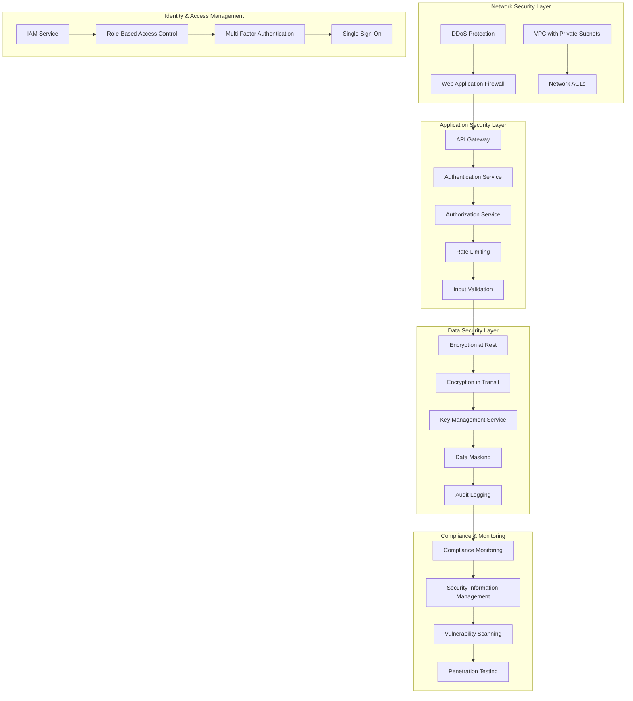

# Архитектура безопасности для системы автоматизации договоров купли-продажи земли

## Обзор

Документ описывает комплексную архитектуру безопасности, разработанную с учетом требований российского законодательства (ФЗ-152 "О персональных данных", ФЗ-63 "Об электронной подписи") и лучших практик информационной безопасности.

## Принципы безопасности

1. **Defense in Depth**: Многоуровневая защита на всех уровнях системы
2. **Zero Trust**: Никому не доверять, все проверять
3. **Privacy by Design**: Приватность встроена в архитектуру
4. **Least Privilege**: Минимальные необходимые права доступа
5. **Compliance by Default**: Соответствие требованиям по умолчанию

## Архитектура безопасности



## 1. Сетевая безопасность

### 1.1 VPC Architecture
```yaml
# infrastructure/vpc.yaml
AWSTemplateFormatVersion: '2010-09-09'
Description: 'VPC Architecture for Land Contracts System'

Parameters:
  Environment:
    Type: String
    Default: production
    AllowedValues: [development, staging, production]

Resources:
  # VPC
  LandContractsVPC:
    Type: AWS::EC2::VPC
    Properties:
      CidrBlock: 10.0.0.0/16
      EnableDnsHostnames: true
      EnableDnsSupport: true
      Tags:
        - Key: Name
          Value: !Sub '${Environment}-land-contracts-vpc'

  # Internet Gateway
  InternetGateway:
    Type: AWS::EC2::InternetGateway
    Properties:
      Tags:
        - Key: Name
          Value: !Sub '${Environment}-land-contracts-igw'

  AttachGateway:
    Type: AWS::EC2::VPCGatewayAttachment
    Properties:
      VpcId: !Ref LandContractsVPC
      InternetGatewayId: !Ref InternetGateway

  # Public Subnets
  PublicSubnet1:
    Type: AWS::EC2::Subnet
    Properties:
      VpcId: !Ref LandContractsVPC
      CidrBlock: 10.0.1.0/24
      AvailabilityZone: !Select [0, !GetAZs '']
      MapPublicIpOnLaunch: true
      Tags:
        - Key: Name
          Value: !Sub '${Environment}-public-subnet-1'

  PublicSubnet2:
    Type: AWS::EC2::Subnet
    Properties:
      VpcId: !Ref LandContractsVPC
      CidrBlock: 10.0.2.0/24
      AvailabilityZone: !Select [1, !GetAZs '']
      MapPublicIpOnLaunch: true
      Tags:
        - Key: Name
          Value: !Sub '${Environment}-public-subnet-2'

  # Private Subnets
  PrivateSubnet1:
    Type: AWS::EC2::Subnet
    Properties:
      VpcId: !Ref LandContractsVPC
      CidrBlock: 10.0.11.0/24
      AvailabilityZone: !Select [0, !GetAZs '']
      Tags:
        - Key: Name
          Value: !Sub '${Environment}-private-subnet-1'

  PrivateSubnet2:
    Type: AWS::EC2::Subnet
    Properties:
      VpcId: !Ref LandContractsVPC
      CidrBlock: 10.0.12.0/24
      AvailabilityZone: !Select [1, !GetAZs '']
      Tags:
        - Key: Name
          Value: !Sub '${Environment}-private-subnet-2'

  # Database Subnets
  DatabaseSubnet1:
    Type: AWS::EC2::Subnet
    Properties:
      VpcId: !Ref LandContractsVPC
      CidrBlock: 10.0.21.0/24
      AvailabilityZone: !Select [0, !GetAZs '']
      Tags:
        - Key: Name
          Value: !Sub '${Environment}-database-subnet-1'

  DatabaseSubnet2:
    Type: AWS::EC2::Subnet
    Properties:
      VpcId: !Ref LandContractsVPC
      CidrBlock: 10.0.22.0/24
      AvailabilityZone: !Select [1, !GetAZs '']
      Tags:
        - Key: Name
          Value: !Sub '${Environment}-database-subnet-2'

  # Route Tables
  PublicRouteTable:
    Type: AWS::EC2::RouteTable
    Properties:
      VpcId: !Ref LandContractsVPC
      Tags:
        - Key: Name
          Value: !Sub '${Environment}-public-rt'

  PublicRoute:
    Type: AWS::EC2::Route
    DependsOn: AttachGateway
    Properties:
      RouteTableId: !Ref PublicRouteTable
      DestinationCidrBlock: 0.0.0.0/0
      GatewayId: !Ref InternetGateway

  # NAT Gateway
  NATGateway:
    Type: AWS::EC2::NatGateway
    Properties:
      AllocationId: !GetAtt NATEIP.AllocationId
      SubnetId: !Ref PublicSubnet1
      Tags:
        - Key: Name
          Value: !Sub '${Environment}-nat-gateway'

  NATEIP:
    Type: AWS::EC2::EIP
    DependsOn: AttachGateway
    Properties:
      Domain: vpc

  PrivateRouteTable:
    Type: AWS::EC2::RouteTable
    Properties:
      VpcId: !Ref LandContractsVPC
      Tags:
        - Key: Name
          Value: !Sub '${Environment}-private-rt'

  PrivateRoute:
    Type: AWS::EC2::Route
    Properties:
      RouteTableId: !Ref PrivateRouteTable
      DestinationCidrBlock: 0.0.0.0/0
      NatGatewayId: !Ref NATGateway

  # Network ACLs
  PublicNetworkACL:
    Type: AWS::EC2::NetworkAcl
    Properties:
      VpcId: !Ref LandContractsVPC
      Tags:
        - Key: Name
          Value: !Sub '${Environment}-public-nacl'

  PrivateNetworkACL:
    Type: AWS::EC2::NetworkAcl
    Properties:
      VpcId: !Ref LandContractsVPC
      Tags:
        - Key: Name
          Value: !Sub '${Environment}-private-nacl'

  DatabaseNetworkACL:
    Type: AWS::EC2::NetworkAcl
    Properties:
      VpcId: !Ref LandContractsVPC
      Tags:
        - Key: Name
          Value: !Sub '${Environment}-database-nacl'
```

### 1.2 Security Groups
```python
# infrastructure/security_groups.py
import boto3
from typing import Dict, List

class SecurityGroupManager:
    def __init__(self, region: str = 'eu-west-1'):
        self.ec2 = boto3.client('ec2', region_name=region)
    
    def create_web_security_group(self, vpc_id: str) -> str:
        """Создание Security Group для веб-серверов"""
        response = self.ec2.create_security_group(
            GroupName='web-servers-sg',
            Description='Security group for web servers',
            VpcId=vpc_id
        )
        
        sg_id = response['GroupId']
        
        # Разрешить HTTP из интернет
        self.ec2.authorize_security_group_ingress(
            GroupId=sg_id,
            IpPermissions=[
                {
                    'IpProtocol': 'tcp',
                    'FromPort': 80,
                    'ToPort': 80,
                    'IpRanges': [{'CidrIp': '0.0.0.0/0'}]
                }
            ]
        )
        
        # Разрешить HTTPS из интернет
        self.ec2.authorize_security_group_ingress(
            GroupId=sg_id,
            IpPermissions=[
                {
                    'IpProtocol': 'tcp',
                    'FromPort': 443,
                    'ToPort': 443,
                    'IpRanges': [{'CidrIp': '0.0.0.0/0'}]
                }
            ]
        )
        
        # Разрешить SSH из офисной сети
        self.ec2.authorize_security_group_ingress(
            GroupId=sg_id,
            IpPermissions=[
                {
                    'IpProtocol': 'tcp',
                    'FromPort': 22,
                    'ToPort': 22,
                    'IpRanges': [{'CidrIp': '192.168.0.0/16'}]
                }
            ]
        )
        
        return sg_id
    
    def create_database_security_group(self, vpc_id: str) -> str:
        """Создание Security Group для баз данных"""
        response = self.ec2.create_security_group(
            GroupName='database-sg',
            Description='Security group for databases',
            VpcId=vpc_id
        )
        
        sg_id = response['GroupId']
        
        # Разрешить PostgreSQL из приватных подсетей
        self.ec2.authorize_security_group_ingress(
            GroupId=sg_id,
            IpPermissions=[
                {
                    'IpProtocol': 'tcp',
                    'FromPort': 5432,
                    'ToPort': 5432,
                    'UserIdGroupPairs': [
                        {
                            'GroupId': sg_id  # Разрешить внутри группы
                        }
                    ]
                }
            ]
        )
        
        return sg_id
    
    def create_redis_security_group(self, vpc_id: str) -> str:
        """Создание Security Group для Redis"""
        response = self.ec2.create_security_group(
            GroupName='redis-sg',
            Description='Security group for Redis',
            VpcId=vpc_id
        )
        
        sg_id = response['GroupId']
        
        # Разрешить Redis из приватных подсетей
        self.ec2.authorize_security_group_ingress(
            GroupId=sg_id,
            IpPermissions=[
                {
                    'IpProtocol': 'tcp',
                    'FromPort': 6379,
                    'ToPort': 6379,
                    'UserIdGroupPairs': [
                        {
                            'GroupId': sg_id
                        }
                    ]
                }
            ]
        )
        
        return sg_id
```

## 2. Аутентификация и авторизация

### 2.1 JWT Authentication Service
```python
# authentication/jwt_service.py
import jwt
import bcrypt
from datetime import datetime, timedelta
from typing import Dict, Any, Optional
import secrets
import redis
from django.conf import settings
import logging

logger = logging.getLogger(__name__)

class JWTService:
    def __init__(self):
        self.secret_key = settings.JWT_SECRET_KEY
        self.algorithm = 'HS256'
        self.access_token_expire_minutes = 15
        self.refresh_token_expire_days = 7
        self.redis_client = redis.Redis(
            host=settings.REDIS_HOST,
            port=settings.REDIS_PORT,
            decode_responses=True
        )
    
    def generate_tokens(self, user_id: str, user_data: Dict[str, Any]) -> Dict[str, str]:
        """Генерация access и refresh токенов"""
        # Access token
        access_payload = {
            'user_id': user_id,
            'user_data': user_data,
            'exp': datetime.utcnow() + timedelta(minutes=self.access_token_expire_minutes),
            'iat': datetime.utcnow(),
            'type': 'access',
            'jti': secrets.token_urlsafe(32)
        }
        
        access_token = jwt.encode(access_payload, self.secret_key, algorithm=self.algorithm)
        
        # Refresh token
        refresh_payload = {
            'user_id': user_id,
            'exp': datetime.utcnow() + timedelta(days=self.refresh_token_expire_days),
            'iat': datetime.utcnow(),
            'type': 'refresh',
            'jti': secrets.token_urlsafe(32)
        }
        
        refresh_token = jwt.encode(refresh_payload, self.secret_key, algorithm=self.algorithm)
        
        # Сохранение refresh token в Redis
        self.redis_client.setex(
            f"refresh_token:{user_id}",
            timedelta(days=self.refresh_token_expire_days),
            refresh_token
        )
        
        return {
            'access_token': access_token,
            'refresh_token': refresh_token,
            'token_type': 'bearer',
            'expires_in': self.access_token_expire_minutes * 60
        }
    
    def verify_token(self, token: str) -> Optional[Dict[str, Any]]:
        """Верификация токена"""
        try:
            payload = jwt.decode(token, self.secret_key, algorithms=[self.algorithm])
            
            # Проверка типа токена
            if payload.get('type') != 'access':
                return None
            
            # Проверка отзыва токена
            if self.is_token_revoked(payload.get('jti')):
                return None
            
            return payload
            
        except jwt.ExpiredSignatureError:
            logger.warning("Token expired")
            return None
        except jwt.InvalidTokenError as e:
            logger.warning(f"Invalid token: {str(e)}")
            return None
    
    def refresh_access_token(self, refresh_token: str) -> Optional[Dict[str, str]]:
        """Обновление access токена"""
        try:
            payload = jwt.decode(refresh_token, self.secret_key, algorithms=[self.algorithm])
            
            # Проверка типа токена
            if payload.get('type') != 'refresh':
                return None
            
            user_id = payload.get('user_id')
            
            # Проверка refresh token в Redis
            stored_token = self.redis_client.get(f"refresh_token:{user_id}")
            if stored_token != refresh_token:
                return None
            
            # Получение данных пользователя
            user_data = self.get_user_data(user_id)
            if not user_data:
                return None
            
            # Генерация новых токенов
            return self.generate_tokens(user_id, user_data)
            
        except jwt.InvalidTokenError as e:
            logger.warning(f"Invalid refresh token: {str(e)}")
            return None
    
    def revoke_token(self, token: str):
        """Отзыв токена"""
        try:
            payload = jwt.decode(token, self.secret_key, algorithms=[self.algorithm])
            jti = payload.get('jti')
            exp = payload.get('exp')
            
            # Добавление в черный список
            self.redis_client.setex(
                f"blacklist:{jti}",
                datetime.fromtimestamp(exp) - datetime.utcnow(),
                "revoked"
            )
            
        except jwt.InvalidTokenError:
            pass
    
    def revoke_all_user_tokens(self, user_id: str):
        """Отзыв всех токенов пользователя"""
        # Удаление refresh token
        self.redis_client.delete(f"refresh_token:{user_id}")
        
        # В реальной системе здесь нужно отозвать все access токены
        # Это можно сделать через отслеживание активных сессий
    
    def is_token_revoked(self, jti: str) -> bool:
        """Проверка отзыва токена"""
        return self.redis_client.exists(f"blacklist:{jti}")
    
    def get_user_data(self, user_id: str) -> Optional[Dict[str, Any]]:
        """Получение данных пользователя"""
        # Здесь должна быть логика получения данных из базы
        return {
            'id': user_id,
            'email': 'user@example.com',
            'role': 'user'
        }
    
    def hash_password(self, password: str) -> str:
        """Хеширование пароля"""
        salt = bcrypt.gensalt()
        return bcrypt.hashpw(password.encode('utf-8'), salt).decode('utf-8')
    
    def verify_password(self, password: str, hashed: str) -> bool:
        """Проверка пароля"""
        return bcrypt.checkpw(password.encode('utf-8'), hashed.encode('utf-8'))
```

### 2.2 RBAC System
```python
# authorization/rbac.py
from enum import Enum
from typing import Dict, List, Set, Optional
from dataclasses import dataclass
import logging

logger = logging.getLogger(__name__)

class Permission(Enum):
    # Пользователи
    USER_READ = "user:read"
    USER_WRITE = "user:write"
    USER_DELETE = "user:delete"
    
    # Договоры
    CONTRACT_READ = "contract:read"
    CONTRACT_WRITE = "contract:write"
    CONTRACT_DELETE = "contract:delete"
    CONTRACT_SIGN = "contract:sign"
    
    # Земельные участки
    LAND_PLOT_READ = "land_plot:read"
    LAND_PLOT_WRITE = "land_plot:write"
    LAND_PLOT_DELETE = "land_plot:delete"
    
    # Документы
    DOCUMENT_READ = "document:read"
    DOCUMENT_WRITE = "document:write"
    DOCUMENT_DELETE = "document:delete"
    DOCUMENT_SIGN = "document:sign"
    
    # Административные
    ADMIN_PANEL = "admin:panel"
    SYSTEM_CONFIG = "system:config"
    AUDIT_LOG = "audit:log"

class Role(Enum):
    BUYER = "buyer"
    SELLER = "seller"
    NOTARY = "notary"
    REGISTRAR = "registrar"
    ADMIN = "admin"
    SUPER_ADMIN = "super_admin"

@dataclass
class User:
    id: str
    email: str
    roles: List[Role]
    additional_permissions: Set[Permission] = None
    
    def __post_init__(self):
        if self.additional_permissions is None:
            self.additional_permissions = set()

class RBACService:
    def __init__(self):
        self.role_permissions = self._initialize_role_permissions()
    
    def _initialize_role_permissions(self) -> Dict[Role, Set[Permission]]:
        """Инициализация прав для ролей"""
        return {
            Role.BUYER: {
                Permission.USER_READ,
                Permission.CONTRACT_READ,
                Permission.LAND_PLOT_READ,
                Permission.DOCUMENT_READ,
                Permission.DOCUMENT_SIGN
            },
            Role.SELLER: {
                Permission.USER_READ,
                Permission.CONTRACT_READ,
                Permission.CONTRACT_WRITE,
                Permission.LAND_PLOT_READ,
                Permission.LAND_PLOT_WRITE,
                Permission.DOCUMENT_READ,
                Permission.DOCUMENT_WRITE,
                Permission.DOCUMENT_SIGN
            },
            Role.NOTARY: {
                Permission.USER_READ,
                Permission.CONTRACT_READ,
                Permission.CONTRACT_WRITE,
                Permission.CONTRACT_SIGN,
                Permission.LAND_PLOT_READ,
                Permission.DOCUMENT_READ,
                Permission.DOCUMENT_WRITE,
                Permission.DOCUMENT_SIGN
            },
            Role.REGISTRAR: {
                Permission.USER_READ,
                Permission.CONTRACT_READ,
                Permission.CONTRACT_WRITE,
                Permission.LAND_PLOT_READ,
                Permission.DOCUMENT_READ,
                Permission.DOCUMENT_WRITE
            },
            Role.ADMIN: {
                Permission.USER_READ,
                Permission.USER_WRITE,
                Permission.CONTRACT_READ,
                Permission.CONTRACT_WRITE,
                Permission.CONTRACT_DELETE,
                Permission.LAND_PLOT_READ,
                Permission.LAND_PLOT_WRITE,
                Permission.LAND_PLOT_DELETE,
                Permission.DOCUMENT_READ,
                Permission.DOCUMENT_WRITE,
                Permission.DOCUMENT_DELETE,
                Permission.ADMIN_PANEL,
                Permission.AUDIT_LOG
            },
            Role.SUPER_ADMIN: {
                # Все права
                Permission.USER_READ,
                Permission.USER_WRITE,
                Permission.USER_DELETE,
                Permission.CONTRACT_READ,
                Permission.CONTRACT_WRITE,
                Permission.CONTRACT_DELETE,
                Permission.CONTRACT_SIGN,
                Permission.LAND_PLOT_READ,
                Permission.LAND_PLOT_WRITE,
                Permission.LAND_PLOT_DELETE,
                Permission.DOCUMENT_READ,
                Permission.DOCUMENT_WRITE,
                Permission.DOCUMENT_DELETE,
                Permission.DOCUMENT_SIGN,
                Permission.ADMIN_PANEL,
                Permission.SYSTEM_CONFIG,
                Permission.AUDIT_LOG
            }
        }
    
    def has_permission(self, user: User, permission: Permission) -> bool:
        """Проверка наличия права у пользователя"""
        # Проверка дополнительных прав
        if permission in user.additional_permissions:
            return True
        
        # Проверка прав по ролям
        for role in user.roles:
            if permission in self.role_permissions.get(role, set()):
                return True
        
        return False
    
    def has_any_permission(self, user: User, permissions: List[Permission]) -> bool:
        """Проверка наличия хотя бы одного из прав"""
        return any(self.has_permission(user, perm) for perm in permissions)
    
    def has_all_permissions(self, user: User, permissions: List[Permission]) -> bool:
        """Проверка наличия всех прав"""
        return all(self.has_permission(user, perm) for perm in permissions)
    
    def get_user_permissions(self, user: User) -> Set[Permission]:
        """Получение всех прав пользователя"""
        permissions = set(user.additional_permissions)
        
        for role in user.roles:
            permissions.update(self.role_permissions.get(role, set()))
        
        return permissions
    
    def can_access_resource(self, user: User, resource: str, action: str) -> bool:
        """Проверка доступа к ресурсу"""
        permission_map = {
            'user': {
                'read': Permission.USER_READ,
                'write': Permission.USER_WRITE,
                'delete': Permission.USER_DELETE
            },
            'contract': {
                'read': Permission.CONTRACT_READ,
                'write': Permission.CONTRACT_WRITE,
                'delete': Permission.CONTRACT_DELETE,
                'sign': Permission.CONTRACT_SIGN
            },
            'land_plot': {
                'read': Permission.LAND_PLOT_READ,
                'write': Permission.LAND_PLOT_WRITE,
                'delete': Permission.LAND_PLOT_DELETE
            },
            'document': {
                'read': Permission.DOCUMENT_READ,
                'write': Permission.DOCUMENT_WRITE,
                'delete': Permission.DOCUMENT_DELETE,
                'sign': Permission.DOCUMENT_SIGN
            }
        }
        
        if resource not in permission_map or action not in permission_map[resource]:
            return False
        
        permission = permission_map[resource][action]
        return self.has_permission(user, permission)

# Декоратор для проверки прав
def require_permission(permission: Permission):
    def decorator(func):
        def wrapper(request, *args, **kwargs):
            user = get_current_user(request)
            rbac = RBACService()
            
            if not rbac.has_permission(user, permission):
                raise PermissionDenied(f"Permission {permission.value} required")
            
            return func(request, *args, **kwargs)
        return wrapper
    return decorator

def require_resource_access(resource: str, action: str):
    def decorator(func):
        def wrapper(request, *args, **kwargs):
            user = get_current_user(request)
            rbac = RBACService()
            
            if not rbac.can_access_resource(user, resource, action):
                raise PermissionDenied(f"Access to {resource}:{action} denied")
            
            return func(request, *args, **kwargs)
        return wrapper
    return decorator

def get_current_user(request) -> User:
    """Получение текущего пользователя из запроса"""
    # Здесь должна быть логика получения пользователя из JWT токена
    return User(
        id="user_id",
        email="user@example.com",
        roles=[Role.BUYER]
    )

class PermissionDenied(Exception):
    """Исключение для отказа в доступе"""
    pass
```

## 3. Защита данных

### 3.1 Encryption Service
```python
# security/encryption.py
import base64
import os
from cryptography.fernet import Fernet
from cryptography.hazmat.primitives import hashes
from cryptography.hazmat.primitives.kdf.pbkdf2 import PBKDF2HMAC
from cryptography.hazmat.primitives.ciphers import Cipher, algorithms, modes
from cryptography.hazmat.backends import default_backend
import boto3
import json
import logging

logger = logging.getLogger(__name__)

class EncryptionService:
    def __init__(self, use_aws_kms: bool = True):
        self.use_aws_kms = use_aws_kms
        
        if use_aws_kms:
            self.kms_client = boto3.client('kms')
            self.key_id = os.getenv('AWS_KMS_KEY_ID')
        else:
            self._init_local_encryption()
    
    def _init_local_encryption(self):
        """Инициализация локального шифрования"""
        password = os.getenv('ENCRYPTION_PASSWORD').encode()
        salt = os.getenv('ENCRYPTION_SALT').encode()
        
        kdf = PBKDF2HMAC(
            algorithm=hashes.SHA256(),
            length=32,
            salt=salt,
            iterations=100000,
            backend=default_backend()
        )
        
        key = base64.urlsafe_b64encode(kdf.derive(password))
        self.cipher_suite = Fernet(key)
    
    def encrypt_sensitive_data(self, data: str, context: Dict[str, str] = None) -> str:
        """Шифрование чувствительных данных"""
        try:
            if self.use_aws_kms:
                return self._encrypt_with_kms(data, context)
            else:
                encrypted_data = self.cipher_suite.encrypt(data.encode())
                return base64.b64encode(encrypted_data).decode()
        except Exception as e:
            logger.error(f"Encryption error: {str(e)}")
            raise EncryptionException(f"Failed to encrypt data: {str(e)}")
    
    def decrypt_sensitive_data(self, encrypted_data: str, context: Dict[str, str] = None) -> str:
        """Расшифровка чувствительных данных"""
        try:
            if self.use_aws_kms:
                return self._decrypt_with_kms(encrypted_data, context)
            else:
                encrypted_bytes = base64.b64decode(encrypted_data.encode())
                decrypted_data = self.cipher_suite.decrypt(encrypted_bytes)
                return decrypted_data.decode()
        except Exception as e:
            logger.error(f"Decryption error: {str(e)}")
            raise EncryptionException(f"Failed to decrypt data: {str(e)}")
    
    def _encrypt_with_kms(self, data: str, context: Dict[str, str] = None) -> str:
        """Шифрование с использованием AWS KMS"""
        kwargs = {'KeyId': self.key_id, 'Plaintext': data.encode()}
        
        if context:
            kwargs['EncryptionContext'] = context
        
        response = self.kms_client.encrypt(**kwargs)
        return base64.b64encode(response['CiphertextBlob']).decode()
    
    def _decrypt_with_kms(self, encrypted_data: str, context: Dict[str, str] = None) -> str:
        """Расшифровка с использованием AWS KMS"""
        kwargs = {
            'CiphertextBlob': base64.b64decode(encrypted_data.encode())
        }
        
        if context:
            kwargs['EncryptionContext'] = context
        
        response = self.kms_client.decrypt(**kwargs)
        return response['Plaintext'].decode()
    
    def encrypt_file(self, file_path: str, output_path: str = None) -> str:
        """Шифрование файла"""
        try:
            if not output_path:
                output_path = f"{file_path}.encrypted"
            
            # Генерация случайного IV для AES
            iv = os.urandom(16)
            
            # Чтение файла
            with open(file_path, 'rb') as f:
                file_data = f.read()
            
            # Шифрование данных
            if self.use_aws_kms:
                # Генерация ключа данных через KMS
                response = self.kms_client.generate_data_key(
                    KeyId=self.key_id,
                    KeySpec='AES_256'
                )
                
                plaintext_key = response['Plaintext']
                encrypted_key = response['CiphertextBlob']
                
                # Шифрование файла с помощью AES
                cipher = Cipher(
                    algorithms.AES(plaintext_key),
                    modes.CBC(iv),
                    backend=default_backend()
                )
                
                encryptor = cipher.encryptor()
                
                # Добавление padding
                pad_length = 16 - (len(file_data) % 16)
                padded_data = file_data + bytes([pad_length] * pad_length)
                
                encrypted_data = encryptor.update(padded_data) + encryptor.finalize()
                
                # Сохранение зашифрованного файла
                with open(output_path, 'wb') as f:
                    f.write(iv)
                    f.write(encrypted_key)
                    f.write(encrypted_data)
            else:
                # Локальное шифрование
                encrypted_data = self.cipher_suite.encrypt(file_data)
                
                with open(output_path, 'wb') as f:
                    f.write(encrypted_data)
            
            return output_path
            
        except Exception as e:
            logger.error(f"File encryption error: {str(e)}")
            raise EncryptionException(f"Failed to encrypt file: {str(e)}")
    
    def decrypt_file(self, encrypted_file_path: str, output_path: str = None) -> str:
        """Расшифровка файла"""
        try:
            if not output_path:
                if encrypted_file_path.endswith('.encrypted'):
                    output_path = encrypted_file_path[:-10]
                else:
                    output_path = f"{encrypted_file_path}.decrypted"
            
            if self.use_aws_kms:
                # Чтение зашифрованного файла
                with open(encrypted_file_path, 'rb') as f:
                    iv = f.read(16)
                    encrypted_key = f.read(1024)  # Максимальный размер ключа KMS
                    encrypted_data = f.read()
                
                # Расшифровка ключа
                response = self.kms_client.decrypt(CiphertextBlob=encrypted_key)
                plaintext_key = response['Plaintext']
                
                # Расшифровка данных
                cipher = Cipher(
                    algorithms.AES(plaintext_key),
                    modes.CBC(iv),
                    backend=default_backend()
                )
                
                decryptor = cipher.decryptor()
                padded_data = decryptor.update(encrypted_data) + decryptor.finalize()
                
                # Удаление padding
                pad_length = padded_data[-1]
                file_data = padded_data[:-pad_length]
                
                # Сохранение расшифрованного файла
                with open(output_path, 'wb') as f:
                    f.write(file_data)
            else:
                # Локальная расшифровка
                with open(encrypted_file_path, 'rb') as f:
                    encrypted_data = f.read()
                
                decrypted_data = self.cipher_suite.decrypt(encrypted_data)
                
                with open(output_path, 'wb') as f:
                    f.write(decrypted_data)
            
            return output_path
            
        except Exception as e:
            logger.error(f"File decryption error: {str(e)}")
            raise EncryptionException(f"Failed to decrypt file: {str(e)}")

class EncryptionException(Exception):
    """Исключение для ошибок шифрования"""
    pass
```

### 3.2 Data Masking Service
```python
# security/data_masking.py
import re
from typing import Dict, Any, Optional
import logging

logger = logging.getLogger(__name__)

class DataMaskingService:
    def __init__(self):
        self.masking_rules = self._initialize_masking_rules()
    
    def _initialize_masking_rules(self) -> Dict[str, Dict[str, Any]]:
        """Инициализация правил маскирования"""
        return {
            'email': {
                'pattern': r'([a-zA-Z0-9._%+-]+)@([a-zA-Z0-9.-]+\.[a-zA-Z]{2,})',
                'replacement': r'\1***@\2',
                'mask_all': False
            },
            'phone': {
                'pattern': r'(\+7|8)(\d{3})(\d{3})(\d{2})(\d{2})',
                'replacement': r'\1 \2***-**-\5',
                'mask_all': False
            },
            'passport': {
                'pattern': r'(\d{2})(\d{2})(\d{6})',
                'replacement': r'\1 \2 ******',
                'mask_all': True
            },
            'inn': {
                'pattern': r'(\d{4})(\d{6})(\d{2})',
                'replacement': r'\1 ****** \3',
                'mask_all': True
            },
            'snils': {
                'pattern': r'(\d{3})(\d{3})(\d{3})(\d{2})',
                'replacement': r'***-***-***-\4',
                'mask_all': True
            },
            'bank_account': {
                'pattern': r'(\d{4})(\d{6})(\d{11})(\d{1})',
                'replacement': r'\1 ****** *********\4',
                'mask_all': True
            },
            'bank_card': {
                'pattern': r'(\d{4})(\d{4})(\d{4})(\d{4})',
                'replacement': r'\1 **** **** \4',
                'mask_all': False
            }
        }
    
    def mask_data(self, data: Any, data_type: str = None) -> Any:
        """Маскирование данных"""
        if data is None:
            return None
        
        if isinstance(data, str):
            return self._mask_string(data, data_type)
        elif isinstance(data, dict):
            return self._mask_dict(data)
        elif isinstance(data, list):
            return [self.mask_data(item, data_type) for item in data]
        else:
            return data
    
    def _mask_string(self, text: str, data_type: str = None) -> str:
        """Маскирование строки"""
        if data_type and data_type in self.masking_rules:
            rule = self.masking_rules[data_type]
            return re.sub(rule['pattern'], rule['replacement'], text)
        
        # Автоматическое определение типа данных
        for data_type, rule in self.masking_rules.items():
            if re.match(rule['pattern'], text):
                return re.sub(rule['pattern'], rule['replacement'], text)
        
        return text
    
    def _mask_dict(self, data: Dict[str, Any]) -> Dict[str, Any]:
        """Маскирование словаря"""
        masked_data = {}
        
        for key, value in data.items():
            # Определение типа данных по ключу
            data_type = self._detect_data_type(key)
            masked_data[key] = self.mask_data(value, data_type)
        
        return masked_data
    
    def _detect_data_type(self, key: str) -> Optional[str]:
        """Определение типа данных по ключу"""
        key_lower = key.lower()
        
        if 'email' in key_lower:
            return 'email'
        elif 'phone' in key_lower or 'telephone' in key_lower:
            return 'phone'
        elif 'passport' in key_lower:
            return 'passport'
        elif 'inn' in key_lower:
            return 'inn'
        elif 'snils' in key_lower:
            return 'snils'
        elif 'account' in key_lower or 'счет' in key_lower:
            return 'bank_account'
        elif 'card' in key_lower or 'карта' in key_lower:
            return 'bank_card'
        
        return None
    
    def mask_for_logging(self, data: Any) -> Any:
        """Маскирование данных для логирования"""
        if isinstance(data, dict):
            masked_data = {}
            for key, value in data.items():
                key_lower = key.lower()
                
                # Полное маскирование чувствительных полей
                if any(sensitive in key_lower for sensitive in ['password', 'token', 'secret', 'key']):
                    masked_data[key] = '***MASKED***'
                else:
                    masked_data[key] = self.mask_for_logging(value)
            
            return masked_data
        elif isinstance(data, list):
            return [self.mask_for_logging(item) for item in data]
        elif isinstance(data, str):
            # Маскирование потенциальных токенов и паролей
            if len(data) > 20 and any(char in data for char in ['.', '-', '_']):
                return '***MASKED***'
            return self.mask_data(data)
        else:
            return data

# Декоратор для маскирования данных в логах
def mask_sensitive_data(func):
    def wrapper(*args, **kwargs):
        masking_service = DataMaskingService()
        
        # Маскирование аргументов
        masked_args = [masking_service.mask_for_logging(arg) for arg in args]
        masked_kwargs = {k: masking_service.mask_for_logging(v) for k, v in kwargs.items()}
        
        logger.info(f"Calling {func.__name__} with args: {masked_args}, kwargs: {masked_kwargs}")
        
        try:
            result = func(*args, **kwargs)
            logger.info(f"{func.__name__} completed successfully")
            return result
        except Exception as e:
            logger.error(f"{func.__name__} failed: {str(e)}")
            raise
    
    return wrapper
```

## 4. Аудит и мониторинг безопасности

### 4.1 Audit Logging Service
```python
# security/audit_logging.py
import json
import asyncio
from datetime import datetime
from typing import Dict, Any, Optional
from dataclasses import dataclass, asdict
from enum import Enum
import boto3
import logging

logger = logging.getLogger(__name__)

class AuditEventType(Enum):
    USER_LOGIN = "user_login"
    USER_LOGOUT = "user_logout"
    USER_REGISTER = "user_register"
    PASSWORD_CHANGE = "password_change"
    
    CONTRACT_CREATE = "contract_create"
    CONTRACT_UPDATE = "contract_update"
    CONTRACT_DELETE = "contract_delete"
    CONTRACT_SIGN = "contract_sign"
    
    DOCUMENT_UPLOAD = "document_upload"
    DOCUMENT_DOWNLOAD = "document_download"
    DOCUMENT_DELETE = "document_delete"
    
    PERMISSION_CHANGE = "permission_change"
    ROLE_CHANGE = "role_change"
    
    SYSTEM_CONFIG_CHANGE = "system_config_change"
    SECURITY_EVENT = "security_event"

class AuditEventSeverity(Enum):
    LOW = "low"
    MEDIUM = "medium"
    HIGH = "high"
    CRITICAL = "critical"

@dataclass
class AuditEvent:
    event_type: AuditEventType
    user_id: str
    user_email: str
    user_role: str
    resource_id: Optional[str] = None
    resource_type: Optional[str] = None
    action: Optional[str] = None
    ip_address: Optional[str] = None
    user_agent: Optional[str] = None
    timestamp: datetime = None
    severity: AuditEventSeverity = AuditEventSeverity.LOW
    details: Optional[Dict[str, Any]] = None
    success: bool = True
    error_message: Optional[str] = None
    
    def __post_init__(self):
        if self.timestamp is None:
            self.timestamp = datetime.utcnow()

class AuditLoggingService:
    def __init__(self, use_cloudwatch: bool = True):
        self.use_cloudwatch = use_cloudwatch
        
        if use_cloudwatch:
            self.cloudwatch_logs = boto3.client('logs')
            self.log_group_name = '/aws/land-contracts/audit'
            self.log_stream_name = f"audit-{datetime.now().strftime('%Y-%m-%d')}"
            
            # Создание log group и stream если не существуют
            self._ensure_log_group_exists()
            self._ensure_log_stream_exists()
    
    def _ensure_log_group_exists(self):
        """Создание log group если не существует"""
        try:
            self.cloudwatch_logs.describe_log_groups(
                logGroupNamePrefix=self.log_group_name
            )
        except self.cloudwatch_logs.exceptions.ResourceNotFoundException:
            self.cloudwatch_logs.create_log_group(
                logGroupName=self.log_group_name
            )
            
            # Установка retention policy
            self.cloudwatch_logs.put_retention_policy(
                logGroupName=self.log_group_name,
                retentionInDays=365  # Хранить год
            )
    
    def _ensure_log_stream_exists(self):
        """Создание log stream если не существует"""
        try:
            self.cloudwatch_logs.describe_log_streams(
                logGroupName=self.log_group_name,
                logStreamNamePrefix=self.log_stream_name
            )
        except self.cloudwatch_logs.exceptions.ResourceNotFoundException:
            self.cloudwatch_logs.create_log_stream(
                logGroupName=self.log_group_name,
                logStreamName=self.log_stream_name
            )
    
    async def log_event(self, event: AuditEvent):
        """Логирование аудита"""
        try:
            # Форматирование события
            log_entry = {
                'timestamp': int(event.timestamp.timestamp() * 1000),
                'event_type': event.event_type.value,
                'severity': event.severity.value,
                'user': {
                    'id': event.user_id,
                    'email': event.user_email,
                    'role': event.user_role
                },
                'resource': {
                    'id': event.resource_id,
                    'type': event.resource_type
                } if event.resource_id else None,
                'action': event.action,
                'network': {
                    'ip_address': event.ip_address,
                    'user_agent': event.user_agent
                } if event.ip_address else None,
                'success': event.success,
                'error_message': event.error_message,
                'details': event.details
            }
            
            # Удаление None значений
            log_entry = {k: v for k, v in log_entry.items() if v is not None}
            
            # Отправка в CloudWatch Logs
            if self.use_cloudwatch:
                await self._send_to_cloudwatch(log_entry)
            
            # Локальное логирование
            logger.info(f"Audit event: {json.dumps(log_entry)}")
            
            # Отправка в SIEM систему (если настроено)
            await self._send_to_siem(log_entry)
            
        except Exception as e:
            logger.error(f"Audit logging error: {str(e)}")
    
    async def _send_to_cloudwatch(self, log_entry: Dict[str, Any]):
        """Отправка события в CloudWatch Logs"""
        try:
            log_message = json.dumps(log_entry)
            
            self.cloudwatch_logs.put_log_events(
                logGroupName=self.log_group_name,
                logStreamName=self.log_stream_name,
                logEvents=[
                    {
                        'timestamp': log_entry['timestamp'],
                        'message': log_message
                    }
                ]
            )
        except Exception as e:
            logger.error(f"CloudWatch logging error: {str(e)}")
    
    async def _send_to_siem(self, log_entry: Dict[str, Any]):
        """Отправка события в SIEM систему"""
        # Здесь может быть интеграция с SIEM системами
        # Например, Splunk, ELK Stack, или российские системы
        pass
    
    async def log_user_action(
        self,
        event_type: AuditEventType,
        user_id: str,
        user_email: str,
        user_role: str,
        request,
        resource_id: str = None,
        resource_type: str = None,
        action: str = None,
        details: Dict[str, Any] = None,
        success: bool = True,
        error_message: str = None
    ):
        """Логирование действия пользователя"""
        event = AuditEvent(
            event_type=event_type,
            user_id=user_id,
            user_email=user_email,
            user_role=user_role,
            resource_id=resource_id,
            resource_type=resource_type,
            action=action,
            ip_address=self._get_client_ip(request),
            user_agent=request.META.get('HTTP_USER_AGENT'),
            severity=self._determine_severity(event_type, success),
            details=details,
            success=success,
            error_message=error_message
        )
        
        await self.log_event(event)
    
    def _get_client_ip(self, request) -> str:
        """Получение IP адреса клиента"""
        x_forwarded_for = request.META.get('HTTP_X_FORWARDED_FOR')
        if x_forwarded_for:
            ip = x_forwarded_for.split(',')[0]
        else:
            ip = request.META.get('REMOTE_ADDR')
        return ip
    
    def _determine_severity(self, event_type: AuditEventType, success: bool) -> AuditEventSeverity:
        """Определение уровня критичности события"""
        if not success:
            return AuditEventSeverity.HIGH
        
        high_severity_events = {
            AuditEventType.USER_LOGIN,
            AuditEventType.CONTRACT_DELETE,
            AuditEventType.PERMISSION_CHANGE,
            AuditEventType.ROLE_CHANGE,
            AuditEventType.SYSTEM_CONFIG_CHANGE,
            AuditEventType.SECURITY_EVENT
        }
        
        if event_type in high_severity_events:
            return AuditEventSeverity.MEDIUM
        
        return AuditEventSeverity.LOW

# Декоратор для аудита действий
def audit_action(event_type: AuditEventType, resource_type: str = None):
    def decorator(func):
        async def wrapper(request, *args, **kwargs):
            audit_service = AuditLoggingService()
            
            # Получение информации о пользователе
            user = get_current_user(request)
            
            try:
                result = await func(request, *args, **kwargs)
                
                # Логирование успешного действия
                await audit_service.log_user_action(
                    event_type=event_type,
                    user_id=user.id,
                    user_email=user.email,
                    user_role=user.role,
                    request=request,
                    resource_id=kwargs.get('id'),
                    resource_type=resource_type,
                    action=func.__name__,
                    success=True
                )
                
                return result
                
            except Exception as e:
                # Логирование ошибки
                await audit_service.log_user_action(
                    event_type=event_type,
                    user_id=user.id,
                    user_email=user.email,
                    user_role=user.role,
                    request=request,
                    resource_id=kwargs.get('id'),
                    resource_type=resource_type,
                    action=func.__name__,
                    success=False,
                    error_message=str(e)
                )
                
                raise
        
        return wrapper
    return decorator

def get_current_user(request):
    """Получение текущего пользователя"""
    # Заглушка для примера
    return type('User', (), {
        'id': 'user_id',
        'email': 'user@example.com',
        'role': 'buyer'
    })()
```

## 5. Соответствие требованиям РФ

### 5.1 Personal Data Protection (ФЗ-152)
```python
# compliance/personal_data.py
import asyncio
from datetime import datetime, timedelta
from typing import Dict, Any, List, Optional
from dataclasses import dataclass
import logging

logger = logging.getLogger(__name__)

@dataclass
class PersonalDataRecord:
    """Запись персональных данных"""
    id: str
    user_id: str
    data_type: str  # ФИО, паспорт, ИНН, телефон, email и т.д.
    data_value: str
    encrypted_value: str
    purpose: str  # Цель обработки
    legal_basis: str  # Правовое основание
    processing_start_date: datetime
    processing_end_date: Optional[datetime] = None
    consent_id: Optional[str] = None
    retention_period_days: int = 2555  # 7 лет по умолчанию

class PersonalDataProtectionService:
    def __init__(self):
        self.encryption_service = EncryptionService()
        self.audit_service = AuditLoggingService()
    
    async def store_personal_data(
        self,
        user_id: str,
        data_type: str,
        data_value: str,
        purpose: str,
        legal_basis: str,
        consent_id: str = None,
        retention_period_days: int = 2555
    ) -> str:
        """Сохранение персональных данных"""
        try:
            # Шифрование данных
            encrypted_value = self.encryption_service.encrypt_sensitive_data(
                data_value,
                context={'user_id': user_id, 'data_type': data_type}
            )
            
            # Создание записи
            record = PersonalDataRecord(
                id=generate_uuid(),
                user_id=user_id,
                data_type=data_type,
                data_value=data_value,  # Временно для валидации
                encrypted_value=encrypted_value,
                purpose=purpose,
                legal_basis=legal_basis,
                processing_start_date=datetime.utcnow(),
                consent_id=consent_id,
                retention_period_days=retention_period_days
            )
            
            # Сохранение в базу данных
            record_id = await self._save_to_database(record)
            
            # Аудит
            await self.audit_service.log_user_action(
                event_type=AuditEventType.USER_REGISTER,
                user_id=user_id,
                user_email="",  # Получить из user service
                user_role="",  # Получить из user service
                request=None,  # Получить из контекста
                resource_id=record_id,
                resource_type="personal_data",
                action="store_personal_data",
                details={
                    'data_type': data_type,
                    'purpose': purpose,
                    'legal_basis': legal_basis
                }
            )
            
            return record_id
            
        except Exception as e:
            logger.error(f"Personal data storage error: {str(e)}")
            raise PersonalDataException(f"Failed to store personal data: {str(e)}")
    
    async def get_personal_data(
        self,
        user_id: str,
        data_type: str = None,
        purpose: str = None
    ) -> List[Dict[str, Any]]:
        """Получение персональных данных"""
        try:
            # Получение зашифрованных данных из базы
            encrypted_records = await self._get_from_database(user_id, data_type, purpose)
            
            # Расшифровка данных
            decrypted_records = []
            for record in encrypted_records:
                decrypted_value = self.encryption_service.decrypt_sensitive_data(
                    record['encrypted_value'],
                    context={'user_id': user_id, 'data_type': record['data_type']}
                )
                
                decrypted_records.append({
                    'id': record['id'],
                    'data_type': record['data_type'],
                    'data_value': decrypted_value,
                    'purpose': record['purpose'],
                    'processing_start_date': record['processing_start_date']
                })
            
            # Аудит доступа
            await self.audit_service.log_user_action(
                event_type=AuditEventType.USER_LOGIN,
                user_id=user_id,
                user_email="",
                user_role="",
                request=None,
                resource_type="personal_data",
                action="access_personal_data",
                details={'data_type': data_type, 'purpose': purpose}
            )
            
            return decrypted_records
            
        except Exception as e:
            logger.error(f"Personal data access error: {str(e)}")
            raise PersonalDataException(f"Failed to access personal data: {str(e)}")
    
    async def delete_personal_data(
        self,
        user_id: str,
        data_type: str = None,
        reason: str = "user_request"
    ) -> bool:
        """Удаление персональных данных"""
        try:
            # Удаление из базы данных
            deleted_count = await self._delete_from_database(user_id, data_type)
            
            # Аудит удаления
            await self.audit_service.log_user_action(
                event_type=AuditEventType.USER_DELETE,
                user_id=user_id,
                user_email="",
                user_role="",
                request=None,
                resource_type="personal_data",
                action="delete_personal_data",
                details={
                    'data_type': data_type,
                    'reason': reason,
                    'deleted_count': deleted_count
                }
            )
            
            return deleted_count > 0
            
        except Exception as e:
            logger.error(f"Personal data deletion error: {str(e)}")
            raise PersonalDataException(f"Failed to delete personal data: {str(e)}")
    
    async def anonymize_personal_data(
        self,
        user_id: str,
        data_type: str = None
    ) -> bool:
        """Анонимизация персональных данных"""
        try:
            # Получение записей для анонимизации
            records = await self._get_from_database(user_id, data_type)
            
            anonymized_count = 0
            for record in records:
                # Анонимизация данных
                anonymized_value = self._anonymize_data(record['data_type'], record['data_value'])
                
                # Шифрование анонимизированных данных
                encrypted_anonymized = self.encryption_service.encrypt_sensitive_data(
                    anonymized_value,
                    context={'user_id': user_id, 'data_type': record['data_type']}
                )
                
                # Обновление записи
                await self._update_record(record['id'], encrypted_anonymized, True)
                anonymized_count += 1
            
            # Аудит анонимизации
            await self.audit_service.log_user_action(
                event_type=AuditEventType.USER_UPDATE,
                user_id=user_id,
                user_email="",
                user_role="",
                request=None,
                resource_type="personal_data",
                action="anonymize_personal_data",
                details={
                    'data_type': data_type,
                    'anonymized_count': anonymized_count
                }
            )
            
            return anonymized_count > 0
            
        except Exception as e:
            logger.error(f"Personal data anonymization error: {str(e)}")
            raise PersonalDataException(f"Failed to anonymize personal data: {str(e)}")
    
    async def check_retention_periods(self):
        """Проверка сроков хранения данных"""
        try:
            expired_records = await self._get_expired_records()
            
            for record in expired_records:
                # Автоматическое удаление или анонимизация
                if record['data_type'] in ['passport', 'inn', 'snils']:
                    await self.anonymize_personal_data(record['user_id'], record['data_type'])
                else:
                    await self.delete_personal_data(record['user_id'], record['data_type'], 'retention_expired')
            
            logger.info(f"Processed {len(expired_records)} expired records")
            
        except Exception as e:
            logger.error(f"Retention check error: {str(e)}")
    
    def _anonymize_data(self, data_type: str, data_value: str) -> str:
        """Анонимизация данных в зависимости от типа"""
        if data_type == 'email':
            return f"anonymized-{generate_uuid()}@anonymized.com"
        elif data_type == 'phone':
            return "+70000000000"
        elif data_type == 'name':
            return "Аноним Анонимович"
        elif data_type == 'address':
            return "Анонимный адрес"
        else:
            return f"anonymized-{generate_uuid()}"
    
    async def _save_to_database(self, record: PersonalDataRecord) -> str:
        """Сохранение записи в базу данных"""
        # Реализация сохранения в базу данных
        return record.id
    
    async def _get_from_database(
        self,
        user_id: str,
        data_type: str = None,
        purpose: str = None
    ) -> List[Dict[str, Any]]:
        """Получение записей из базы данных"""
        # Реализация получения из базы данных
        return []
    
    async def _delete_from_database(self, user_id: str, data_type: str = None) -> int:
        """Удаление записей из базы данных"""
        # Реализация удаления из базы данных
        return 0
    
    async def _update_record(self, record_id: str, encrypted_value: str, is_anonymized: bool):
        """Обновление записи в базе данных"""
        # Реализация обновления в базе данных
        pass
    
    async def _get_expired_records(self) -> List[Dict[str, Any]]:
        """Получение записей с истекшим сроком хранения"""
        # Реализация получения записей с истекшим сроком
        return []

class PersonalDataException(Exception):
    """Исключение для ошибок работы с персональными данными"""
    pass

def generate_uuid() -> str:
    """Генерация UUID"""
    import uuid
    return str(uuid.uuid4())
```

## Заключение

Предложенная архитектура безопасности обеспечивает комплексную защиту системы автоматизации договоров купли-продажи земли с учетом требований российского законодательства. Ключевые особенности:

1. **Многоуровневая защита**: Сетевая, прикладная и защита данных
2. **Соответствие ФЗ-152**: Полная защита персональных данных
3. **Электронная подпись**: Поддержка квалифицированных ЭП по ФЗ-63
4. **Аудит и мониторинг**: Полное отслеживание всех действий
5. **Масштабируемость**: Возможность роста системы без потери безопасности

Эта архитектура обеспечивает высокий уровень безопасности и готова к прохождению проверок регуляторов.