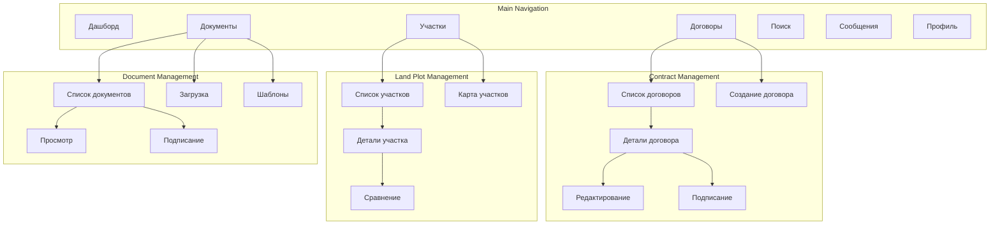
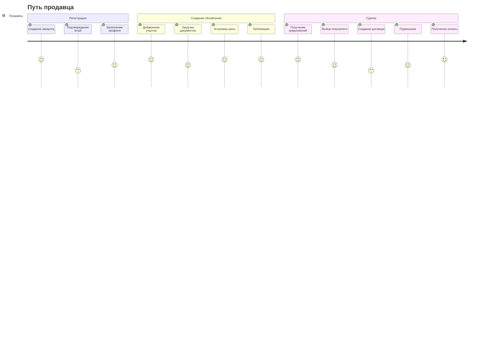
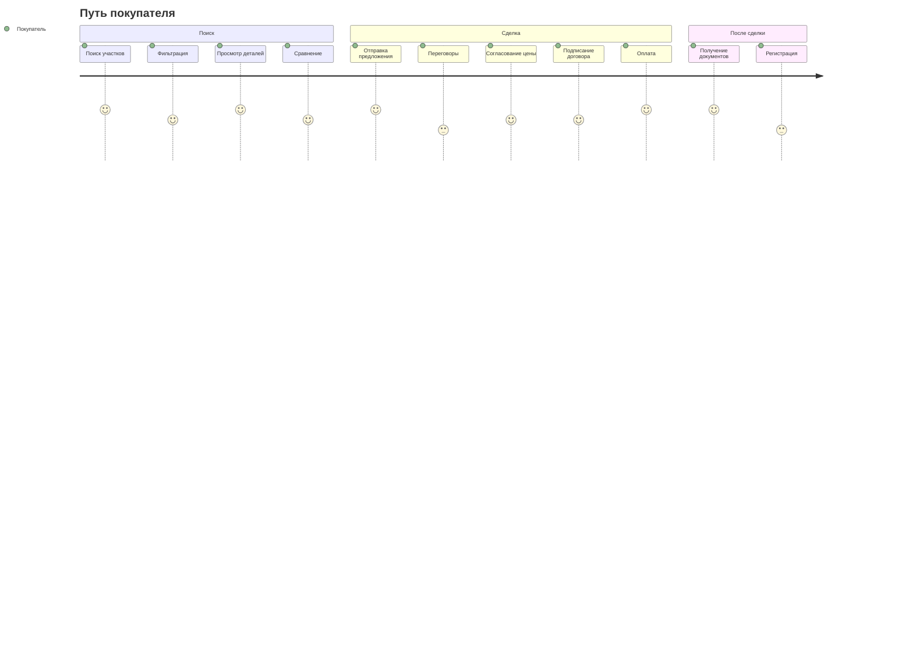

# Архитектура пользовательского опыта и интерфейса для системы автоматизации договоров купли-продажи земли

## Обзор

Документ описывает архитектуру пользовательского опыта (UX) и пользовательского интерфейса (UI) для системы автоматизации договоров купли-продажи земли, ориентированную на создание интуитивного, эффективного и доступного решения для различных категорий пользователей.

## Пользовательские персоны

### Основные персоны

```mermaid
graph TB
    subgraph "User Personas"
        SELLER[Продавец<br/>Иван, 45 лет<br/>Собственник земли]
        BUYER[Покупатель<br/>Елена, 32 года<br/>Инвестор]
        AGENT[Риелтор<br/>Мария, 38 лет<br/>Профессионал]
        NOTARY[Нотариус<br/>Алексей, 50 лет<br/>Юрист]
        ADMIN[Администратор<br/>Ольга, 35 лет<br/>IT-специалист]
    end
    
    subgraph "User Needs"
        SN1[Продать участок быстро]
        SN2[Получить справедливую цену]
        SN3[Минимум бумажной работы]
        
        BN1[Найти подходящий участок]
        BN2[Проверить юридическую чистоту]
        BN3[Безопасная сделка]
        
        AN1[Управлять множеством сделок]
        AN2[Быстрый поиск клиентов]
        AN3[Автоматизация документов]
        
        NN1[Проверка документов]
        NN2[Юридическая чистота]
        NN3[Электронное подписание]
        
        ADN1[Мониторинг системы]
        ADN2[Управление пользователями]
        ADN3[Аналитика и отчеты]
    end
    
    SELLER --> SN1
    SELLER --> SN2
    SELLER --> SN3
    
    BUYER --> BN1
    BUYER --> BN2
    BUYER --> BN3
    
    AGENT --> AN1
    AGENT --> AN2
    AGENT --> AN3
    
    NOTARY --> NN1
    NOTARY --> NN2
    NOTARY --> NN3
    
    ADMIN --> ADN1
    ADMIN --> ADN2
    ADMIN --> ADN3
```



### Детальные характеристики персон

#### Продавец (Иван, 45 лет)
- **Цель**: Продать земельный участок быстро и по справедливой цене
- **Опыт**: Базовые навыки работы с компьютером, использует смартфон
- **Боли**: Сложность юридических процедур, боязнь обмана, нехватка времени
- **Ожидания**: Простота использования, подсказки, безопасность

#### Покупатель (Елена, 32 года)
- **Цель**: Найти и приобрести земельный участок для инвестиций
- **Опыт**: Уверенный пользователь ПК и мобильных устройств
- **Боли**: Риск мошенничества, сложность проверки документов, долгие сделки
- **Ожидания**: Полная информация, прозрачность, быстрые сделки

#### Риелтор (Мария, 38 лет)
- **Цель**: Эффективно управлять множеством сделок одновременно
- **Опыт**: Продвинутый пользователь, работает с несколькими CRM
- **Боли**: Ручная работа с документами, потеря клиентов из-за медленных процессов
- **Ожидания**: Автоматизация, интеграции, мобильность

## Принципы UX/UI дизайна

### Основные принципы

1. **Простота и ясность**: Минимизация когнитивной нагрузки
2. **Последовательность**: Единый дизайн-система во всех частях приложения
3. **Доступность**: Соответствие WCAG 2.1 AA для всех пользователей
4. **Эффективность**: Быстрое достижение целей пользователя
5. **Надежность**: Предсказуемое и стабильное поведение
6. **Адаптивность**: Оптимизация для различных устройств и контекстов

### Дизайн-система

```typescript
// design-system/tokens.ts
export const designTokens = {
  colors: {
    primary: {
      50: '#e3f2fd',
      100: '#bbdefb',
      200: '#90caf9',
      300: '#64b5f6',
      400: '#42a5f5',
      500: '#2196f3',
      600: '#1e88e5',
      700: '#1976d2',
      800: '#1565c0',
      900: '#0d47a1',
    },
    secondary: {
      50: '#fce4ec',
      100: '#f8bbd9',
      200: '#f48fb1',
      300: '#f06292',
      400: '#ec407a',
      500: '#e91e63',
      600: '#d81b60',
      700: '#c2185b',
      800: '#ad1457',
      900: '#880e4f',
    },
    neutral: {
      50: '#fafafa',
      100: '#f5f5f5',
      200: '#eeeeee',
      300: '#e0e0e0',
      400: '#bdbdbd',
      500: '#9e9e9e',
      600: '#757575',
      700: '#616161',
      800: '#424242',
      900: '#212121',
    },
    success: {
      light: '#81c784',
      main: '#4caf50',
      dark: '#388e3c',
    },
    warning: {
      light: '#ffb74d',
      main: '#ff9800',
      dark: '#f57c00',
    },
    error: {
      light: '#e57373',
      main: '#f44336',
      dark: '#d32f2f',
    },
  },
  
  typography: {
    fontFamily: {
      primary: '"Roboto", "Helvetica", "Arial", sans-serif',
      secondary: '"Montserrat", "Helvetica", "Arial", sans-serif',
      mono: '"Fira Code", "Courier New", monospace',
    },
    fontSize: {
      xs: '0.75rem',    // 12px
      sm: '0.875rem',   // 14px
      base: '1rem',     // 16px
      lg: '1.125rem',   // 18px
      xl: '1.25rem',    // 20px
      '2xl': '1.5rem',  // 24px
      '3xl': '1.875rem', // 30px
      '4xl': '2.25rem', // 36px
      '5xl': '3rem',    // 48px
    },
    fontWeight: {
      light: 300,
      normal: 400,
      medium: 500,
      semibold: 600,
      bold: 700,
    },
    lineHeight: {
      tight: 1.25,
      normal: 1.5,
      relaxed: 1.75,
    },
  },
  
  spacing: {
    0: '0',
    1: '0.25rem',   // 4px
    2: '0.5rem',    // 8px
    3: '0.75rem',   // 12px
    4: '1rem',      // 16px
    5: '1.25rem',   // 20px
    6: '1.5rem',    // 24px
    8: '2rem',      // 32px
    10: '2.5rem',   // 40px
    12: '3rem',     // 48px
    16: '4rem',     // 64px
    20: '5rem',     // 80px
    24: '6rem',     // 96px
  },
  
  borderRadius: {
    none: '0',
    sm: '0.125rem',   // 2px
    base: '0.25rem',  // 4px
    md: '0.375rem',   // 6px
    lg: '0.5rem',     // 8px
    xl: '0.75rem',    // 12px
    '2xl': '1rem',    // 16px
    full: '9999px',
  },
  
  shadows: {
    sm: '0 1px 2px 0 rgba(0, 0, 0, 0.05)',
    base: '0 1px 3px 0 rgba(0, 0, 0, 0.1), 0 1px 2px 0 rgba(0, 0, 0, 0.06)',
    md: '0 4px 6px -1px rgba(0, 0, 0, 0.1), 0 2px 4px -1px rgba(0, 0, 0, 0.06)',
    lg: '0 10px 15px -3px rgba(0, 0, 0, 0.1), 0 4px 6px -2px rgba(0, 0, 0, 0.05)',
    xl: '0 20px 25px -5px rgba(0, 0, 0, 0.1), 0 10px 10px -5px rgba(0, 0, 0, 0.04)',
  },
  
  breakpoints: {
    sm: '640px',
    md: '768px',
    lg: '1024px',
    xl: '1280px',
    '2xl': '1536px',
  },
};
```

## Информационная архитектура

### Структура приложения



### Карта пользовательских путей

#### Путь продавца



#### Путь покупателя



## Компонентная архитектура UI

### Атомарные компоненты

```typescript
// components/atoms/Button/Button.tsx
import React from 'react';
import { ButtonProps } from './Button.types';
import { useButtonStyles } from './Button.styles';

const Button: React.FC<ButtonProps> = ({
  variant = 'primary',
  size = 'medium',
  disabled = false,
  loading = false,
  icon,
  children,
  onClick,
  ...props
}) => {
  const styles = useButtonStyles({ variant, size, disabled, loading });
  
  return (
    <button
      className={styles.button}
      disabled={disabled || loading}
      onClick={onClick}
      {...props}
    >
      {loading && <span className={styles.spinner} />}
      {icon && <span className={styles.icon}>{icon}</span>}
      <span className={styles.text}>{children}</span>
    </button>
  );
};

export default Button;
```

```typescript
// components/atoms/Input/Input.tsx
import React from 'react';
import { InputProps } from './Input.types';
import { useInputStyles } from './Input.styles';

const Input: React.FC<InputProps> = ({
  label,
  error,
  helperText,
  required = false,
  disabled = false,
  icon,
  ...props
}) => {
  const styles = useInputStyles({ error, disabled });
  
  return (
    <div className={styles.container}>
      {label && (
        <label className={styles.label}>
          {label}
          {required && <span className={styles.required}>*</span>}
        </label>
      )}
      <div className={styles.inputWrapper}>
        {icon && <span className={styles.icon}>{icon}</span>}
        <input
          className={styles.input}
          disabled={disabled}
          {...props}
        />
      </div>
      {(error || helperText) && (
        <span className={styles.helperText}>
          {error || helperText}
        </span>
      )}
    </div>
  );
};

export default Input;
```

### Молекулярные компоненты

```typescript
// components/molecules/ContractCard/ContractCard.tsx
import React from 'react';
import { ContractCardProps } from './ContractCard.types';
import { useContractCardStyles } from './ContractCard.styles';
import Button from '../Button/Button';
import StatusBadge from '../StatusBadge/StatusBadge';
import PriceDisplay from '../PriceDisplay/PriceDisplay';

const ContractCard: React.FC<ContractCardProps> = ({
  contract,
  onView,
  onEdit,
  onDelete,
  onSign,
  actions = ['view', 'edit', 'delete']
}) => {
  const styles = useContractCardStyles();
  
  return (
    <div className={styles.card}>
      <div className={styles.header}>
        <h3 className={styles.title}>{contract.title}</h3>
        <StatusBadge status={contract.status} />
      </div>
      
      <div className={styles.content}>
        <div className={styles.info}>
          <p className={styles.description}>{contract.description}</p>
          <div className={styles.details}>
            <span className={styles.landPlot}>
              Участок: {contract.landPlot.cadastralNumber}
            </span>
            <span className={styles.parties}>
              {contract.seller.fullName} → {contract.buyer.fullName}
            </span>
          </div>
        </div>
        
        <div className={styles.financial}>
          <PriceDisplay
            amount={contract.price}
            currency={contract.currency}
            size="large"
          />
          <span className={styles.date}>
            Создан: {new Date(contract.createdAt).toLocaleDateString()}
          </span>
        </div>
      </div>
      
      <div className={styles.actions}>
        {actions.includes('view') && (
          <Button
            variant="outline"
            size="small"
            onClick={() => onView(contract.id)}
          >
            Просмотр
          </Button>
        )}
        
        {actions.includes('edit') && contract.status === 'draft' && (
          <Button
            variant="outline"
            size="small"
            onClick={() => onEdit(contract.id)}
          >
            Редактировать
          </Button>
        )}
        
        {actions.includes('sign') && contract.status === 'pending_signature' && (
          <Button
            variant="primary"
            size="small"
            onClick={() => onSign(contract.id)}
          >
            Подписать
          </Button>
        )}
        
        {actions.includes('delete') && contract.status === 'draft' && (
          <Button
            variant="danger"
            size="small"
            onClick={() => onDelete(contract.id)}
          >
            Удалить
          </Button>
        )}
      </div>
    </div>
  );
};

export default ContractCard;
```

### Организмические компоненты

```typescript
// components/organisms/ContractForm/ContractForm.tsx
import React, { useState, useEffect } from 'react';
import { useForm, Controller } from 'react-hook-form';
import { yupResolver } from '@hookform/resolvers/yup';
import * as yup from 'yup';
import { ContractFormProps } from './ContractForm.types';
import { useContractFormStyles } from './ContractForm.styles';
import Input from '../../atoms/Input/Input';
import Button from '../../atoms/Button/Button';
import Select from '../../atoms/Select/Select';
import Textarea from '../../atoms/Textarea/Textarea';
import LandPlotSelector from '../../molecules/LandPlotSelector/LandPlotSelector';
import UserSelector from '../../molecules/UserSelector/UserSelector';
import PriceInput from '../../molecules/PriceInput/PriceInput';

const contractSchema = yup.object().shape({
  title: yup.string().required('Название договора обязательно'),
  description: yup.string().required('Описание обязательно'),
  landPlotId: yup.string().required('Участок обязателен'),
  sellerId: yup.string().required('Продавец обязателен'),
  buyerId: yup.string().required('Покупатель обязателен'),
  price: yup.number().positive('Цена должна быть положительной').required('Цена обязательна'),
  currency: yup.string().required('Валюта обязательна'),
  startDate: yup.date().required('Дата начала обязательна'),
  endDate: yup.date().min(yup.ref('startDate'), 'Дата окончания должна быть после даты начала').required('Дата окончания обязательна'),
});

const ContractForm: React.FC<ContractFormProps> = ({
  initialData,
  onSubmit,
  onCancel,
  loading = false
}) => {
  const styles = useContractFormStyles();
  const [selectedLandPlot, setSelectedLandPlot] = useState(null);
  
  const {
    control,
    handleSubmit,
    formState: { errors, isValid },
    setValue,
    watch
  } = useForm({
    resolver: yupResolver(contractSchema),
    defaultValues: initialData || {
      title: '',
      description: '',
      landPlotId: '',
      sellerId: '',
      buyerId: '',
      price: 0,
      currency: 'RUB',
      startDate: new Date().toISOString().split('T')[0],
      endDate: '',
    }
  });
  
  const watchedLandPlotId = watch('landPlotId');
  
  useEffect(() => {
    if (watchedLandPlotId) {
      // Загрузка данных об участке
      // setSelectedLandPlot(landPlotData);
    }
  }, [watchedLandPlotId]);
  
  const handleFormSubmit = (data) => {
    onSubmit({
      ...data,
      landPlot: selectedLandPlot
    });
  };
  
  return (
    <form className={styles.form} onSubmit={handleSubmit(handleFormSubmit)}>
      <div className={styles.section}>
        <h3 className={styles.sectionTitle}>Основная информация</h3>
        
        <Controller
          name="title"
          control={control}
          render={({ field }) => (
            <Input
              {...field}
              label="Название договора"
              error={errors.title?.message}
              required
            />
          )}
        />
        
        <Controller
          name="description"
          control={control}
          render={({ field }) => (
            <Textarea
              {...field}
              label="Описание"
              error={errors.description?.message}
              required
              rows={4}
            />
          )}
        />
      </div>
      
      <div className={styles.section}>
        <h3 className={styles.sectionTitle}>Участок и участники</h3>
        
        <Controller
          name="landPlotId"
          control={control}
          render={({ field }) => (
            <LandPlotSelector
              {...field}
              onSelect={(landPlot) => setSelectedLandPlot(landPlot)}
              error={errors.landPlotId?.message}
              required
            />
          )}
        />
        
        <Controller
          name="sellerId"
          control={control}
          render={({ field }) => (
            <UserSelector
              {...field}
              label="Продавец"
              role="seller"
              error={errors.sellerId?.message}
              required
            />
          )}
        />
        
        <Controller
          name="buyerId"
          control={control}
          render={({ field }) => (
            <UserSelector
              {...field}
              label="Покупатель"
              role="buyer"
              error={errors.buyerId?.message}
              required
            />
          )}
        />
      </div>
      
      <div className={styles.section}>
        <h3 className={styles.sectionTitle}>Финансовые условия</h3>
        
        <Controller
          name="price"
          control={control}
          render={({ field }) => (
            <PriceInput
              {...field}
              label="Цена"
              error={errors.price?.message}
              required
            />
          )}
        />
        
        <Controller
          name="currency"
          control={control}
          render={({ field }) => (
            <Select
              {...field}
              label="Валюта"
              options={[
                { value: 'RUB', label: 'Российский рубль' },
                { value: 'USD', label: 'Доллар США' },
                { value: 'EUR', label: 'Евро' }
              ]}
              error={errors.currency?.message}
              required
            />
          )}
        />
      </div>
      
      <div className={styles.section}>
        <h3 className={styles.sectionTitle}>Сроки договора</h3>
        
        <Controller
          name="startDate"
          control={control}
          render={({ field }) => (
            <Input
              {...field}
              type="date"
              label="Дата начала"
              error={errors.startDate?.message}
              required
            />
          )}
        />
        
        <Controller
          name="endDate"
          control={control}
          render={({ field }) => (
            <Input
              {...field}
              type="date"
              label="Дата окончания"
              error={errors.endDate?.message}
              required
            />
          )}
        />
      </div>
      
      <div className={styles.actions}>
        <Button
          type="submit"
          variant="primary"
          loading={loading}
          disabled={!isValid}
        >
          Сохранить договор
        </Button>
        
        <Button
          type="button"
          variant="outline"
          onClick={onCancel}
        >
          Отмена
        </Button>
      </div>
    </form>
  );
};

export default ContractForm;
```

## Адаптивный дизайн

### Мобильная-first стратегия

```typescript
// hooks/useResponsive.ts
import { useState, useEffect } from 'react';
import { designTokens } from '../design-system/tokens';

type Breakpoint = keyof typeof designTokens.breakpoints;

export const useResponsive = () => {
  const [screenSize, setScreenSize] = useState<Breakpoint>('lg');
  const [windowSize, setWindowSize] = useState({
    width: 0,
    height: 0,
  });
  
  useEffect(() => {
    const handleResize = () => {
      const width = window.innerWidth;
      const height = window.innerHeight;
      
      setWindowSize({ width, height });
      
      if (width < 640) {
        setScreenSize('sm');
      } else if (width < 768) {
        setScreenSize('md');
      } else if (width < 1024) {
        setScreenSize('lg');
      } else if (width < 1280) {
        setScreenSize('xl');
      } else {
        setScreenSize('2xl');
      }
    };
    
    handleResize();
    window.addEventListener('resize', handleResize);
    
    return () => window.removeEventListener('resize', handleResize);
  }, []);
  
  return {
    screenSize,
    windowSize,
    isMobile: screenSize === 'sm',
    isTablet: screenSize === 'md',
    isDesktop: ['lg', 'xl', '2xl'].includes(screenSize),
  };
};
```

### Адаптивные компоненты

```typescript
// components/organisms/ContractList/ContractList.tsx
import React from 'react';
import { ContractListProps } from './ContractList.types';
import { useContractListStyles } from './ContractList.styles';
import { useResponsive } from '../../../hooks/useResponsive';
import ContractCard from '../../molecules/ContractCard/ContractCard';
import ContractTable from '../../molecules/ContractTable/ContractTable';
import Pagination from '../../molecules/Pagination/Pagination';
import FilterPanel from '../../molecules/FilterPanel/FilterPanel';

const ContractList: React.FC<ContractListProps> = ({
  contracts,
  loading,
  pagination,
  filters,
  onContractClick,
  onFilterChange,
  onPageChange
}) => {
  const styles = useContractListStyles();
  const { isMobile, isTablet } = useResponsive();
  
  return (
    <div className={styles.container}>
      <div className={styles.header}>
        <h1 className={styles.title}>Договоры</h1>
        {!isMobile && (
          <FilterPanel
            filters={filters}
            onChange={onFilterChange}
          />
        )}
      </div>
      
      <div className={styles.content}>
        {loading ? (
          <div className={styles.loading}>Загрузка...</div>
        ) : (
          <>
            {isMobile ? (
              <div className={styles.mobileList}>
                {contracts.map(contract => (
                  <ContractCard
                    key={contract.id}
                    contract={contract}
                    onView={onContractClick}
                    actions={['view', 'edit', 'sign']}
                  />
                ))}
              </div>
            ) : (
              <div className={styles.desktopList}>
                <ContractTable
                  contracts={contracts}
                  onContractClick={onContractClick}
                />
              </div>
            )}
            
            {pagination && (
              <div className={styles.pagination}>
                <Pagination
                  currentPage={pagination.currentPage}
                  totalPages={pagination.totalPages}
                  onPageChange={onPageChange}
                  compact={isMobile}
                />
              </div>
            )}
          </>
        )}
      </div>
      
      {isMobile && (
        <div className={styles.mobileFilters}>
          <FilterPanel
            filters={filters}
            onChange={onFilterChange}
            compact
          />
        </div>
      )}
    </div>
  );
};

export default ContractList;
```

## Доступность (Accessibility)

### WCAG 2.1 AA соответствие

```typescript
// components/atoms/AccessibleButton/AccessibleButton.tsx
import React from 'react';
import { AccessibleButtonProps } from './AccessibleButton.types';

const AccessibleButton: React.FC<AccessibleButtonProps> = ({
  children,
  ariaLabel,
  ariaDescribedBy,
  onClick,
  disabled = false,
  variant = 'primary',
  size = 'medium',
  ...props
}) => {
  const handleClick = (event: React.MouseEvent<HTMLButtonElement>) => {
    if (disabled) {
      event.preventDefault();
      return;
    }
    
    onClick?.(event);
  };
  
  const handleKeyDown = (event: React.KeyboardEvent<HTMLButtonElement>) => {
    if (disabled) return;
    
    // Поддержка клавиатурной навигации
    if (event.key === 'Enter' || event.key === ' ') {
      event.preventDefault();
      onClick?.(event as any);
    }
  };
  
  return (
    <button
      type="button"
      disabled={disabled}
      aria-label={ariaLabel}
      aria-describedby={ariaDescribedBy}
      onClick={handleClick}
      onKeyDown={handleKeyDown}
      role="button"
      tabIndex={disabled ? -1 : 0}
      {...props}
    >
      {children}
    </button>
  );
};

export default AccessibleButton;
```

### Скринридер поддержка

```typescript
// hooks/useScreenReader.ts
import { useEffect, useRef } from 'react';

export const useScreenReader = () => {
  const announceRef = useRef<HTMLDivElement>(null);
  
  const announce = (message: string, priority: 'polite' | 'assertive' = 'polite') => {
    if (announceRef.current) {
      announceRef.current.setAttribute('aria-live', priority);
      announceRef.current.textContent = message;
      
      // Очистка после анонса
      setTimeout(() => {
        if (announceRef.current) {
          announceRef.current.textContent = '';
        }
      }, 1000);
    }
  };
  
  const announceError = (message: string) => {
    announce(message, 'assertive');
  };
  
  const announceSuccess = (message: string) => {
    announce(message, 'polite');
  };
  
  return {
    announce,
    announceError,
    announceSuccess,
    AnnounceComponent: () => (
      <div
        ref={announceRef}
        className="sr-only"
        aria-live="polite"
        aria-atomic="true"
      />
    )
  };
};
```

## Микровзаимодействия и анимации

### Принципы анимации

```typescript
// animations/transitions.ts
export const transitions = {
  // Длительность анимаций
  duration: {
    fast: '150ms',
    normal: '300ms',
    slow: '500ms',
  },
  
  // Функции easing
  easing: {
    easeIn: 'cubic-bezier(0.4, 0, 1, 1)',
    easeOut: 'cubic-bezier(0, 0, 0.2, 1)',
    easeInOut: 'cubic-bezier(0.4, 0, 0.2, 1)',
  },
  
  // Стандартные переходы
  fadeIn: {
    initial: { opacity: 0 },
    animate: { opacity: 1 },
    exit: { opacity: 0 },
    transition: { duration: 0.3 }
  },
  
  slideUp: {
    initial: { y: 20, opacity: 0 },
    animate: { y: 0, opacity: 1 },
    exit: { y: -20, opacity: 0 },
    transition: { duration: 0.3 }
  },
  
  scaleIn: {
    initial: { scale: 0.9, opacity: 0 },
    animate: { scale: 1, opacity: 1 },
    exit: { scale: 0.9, opacity: 0 },
    transition: { duration: 0.2 }
  }
};
```

### Интерактивные компоненты

```typescript
// components/molecules/AnimatedCard/AnimatedCard.tsx
import React from 'react';
import { motion } from 'framer-motion';
import { AnimatedCardProps } from './AnimatedCard.types';

const AnimatedCard: React.FC<AnimatedCardProps> = ({
  children,
  hover = true,
  tap = true,
  layout = true,
  ...props
}) => {
  return (
    <motion.div
      whileHover={hover ? { scale: 1.02, y: -2 } : undefined}
      whileTap={tap ? { scale: 0.98 } : undefined}
      layout={layout}
      transition={{
        type: 'spring',
        stiffness: 300,
        damping: 30
      }}
      {...props}
    >
      {children}
    </motion.div>
  );
};

export default AnimatedCard;
```

## Персонализация и кастомизация

### Темы оформления

```typescript
// themes/theme-provider.tsx
import React, { createContext, useContext, useEffect, useState } from 'react';
import { Theme, ThemeMode } from './theme.types';

interface ThemeContextType {
  theme: Theme;
  themeMode: ThemeMode;
  toggleTheme: () => void;
  setThemeMode: (mode: ThemeMode) => void;
}

const ThemeContext = createContext<ThemeContextType | undefined>(undefined);

export const useTheme = () => {
  const context = useContext(ThemeContext);
  if (!context) {
    throw new Error('useTheme must be used within a ThemeProvider');
  }
  return context;
};

export const ThemeProvider: React.FC<{ children: React.ReactNode }> = ({ children }) => {
  const [themeMode, setThemeMode] = useState<ThemeMode>(() => {
    const saved = localStorage.getItem('themeMode');
    return (saved as ThemeMode) || 'light';
  });
  
  const theme = {
    mode: themeMode,
    colors: themeMode === 'light' ? lightColors : darkColors,
    typography,
    spacing,
    borderRadius,
    shadows
  };
  
  const toggleTheme = () => {
    const newMode = themeMode === 'light' ? 'dark' : 'light';
    setThemeMode(newMode);
    localStorage.setItem('themeMode', newMode);
  };
  
  useEffect(() => {
    document.documentElement.setAttribute('data-theme', themeMode);
  }, [themeMode]);
  
  return (
    <ThemeContext.Provider value={{
      theme,
      themeMode,
      toggleTheme,
      setThemeMode
    }}>
      {children}
    </ThemeContext.Provider>
  );
};
```

## Заключение

Архитектура пользовательского опыта и интерфейса спроектирована с учетом потребностей различных категорий пользователей системы автоматизации договоров купли-продажи земли. Компонентный подход, адаптивный дизайн, обеспечение доступности и персонализация создают интуитивную и эффективную среду для работы с земельными сделками.